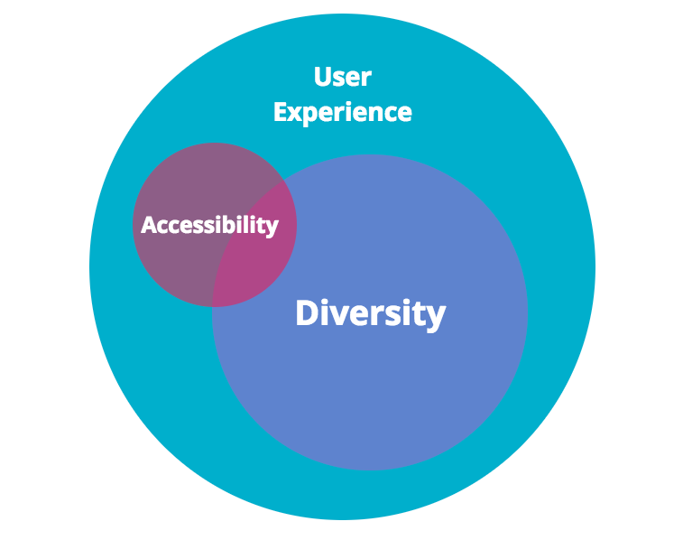
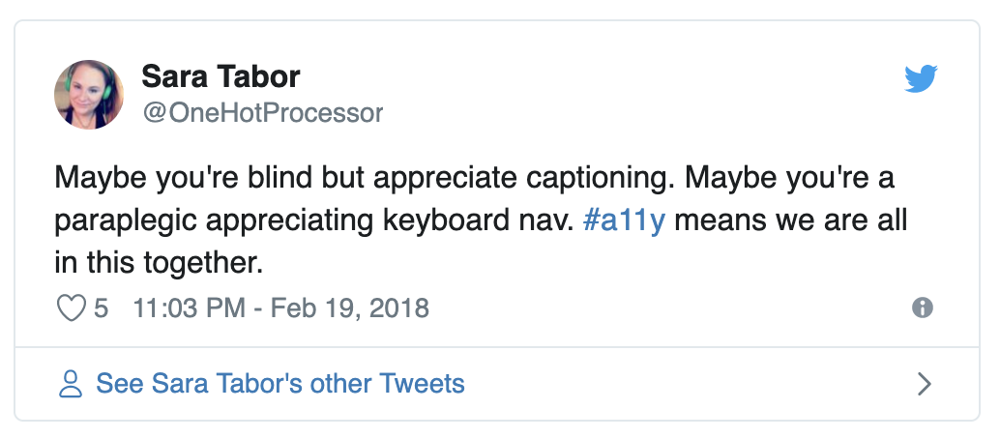

<em class="hidden">Originally published on <a href="https://hackernoon.com/finding-a-place-for-website-accessibility-in-tech-conferences-4b1d2d4e2371" target="_blank" rel="noopener noreferrer">Hacker Noon</a></em>

##Where does accessibility fit into tech?

Now that the winter holidays are over and the snow is beginning to melt, we find ourselves at the beginning of a new season. No, not spring, but tech conference season. By this time of the year, I have usually submitted a few talks to a handful of conferences, patiently waiting to hear back on decisions so I can try to figure out how I can magically stretch my limited budget.

Between coordinating work and family, travel schedules, and actually writing/practicing a talk, the simple act of submitting a talk should be the easy part. But each time I submit a talk to a tech conference, I pause. What track does this website accessibility talk fit under? Development? User experience? Diversity? Off the island (aka miscellaneous)? Do I choose a “soft science” category because the talk might be more likely to be accepted or do I choose something more technical to reach a broader audience? Sometimes the answer is obvious, but often it is not.

##Accessibility vs Diversity vs User Experience

So let’s take a step back here a minute and review the terms Accessibility, Diversity, and User Experience. These topics are sometimes lumped together at tech conferences, but researchers see these as three separate and equally important areas of study.

According to Wikipedia,<a target="_blank" rel="noopener noreferrer" class="c3" href="https://www.google.com/url?q=https://en.wikipedia.org/wiki/Accessibility&amp;sa=D&amp;ust=1560140953197000">Accessibility</a>:

<blockquote>Refers to the design of products, devices, services, or environments for people who experience disabilities. Accessibility is strongly related to universal design which is the process of creating products that are usable by people with the widest possible range of abilities, operating within the widest possible range of situations. This is about making things accessible to all people (whether they have a disability or not).</blockquote>

While<a class="c3" target="_blank" rel="noopener noreferrer" href="https://www.google.com/url?q=https://en.wikipedia.org/wiki/User_experience&amp;sa=D&amp;ust=1560140953198000">User Experience</a> is broadly defined as:

<blockquote>A person’s emotions and attitudes about using a particular product, system or service. Additionally, it includes a person’s perceptions of system aspects such as utility, ease of use and efficiency. User experience is dynamic as it is constantly modified over time due to changing usage circumstances and changes to individual systems as well as the wider usage context in which they can be found. In the end user experience is about how the user interacts with and experiences the product.</blockquote>

Looking up the term<a class="c3" target="_blank" rel="noopener noreferrer" href="https://www.google.com/url?q=https://en.wikipedia.org/wiki/Diversity&amp;sa=D&amp;ust=1560140953199000">Diversity</a> is a much more complex endeavor. Wikipedia gives you around 50 different possible sub-categories to choose from! If we look at the broadest definition we can of just the wordDiversity, we get this from<a class="c3" target="_blank" rel="noopener noreferrer" href="https://www.google.com/url?q=https://www.merriam-webster.com/dictionary/diversity&amp;sa=D&amp;ust=1560140953199000">Merriam-Webster</a>:

The condition of having or being composed of differing elements: variety; especially: the inclusion of different types of people (such as people of different races or cultures) in a group or organization.

I realize that just reading limited definitions of these three complex topics is akin to explaining Albert Einstein’s<a class="c3" target="_blank" rel="noopener noreferrer" href="https://www.google.com/url?q=https://en.wikipedia.org/wiki/General_relativity&amp;sa=D&amp;ust=1560140953200000">theory of relativity</a>&nbsp;to a two-year-old. But the simple point I am trying to make is that in all three areas of study — Accessibility&nbsp;and Diversity&nbsp;and User Experience&nbsp;— the commonality between them is people.

In a broad sense, I tend to think of Accessibility as an overlapping subset of Diversity, all under the User Experience umbrella. There are many theories and smarter people that may argue differently, but however you look at it, it boils down to users.

If we are talking about technology specifically, this commonality can be reframed to: How people create technology…how people use technology…how people interact and grow and change due to the technology. And at the end of the day, really what good is the technology if you must limit the people who can use it?

<h2 class="c11" id="h.im99myoh2htz">Website Accessibility is Nebulous to Many</h2>
At this point in time, Diversity&nbsp;and User Experience&nbsp;have been widely accepted (although not always put into practice) and are subjects that a lot of us in the tech community are familiar with, at least in a non-scholarly sense. Even at tiny tech conferences, they often have their own tracks. But I still feel like Website Accessibility&nbsp;is a bit nebulous to conference organizers and participants and they aren’t sure what to do with it.

Don’t believe me? Here is a typical conversation I often have at general tech conferences:
<blockquote name="9060" id="9060" class="graf graf--blockquote graf-after--p"><strong class="markup--strong markup--blockquote-strong">PersonX</strong>: Hi Carie it’s nice to meet you! What do you do? <strong class="markup--strong markup--blockquote-strong">Me</strong>: Nice to meet you too PersonX! I primarily work as a front-end developer with a focus on accessibility. <strong class="markup--strong markup--blockquote-strong">PersonX</strong>: Oh you mean like for screen readers for blind people. <strong class="markup--strong markup--blockquote-strong">Me</strong>: Well, there is a bit more to it than that…[PersonX interrupts] <strong class="markup--strong markup--blockquote-strong">PersonX</strong>: Oh yeah, I know about video captions for deaf people too. <strong class="markup--strong markup--blockquote-strong">Me</strong>: Well, there are a lot of…[PersonX interrupts again] <strong class="markup--strong markup--blockquote-strong">PersonX</strong>: Yeah, I went to a talk once where they mentioned checking website colors, but I’m not a designer so I didn’t pay much attention. <strong class="markup--strong markup--blockquote-strong">Me</strong>: I’m not a designer either, but it is a really important step in making your website more accessible. We all have to work together to make it happen. [Pause, blinking, awkwardness] <strong class="markup--strong markup--blockquote-strong">PersonX</strong>: Hey it was nice chatting. Catch you at the after party? <strong class="markup--strong markup--blockquote-strong">Me</strong>: Sure…[insert: sad face]</blockquote>

News flash PersonX: Accessibility is not just for the disabled!

I use captions for videos all the time, but I am not part of the deaf community. I know people who refuse to use a computer mouse, but they do not have any mobility issues. A programmer friend of mine likes to use VoiceOver to quickly<a target="_blank" rel="noopener noreferrer" class="c3" href="https://www.google.com/url?q=https://www.apple.com/voiceover/info/guide/_1128.html&amp;sa=D&amp;ust=1560140953204000">read documents</a>, although he is not blind.

These three technologies — video captioning, keyboard navigation, screen readers — can obviously benefit people with disabilities, but they also can benefit many others that do not identify as having a disability. So why is it when we talk and think about accessible technologies, we do so with such a narrow lens? Why is accessibility in technology seen as “them” and not “us” — don’t we all benefit from advancements in technology?

I love this thought/thread.<a class="c3" target="_blank" rel="noopener noreferrer" href="https://www.google.com/url?q=https://twitter.com/OneHotProcessor&amp;sa=D&amp;ust=1560140953205000">Sara Tabor</a>&nbsp;calling it like it should be.

Part of the solution here is rethinking the way we approach design and development and how those topics are addressed at conferences. Website accessibility should be about making something valuable, not just accessible, to as many people as we can.

When we get to that magical tipping point of thinking about Website Accessibility&nbsp;as we do Diversity&nbsp;and User Experience — as essential pieces to the development process — it will be much easier to submit talks to tech conferences. In the meantime, you can find me trying out all of the various tracks until accessibility has one of its own.

