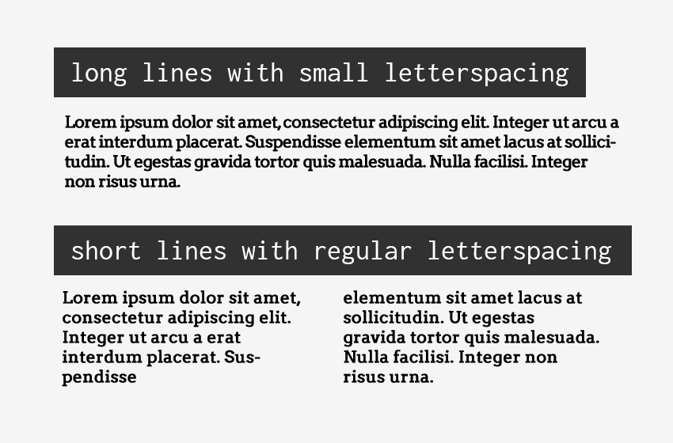
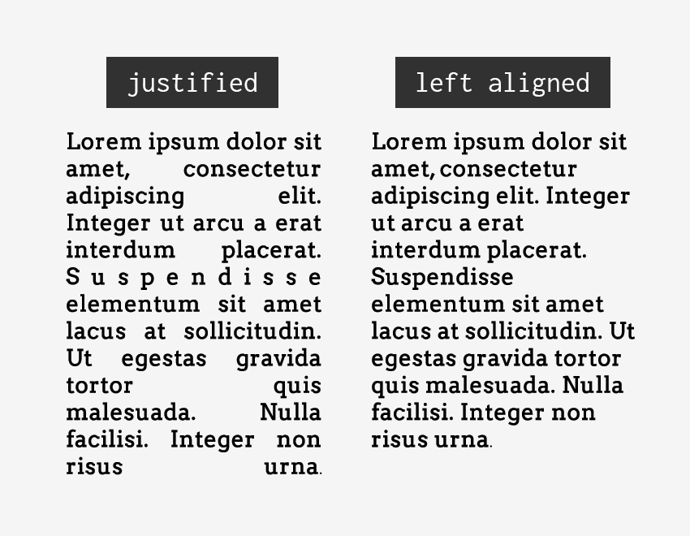

<em class="published">Originally published on <a href="https://webdesign.tutsplus.com/articles/designing-accessible-content-typography-font-styling-and-structure--cms-31934" target="_blank">Envato Tuts+</a></em>

##Consider Your Typography

It can be a bit overwhelming when you think of all the elements you have to consider when choosing an accessible typeface–serif vs. sans-serif, font variations, font size, kerning, tracking…to name just a few–but if you follow the guidelines below you will have taken the first steps in making your website typography more accessible.

###Find Common Ground
Less is more when it comes to accessible typography. The easiest way to make your typography accessible is to choose a common font and limit the number of fonts on your website. This is especially important for your main body copy. Studies show common fonts most often win when reading speed and user preference of different fonts is compared.

Common fonts include:

- sans-serif font families: Arial, Calibri, Century Gothic, Helvetica, Tahoma, and Verdana
- serif font families: Times New Roman and Georgia
- slab serif font families: Arvo, Museo Slab, and Rockwell

It’s not that these fonts are inherently accessible, but most users who have difficulty with typography choices have already seen these fonts and learned how to work with (or around) them.

###Readability of Serif vs. Sans Serif
The research is not conclusive as to whether serif or sans serif typefaces are easier to read. So this choice is entirely yours as long as you are picking common fonts or font families that have strong and unique characters.

For people with visual impairments or dyslexia, certain letters or combinations of letters can be confusing, so it’s important that letter shapes are clearly defined and unique. Common offenders are the “I” (ex. India), “l” (ex. lettuce) and “1” (ex. one). Likewise, characters like “b” and “d” and “q” and “p” can sometimes be mirrored (either left-right or up-down) so words such as “piqued” could be flipped into a nonsensical word like “qipueb” or sometimes into a real word that would entirely change the meaning of the content.

There are some characteristics that can aid legibility. So when you are looking for your next font family, pay particular attention to the following things and you’ll be on your way to choosing an accessible font:

- Prominent ascenders (ex. the vertical line in d).
- Prominent descenders (ex. the down-pointing line in y).
- A d/b or p/q combination which are not an exact mirror image of one another.
- Uppercase I, lowercase l, and 1 must all have different characteristics from one another.
- Avoid fonts that have tight letter spacing; these will be difficult for some users to read.
- Kerning is also important, particularly between r and n. Otherwise, words like “barn” could be read as “bam” or “modern” could change to “modem”.

###Avoid Specialty Display Fonts

Besides picking a common font family and paying attention to character uniqueness, make sure you avoid using fancy or handwritten fonts and/or fonts that only have one character case available (ex. only uppercase characters). Specialty fonts with cursive, or unusual shapes, or artistic features, may look nice, but they are much harder to read then common font families.

Likewise, don’t use fonts that claim to be accessible or help one particular disability (ex. dyslexic fonts). They are tempting to use, but there is <a href="https://www.understood.org/en/learning-attention-issues/child-learning-disabilities/dyslexia/dyslexia-friendly-font">no clear evidence</a> they actually help readers. You are better off picking a common font that the majority of your users are already familiar with.

##Typographic Styling

People often assume that having picked out an accessible font their job is done–wrong! The next step is to consider how the fonts will actually be styled on a page and to build that into their style guide, or somehow limit certain styles to content editors/creators to ensure that the typography remains accessible.

###Font Size and Variations
Some font sizes and styling can be problematic for people with disabilities. For example, screen readers often ignore styling methods, such as bold and italics, making these styles useless for blind users. Users with low vision or color blindness may not be able to see some of the text if it is too small, while other users may have trouble reading italic text.

For these reasons, you should consider the following guidelines:

- Base font sizes should be set to at least 14px (0.875rem)—in fact, many publications use 20px or larger for their body copy nowadays.
- Font size should be defined with a relative value (ex. %, rem, or em) to allow easy resizing.
- Limit the use of font variations such as italic, bold, ALL CAPS or other styling methods that may make the content difficult to read.
- Do not use underlines for items that are not links.
- Use markup instead of text on images!* Screen readers cannot read embedded text on images (without extra code added) and embedded text can also become pixelated when magnified by users with low vision.

###Color and Contrast
With the number of people who have some variant of color blindness, suffer from low vision, or are completely blind (all together roughly 9% of the global population), this is a very large area where designers can have a direct and immediate impact on website accessibility.

There are a lot of things to consider when making your content accessible from a color and contrast perspective including:

- Use color/contrast testing tools and simulators to measure contrast ratios for your website design. According to the WCAG contrast guidelines, small text should have a contrast ratio of at least 4.5:1 against its background. While large text (18pt and larger) should have a contrast ratio of at least 3:1 against its background.
- Use solid color backgrounds–reading text on busy backgrounds, overlays, or gradients is difficult, especially if it does not have enough contrast.
- Use colors on the opposite ends of the color spectrum–avoid red/green and blue/yellow combinations when you can.
- Be careful with light shades of color, especially grays–they are difficult to see for people with low vision.
- Do not rely on color alone to convey info to your users. For example, make sure your links have underlines, or some other visual indicator besides color.

##Structure and Layout Are Key

While your choice of typography and styling can certainly help make or break a website from an accessibility point of view, the importance of structure and layout should not be ignored. How your website is laid out (UI) and how people actually interact with your website (UX) are equally important factors when making your content accessible. Users with screen readers, reading disorders, learning disabilities, or attention deficit disorders will especially benefit from having a clear layout and concise content.

###Clearly Define Your Page Layout
Think of each page on your website as being an outline to a story. By thinking about your web pages as individual stories, it will help you plan out the overall page structure using headings, subheadings, and paragraphs. A big piece of that is making critical elements visually distinct from one another. If they are too close in proximity to each other, it can be difficult to tell where one element begins and another ends, especially if they have similar styling.

For people with some reading or vision disabilities, long lines of text can also be a barrier. These users have trouble keeping their place and following the flow of the content. Having a narrow block of text makes it easier for them to continue on to the next line in a block. The number of characters per line in any paragraph or section of text (the “measure”) should not exceed 80. For Chinese, Japanese, or Korean characters you should limit each line width to 40 to help with focus and readability.

Finally, when considering your page structure and layout, make sure you think about all your users. The page should make sense to users on any breakpoint and device using a mouse, keyboard, touchscreen screen, or other adaptive technology device. Once this skeleton structure is in place, the styling of each sentence and paragraph comes into play.

###Paragraph and Sentence Spacing
For people with cognitive and attention-deficit disorders, whitespace is helpful to retain reading focus. It is best practice to set the space between each sentence to 1.5 relative to the line-height of your type. Within paragraphs, the spacing should be at least 1.5 times larger than the line spacing to clearly define new sections of content. Under most circumstances, line spacing should not exceed 2.0, and the spacing between paragraphs should not exceed 2.0 times larger than the line spacing, or you risk distract your readers.

Similarly, people with certain reading or cognitive disabilities have problems reading text that is fully justified. The uneven spacing between words in fully justified text can cause “rivers of space” to form down the page, making content difficult to read. Text justification can also cause words to be either bunched closely together or stretched in unnatural ways so readers find it difficult to locate word boundaries.

##Summary
There are many design considerations for making your content more accessible to all. Some things to think about and build into your design workflow include:

- Choose a common font that most users have encountered before.
- The “serif vs. sans-serif debate” is not a huge deal if you choose a common font family or one that has unique characters.
- Avoid specialty display fonts or font families that are not unique (ex. letters or numbers that could mirror each other).
- Your fonts should have a minimum size of 14px (ideally more) and when coded should use relative values.
- Pay attention to color and contrast! Use tools to check the ratio between the text and background and be wary of gray.
- Don’t rely on color alone to signify information (ex. “click on the red button”).
- Clearly define paragraph and letter spacing.
- Do not let the overall width of the content exceed 80 characters (40 characters for logograms).
- Avoid paragraph alignment (such as justified) which creates whitespace within the content.