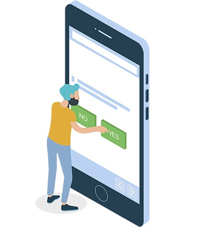

## Refine Your UI/UX

How your website is laid out (ie. user interface — UI) and how people actually interact with your website (ie. user experience — UX) are equally important factors when creating an accessible design. I will not get into the <a href="https://www.usertesting.com/blog/2016/04/27/ui-vs-ux/" target="_blank" rel="noopener noreferrer">differences of UI/UX</a> in this article, but suffice it to say, they both play an important role in creating an accessible website.

Users with screen readers, reading disorders, learning disabilities, or attention deficit disorders will especially benefit from having a <a href="https://www.w3.org/WAI/perspectives/layout.html" target="_blank" rel="noopener noreferrer">clear layout and concise content</a> — but good UI/UX is really awesome for everyone.

###Accessible UI/UX Guidelines for Designers

<ul>
<li>Plan out heading and page structure — make sure it makes sense to readers using a mouse, keyboard, and touchscreen devices.</li>
<li>Design <a href="https://www.deque.com/blog/give-site-focus-tips-designing-usable-focus-indicators/" target="_blank" rel="noopener noreferrer">obvious focus indicators</a>, so users can tell where they are on a page at all times. Barely there focus indicators are almost worse than none at all.</li>
<li>Use whitespace to set the body copy apart from other website elements, so it it easier for users to focus on.</li>
<li>Place important actions at the top or bottom of the design. These will be more reachable with shortcuts on the actual website (ex. navigation links).</li>
<li>Do not use complex words, when simple ones will do. This is especially true for the essential or interactive pieces of your website design (ex. call to action buttons).</li>
<li>Heading level hierarchy is meaningful on a live website, so <a href="http://a11y-style-guide.com/style-guide/section-structure.html#kssref-structure-headings" target="_blank" rel="noopener noreferrer">do not to skip heading levels</a> in your designs/wires either.</li>
</ul>

##Typography All the Things
Your choice of typeface/fonts can make or break a website, especially from an accessibility point of view. Users with reading, learning, and attention disorders (ex. dyslexia, ADHD), English as a second language (ESL) users, and users with low vision all benefit from accessible typography.

While it can be a bit overwhelming when you think of all the elements you have to consider when choosing an <a href="https://webaim.org/techniques/fonts/" target="_blank" rel="noopener noreferrer">accessible typeface</a>: serif vs sans-serif, font variations, font size, kerning, tracking…just to name a few, if you follow the guidelines below you will have taken the first steps to making your website typography more accessible.

###Accessible Typography Guidelines for Designers

<ul>
<li>Easy win: pick a font that is <a href="https://www.boia.org/blog/best-fonts-to-use-for-website-accessibility" target="_blank" rel="noopener noreferrer">considered accessible</a> from the start. This is especially important for your main body copy.</li>
<li>Limit the total number of fonts families on your website and provide alternative fonts whenever possible.</li>
<li>Use adequate base font size — 14px at the minimum. Bonus points for specifying the font size in terms of percentage or relative value to allow easy resizing.</li>
<li>Limit the use of font variations (ex. italic, bold, ALL CAPS) and do not use underlines for items that are not links.</li>
<li>When in doubt, use the <a href="https://pearsonified.com/typography/" target="_blank" rel="noopener noreferrer">Golden Ratio Typography Calculator</a> tool to help determine the perfect font size, line-height, width, and characters per line (CPL) for your website.</li>
</ul>

.")

##Color & Contrast is Key
Color and contrast is at the heart of every design. There are numerous studies and articles showing how the perception of a brand is really tied to the colors it uses. One study even suggests that up to 90% of snap judgments made about products can be <a href="http://www.emeraldinsight.com/doi/abs/10.1108/00251740610673332" target="_blank" rel="noopener noreferrer">based on color alone</a>. When you pair that information on color theory with the number of people who have some variant of <a href="http://www.colourblindawareness.org/colour-blindness/" target="_blank" rel="noopener noreferrer">color blindness</a>, suffer from low vision, or are completely blind (all together roughly 9% of the global population), this is a very large area where designers can have a direct and immediate impact on website accessibility.

###Accessible Color & Contrast Guidelines for Designers

<ul>
<li>Use colors on the opposite ends of the color spectrum — avoid red/green and blue/yellow combos when you can.</li>
<li>Be careful with light shades in general — they are hard to see for people with low vision.</li>
<li>Do not rely on color alone to convey info to your users. Make sure your links have underlines or some other visual indicator besides color.</li>
<li>Use solid color backgrounds — reading text on busy backgrounds is difficult, especially if it does not have enough contrast.</li>
<li>Use color/contrast <a href="https://www.w3.org/TR/UNDERSTANDING-WCAG20/visual-audio-contrast-contrast.html" target="_blank" rel="noopener noreferrer">WCAG 2.0</a> testing <a href="http://contrastchecker.com/" target="_blank" rel="noopener noreferrer">tools</a> and <a href="http://www.color-blindness.com/coblis-color-blindness-simulator/" target="_blank" rel="noopener noreferrer">simulators</a> to measure contrast ratios for your website design. Small text should have a contrast ratio of at least 4.5:1 against its background. While large text (18pt and larger) should have a contrast ratio of at least 3:1 against its background.</li>
<li>Icons or other critical elements should also use the above recommended contrast ratios, but decorative visual elements (including logos) are exempt from contrast ratios.</li>
</ul>

##Forms FTW
Ah…website forms. One could write an entire book on <a href="https://webaim.org/techniques/forms/controls" target="_blank" rel="noopener noreferrer">how and why to make forms accessible</a>. But it really boils down to the fundamental question: can a user input information and then submit it on your website?

As a designer, you get off relatively easy on this element — developing the perfect accessible webform is one of those eternal conundrums of our age — but it is important to lay the foundation of development with an <a href="http://www.afb.org/info/programs-and-services/technology-evaluation/creating-accessible-websites/accessible-forms/1235" target="_blank" rel="noopener noreferrer">accessible form design</a>.

###Accessible Form Guidelines for Designers

<ul>
<li>Label, label, label all form fields…did I mention, label? No matter how elegant your form design is, a user will not know what information to input if your field labels are blank.</li>
<li>Make required fields obvious. Please do not use color alone to indicate a required field (see the color and contrast section for reasons why).</li>
<li>Input errors/messages are a must for all forms, so designers should include them in their designs.</li>
<li>Group fields into logical sections when you can. For example: first name, last name and DOB fields could all be grouped under a “Personal Information” heading.</li>
<li>Make your forms as simple and succinct as possible and <a href="http://uxmovement.com/forms/why-the-confirm-password-field-must-die/" target="_blank" rel="noopener noreferrer">avoid redundancy</a> in your accessible forms.</li>
<li>Make the submit button clear and place it in a logical spot. There are all sorts of tricky submit buttons out there — different color/contrast, multiple buttons, hidden submit button, etc. If you want users to give you their information, you need to make it as easy as possible.</li>
</ul>

##Media Considerations
I can admit it…I am a sucker for a good GIF. If I could design interactive SVGs for a living, I would. I also love having millions of photos and videos at my fingertips at all times (well, as long as the wifi is good). All of these forms of media can enrich our lives — but for lot of people, it can also mean frustration.

People with visual disabilities (ex. seizure disorders, blind), auditory disabilities (ex. deaf, hard of hearing), situational/temporary disabilities, people with poor bandwidth connections, and many others can benefit greatly from media that is displayed in an accessible way.

###Accessible Media Guidelines for Designers

<ul>
<li>Limit the use of complicated media components (ex. slideshows, videos) in your design when possible. No fear…there are alternative layout options.</li>
<li>If you have to include media in your design, show links to alternative ways to access the media — even in the wireframe/design phase. It is a good reminder to developers/clients to include that element.</li>
<li>Videos or slideshows should at least have a play/pause button. Ideally, you would show all possible media controls.</li>
<li>Add clear, complete, and concise text descriptions to essential imagery. Think twice about non-essential images.</li>
<li>Scalable Vector Graphics (SVGs) are awesome — level them up by adding additional <a href="https://css-tricks.com/accessible-svgs/" target="_blank" rel="noopener noreferrer">accessibility information</a> such as title IDs, desc IDs, and ARIA tags.</li>
<li>Finally, make sure your design works even if the media is missing. Thinking about graceful design degradation or progressive enhancement from the beginning, will help your website design be more useful to more users.</li>
</ul>

