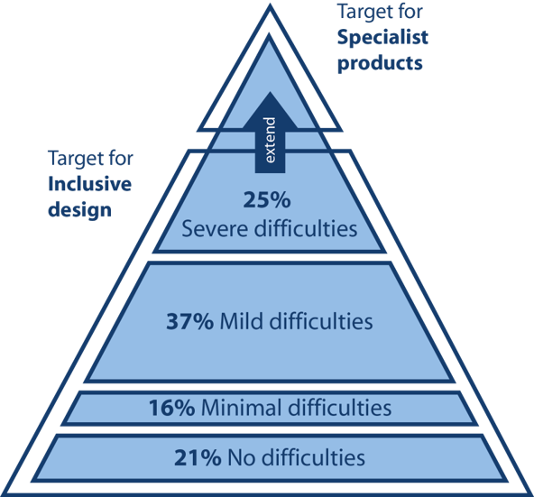
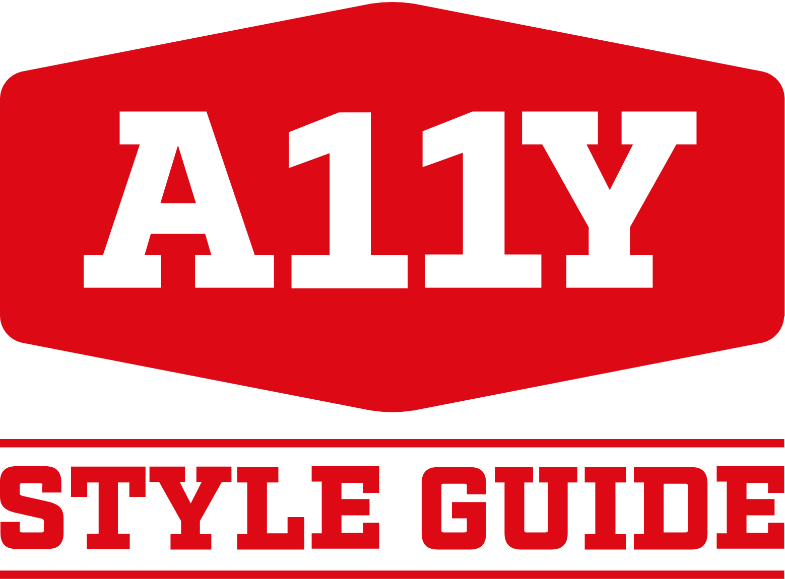

##Inclusive Design and Development Principles

The term <a href="http://www.inclusivedesigntoolkit.com/whatis/whatis.html" target="_blank" rel="noopener noreferrer"><em>Inclusive Design</em></a> is not a new one. It is a phrase that has been around since 2005. It is defined as “The design of mainstream products and/or services that are accessible to, and usable by, as many people as reasonably possible…without the need for special adaptation or specialized design.”

<em>Inclusive Development</em> is really taking that next logical step and adhering to inclusive design principles during the development process. Essentially, it is a shift in the way you approach your thinking about development. So during the development phase, you choose or create code, markup, libraries, and other developmental pieces that are accessible (or as accessible as possible).

In both inclusive design and development, you want to target the users near the top of the pyramid that have severe difficulties (~25% of the population). By making that your target, you will cover all the additional users with little to no difficulties (~74% of the population). This is essentially a “trickle down” effect for accessibility. Adaptive technologies (often called AT) help cover the severely disabled users at the top of the pyramid with specialized products.

When we rethink our approach to development, we go beyond just the base level of access to information. Inclusive <strong>development</strong> means making something valuable, not just accessible, to as many people as we can*. It is about putting Accessibility First.

* Adapted quote from Heydon Pickering’s article on <a href="https://24ways.org/2016/what-the-heck-is-inclusive-design/" target="_blank" rel="noopener noreferrer">Inclusive Design</a>

<h2>Inclusive Design and Development in Action</h2>

Font families are a good example of a place where you can make an inclusive design and development choice. Your choice of typeface/fonts can make or break a website, especially from an accessibility point of view. English as a second language (ESL) users, users with low vision, and users with reading, learning, and attention disorders (ex. dyslexia, ADHD), all benefit from accessible typography.

")

In fact, researchers estimate that 10-17% of the U.S. population has dyslexia. That is a pretty significant percentage, which is even higher than current Internet Explorer, Edge, Firefox and Opera users combined (as of September 2017).

So if we choose a typeface we know that is legible for people with dyslexia (as shown by the top section on the pyramid with severe difficulties), then we also know every group under that section can also read the font. People who are blind or have more serious sight issues other than dyslexia would need additional typography or assistive technology considerations.

Heydon Pickering sums it up best with this quote from his book <a href="https://shop.smashingmagazine.com/products/inclusive-design-patterns" target="_blank" rel="noopener noreferrer">Inclusive Design Patterns</a>:

<blockquote>
“By choosing a typeface that we feel the average user could read we’d be consciously alienating a section of our users. Instead, by selecting a typeface which is workable for those who struggle to read, we arrive at a choice that works for everyone. This is efficient and effective inclusive design.”
</blockquote>

Beyond just font families, other inclusive design and development choices include:

<ul>
<li><strong>Structure</strong> — How your website is laid out (ie. user interface — UI) and how people actually interact with your website (ie. user experience — UX) are equally important factors when creating an accessible website design. Users with screen readers, reading disorders, learning disabilities, or attention deficit disorders will especially benefit from having a clear layout and concise content —so make sure your markup is as semantic as possible. If you can use HTML5 tags or ARIA labels, even better.</li>
<li><strong>Color and Contrast</strong> — Color and contrast is at the heart of every design. There are numerous studies and&nbsp;articles&nbsp;showing how the perception of a brand is really tied to the colors it uses. When you pair that information on color theory with the number of people who have some variant of&nbsp;color blindness, suffer from low vision, or are completely blind (all together roughly 9% of the global population), this is a very large area where designers can have a direct and immediate impact on website accessibility.</li>
<li><strong>Forms</strong> — One could write an entire book on&nbsp;how and why to make online forms accessible. But it really boils down to the fundamental question: can a user input information and then submit it to your website? Ultimately, it could be argued it is easier to design an accessible form than to build one (as developing the perfect accessible web form is one of those eternal conundrums of our age), but both aspects are important when creating forms.</li>
<li><strong>Media </strong>— People with visual disabilities (ex. seizure disorders, blind), auditory disabilities (ex. deaf, hard of hearing), situational/temporary disabilities, people with poor bandwidth connections, and many others can benefit greatly from media that is displayed or available in an accessible way. By considering accessibility in your media choices, you can help people unlock more information from the internet and all its wonders/cat gifs.</li>
</ul>

<h2>Accessibility First + Component-Driven Development</h2>

One of the questions I get asked a lot is: how do we add website accessibility to a project does not have a lot of time or budget to include that piece? Well, one way we can tackle these issues is by using an accessible component-driven approach using the inclusive design and development principles. By thinking about inclusiveness from the start, we can get a head start on accessibility while still building the required website components.

By now, a lot of people have used component driven development using style guides in their development workflow process. Even if you have not formally heard the term or use the tools, I am betting you are already doing it to some degree already…it is about breaking a large website down into manageable pieces. Much like building a house, you need to build one piece of your house at a time…first the foundation, then the structure, walls, windows, roof, and everything in between. Component driven development tools allow us to do this, but for websites.

Component driven development helps break the website down into manageable components, so there is less development time with these reusable components. It allows front-end and back-end developers to work simultaneously. And clients love it because they can preview the build process and can use living style guide as a reference after the website has launched.

The <a href="http://a11y-style-guide.com/style-guide" target="_blank" rel="noopener noreferrer">A11Y Style Guide</a> was formed out of development workflows, aided by the component driven development tool&nbsp;KSS node, and fueled by the conviction that everyone deserves to be able to use and contribute back to the wonderfully wacky web. The A11Y Style Guide is ultimately a style guide that comes with pre-populated accessible components that include helpful links to related tools, articles, and WCAG guidelines to make your website more inclusive. You can use it as a reference, as a base for your own style guide or accessible components. You may even decide to create a new accessible theme based on the guides.

The concept of the A11Y Style Guide is really simple. I did not reinvent the wheel with this project and at this point in time, there are many more people/organizations with their own spin on this accessible component concept. My style guide tool builds on all the wonderful work that is already being done in the world of accessibility and makes that existing knowledge base more applicable to real-world scenarios in a condensed manner. I lovingly think of it as the CliffsNotes of website accessibility or a nicer term may be accessible pattern library for developers. But by using a reusable, accessible, component-driven approach and thinking about inclusiveness from the start, we can get a head start on building accessible websites. So ultimately you and your clients save&nbsp;time&nbsp;and&nbsp;money, plus your website is a little more&nbsp;inclusive…what’s not to love?

<h2>Final Thoughts on Accessibility First</h2>

If thinking about <em>Accessibility First</em> is scaring you a bit, let me remind you that we have been here before. Around 2009, is when we first heard about the <em>Mobile First</em> concept. If you remember, when the mobile first approach appeared—where we design/develop for smaller screens first then add more features and content for larger screens—it was a crazy and overwhelming shift in thinking and development workflows. Now it is just part of our daily lives as developers. I am not even sure I could make a website that&nbsp;was not responsive at this point.

Now in 2017, the <em>Accessibility First</em> concept may seem just as daunting and impossible as <em>Mobile First</em> was years ago—there is so much to know, so many different ideas of what accessibility means, new rules, new tools—but if you have the right tools and attitude, there is hope. I am looking forward to seeing what 2018 brings in the world of website accessibility.

