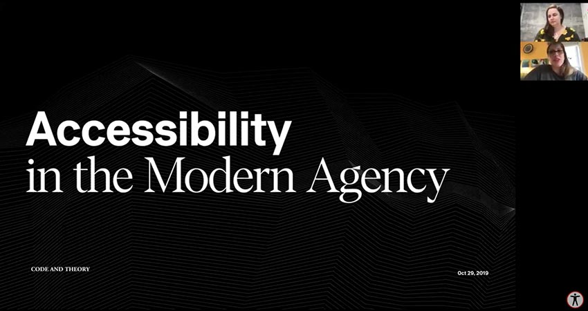
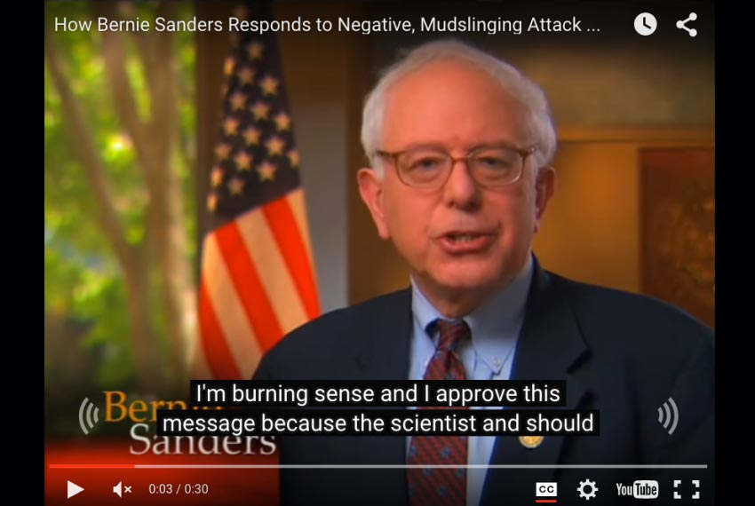
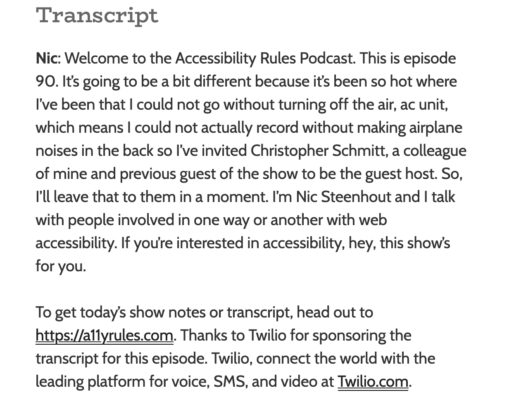
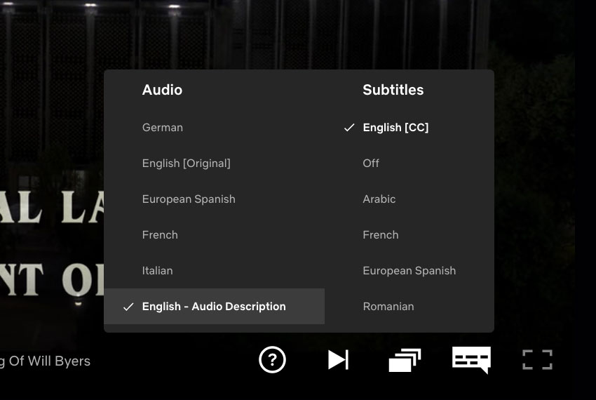
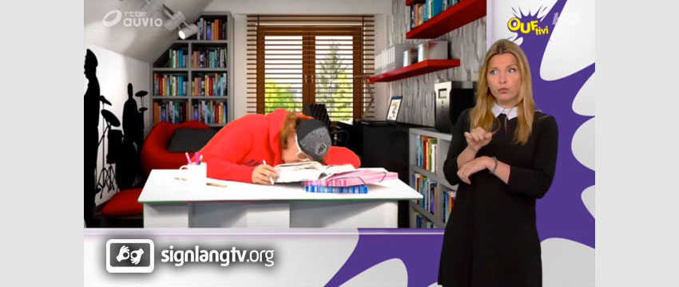

##Accessibility Talks (Backstory)

As an effort to spread awareness about digital accessibility and to highlight some awesome speakers, I founded a virtual meet-up group called <a href="https://twitter.com/A11YTalks" rel="external" target="_blank">Accessibility Talks</a> about three years ago. In the beginning, the group met informally and the sessions were not recorded, but soon I realized we needed to record the talks and post them on a media platform so we could share the knowledge with others.

I chose the <a href="https://www.youtube.com/c/accessibilitytalks" rel="external" target="_blank">YouTube</a> platform due to its flexibility and available accessibility options, including auto-captioning. Little did I know at the time, the level of complexity that comes with producing videos and hosting live streaming events with digital accessibility best practices in mind!

Below are some tips, tricks, and information about alternative media types (such as captions, transcriptions, etc.) to help make your next multimedia video or live stream event more successful!

##Alternative Multimedia Types and Requirements

When it comes to producing accessible digital content of any kind, the best resource is the <a href="https://www.w3.org/WAI/standards-guidelines/wcag" rel="external" target="_blank">Web Content Accessibility Guidelines (WCAG)</a>&nbsp;from the W3C group. The goal of this group is to provide a single shared standard for web content accessibility that meets the needs of individuals, organizations, and governments internationally, and to make digital content more accessible to people with disabilities.

For this article, we will focus on multimedia best practices, since the videos I produced also included audio. For more information on the WCAG requirements for other types of media (ex. audio-only files like a podcast), please consult the audio-only and video-only sections of the guidelines.

For accessible multimedia on the web, we need to be concerned with four alternative media types:

<ol>
<li>captions</li>
<li>transcripts</li>
<li>audio descriptions</li>
<li>sign language interpretation</li>
</ol>

Below are some definitions of each, some information on which disabilities they target, plus the requirements for each level of WCAG conformance (A, AA, or AAA).

###1. What Are Captions?

Captions are text synchronized with the multimedia for people who cannot hear the spoken words.

People often confuse “captions” and “subtitles," but they are not the same thing. Both are text synchronized with the words in a video and both often appear in the same location in the media (usually the bottom of the screen). However&nbsp;<em>captions</em> can be thought of as a transcription of dialogue for people who are Deaf and hard-of-hearing, while <em>subtitles</em> are essentially helper text for people who can hear the audio but may not understand what was said (ex. garbled speech or words spoken in a language you don’t understand).&nbsp;

<strong>Note</strong>: there are some geographical differences in defining captions vs subtitles - so double-check the terminology in your location.

Captions come in two forms — open or closed. Closed captioning (CC) can be turned off by the viewer with the click of a button, while open captions are essentially burned into the video and cannot be turned off. Depending on the situation or how the multimedia is going to be consumed, one method might be preferable to the other.

####Auto-Craptions

Another aspect of captions is auto-captioning. That is when the media platforms like YouTube will use speech recognition software to try and understand the words being spoken and add them to the multimedia as captions. As exciting as this technology is, it is not yet 100% reliable. In fact, many dub these “auto-craptions” as they are so awful that they are almost funny.&nbsp;

Your best bet at this point in time is to use the auto-captioning feature as a “first step” in your captioning process. For example, on the Accessibility Talks videos, I upload the media, let YouTube auto-caption it, then I go back and edit the file with the proper captions. 

Captions are beneficial to a lot of people including Deaf or hard of hearing, people who are not fluent in the language used in the audio content, and people with cognitive disabilities who may need to see the words, not just hear them.

####WCAG Requirements for Captions

<a href="https://www.w3.org/WAI/WCAG21/Understanding/captions-prerecorded" rel="external" target="_blank">Pre-recorded Multimedia</a>:
<ul>
<li>A: <strong>REQUIRED</strong>
</li>
<li>AA: <strong>REQUIRED</strong>
</li>
<li>AAA: <strong>REQUIRED</strong>
</li>
</ul>
<a href="https://www.w3.org/WAI/WCAG21/Understanding/captions-live" rel="external" target="_blank">Live Multimedia</a>:
<ul>
<li>A: ENCOURAGED</li>
<li>AA: <strong>REQUIRED</strong>
</li>
<li>AAA: <strong>REQUIRED</strong>
</li>
</ul>

###2. What Are Transcripts?

Transcripts are the full text of the spoken words and important visual information in the media file, to read as an alternative to watching or listening to the media file.

Transcripts are text-based documents that serve as an alternative to information presented in an audible and visual format. They are similar to captions, but they take the experience to the next level by including important sound effects and other significant visual descriptions (ex. describing eerie sounds in the background).&nbsp;

Transcripts help people who are hard of hearing, Deaf, or <a href="https://www.sense.org.uk/get-support/information-and-advice/conditions/deafblindness" target="_self">Deafblind</a>. Transcripts are also great for people with cognitive disabilities or people who want to browse through audio and video information at their own speed. For an added bonus, Search Engine Optimization (SEO) gets a boost when your multimedia includes transcripts since search bots cannot crawl your multimedia, but they can crawl your text transcripts.

####WCAG Requirements for Transcripts

<a href="https://www.w3.org/WAI/media/av/transcripts/" rel="external" target="_blank">Pre-recorded Multimedia</a>:
<ul>
<li>A: ENCOURAGED</li>
<li>AA: ENCOURAGED</li>
<li>AAA: <strong>REQUIRED</strong>
</li>
</ul>
Live Multimedia:
<ul><li>n/a</li></ul>

###3. What Are Audio Descriptions and Extended Audio Descriptions?

Audio descriptions are a version of the multimedia file that includes a narrator explaining important visual information (such as unspoken actions and events) for the benefit of people who cannot see what’s happening on the screen.

Audio descriptions, unlike captions and transcripts, are a recording of a person explaining the visual aspects of the video that aren’t in the video’s original dialog or narration (ex. describing facial expressions or scenery). Audio descriptions should convey visual information verbally–that dialogue and other sounds cannot.

Sometimes audio descriptions need to be very detailed due to large amounts of information but there are not enough pauses in the video for audio description to work; enter <em>extended</em> audio descriptions. Extended audio descriptions are essentially expanded audio descriptions. In extended&nbsp;audio descriptions, a video will pause to give a narrator enough time to convey the information in the video.

Audio descriptions and extended audio descriptions primarily help people who are blind or have low vision but could also help people with some cognitive disorders as well.

####WCAG Requirements for Audio Descriptions

<a href="https://www.w3.org/WAI/WCAG21/Understanding/audio-description-prerecorded" rel="external" target="_blank">Pre-recorded Multimedia</a>:
<ul>
<li>A: <strong>REQUIRED</strong> <em>(</em><em><a href="https://www.w3.org/WAI/WCAG21/Understanding/audio-description-or-media-alternative-prerecorded" rel="external" target="_blank">or Media Alternative</a>)</em>
</li>
<li>AA: <strong>REQUIRED</strong>
</li>
<li>AAA: <strong>REQUIRED</strong>
</li>
</ul>
Live Multimedia:
<ul>
<li>A: OPTIONAL</li>
<li>AA: OPTIONAL</li>
<li>AAA: OPTIONAL</li>
</ul>

####WCAG Requirements for Extended Audio Descriptions

<a href="https://www.w3.org/WAI/WCAG21/Understanding/extended-audio-description-prerecorded" rel="external" target="_blank">Pre-recorded Multimedia</a>:
<ul>
<li>A: OPTIONAL</li>
<li>AA: OPTIONAL</li>
<li>AAA:&nbsp;<strong>REQUIRED</strong>
</li>
</ul>

Live Multimedia:
<ul><li>n/a</li></ul>

###4. What is Sign Language Interpretation?

Sign language interpretation for multimedia is when you add a video of an interpreter, usually shown in a box to the side of the video, who narrates the audio portion through sign language. If you are live streaming your event, typically the sign language interpreter is in the same room as the speaker to one side.

Sign language interpretation is important for multimedia since for many people who are Deaf, sign language is their first and most fluent language. Sign language interpretation is often is more expressive than just written transcripts, so can provide a much richer experience than captions or transcripts alone.

However, sign language interpretation can be cost-prohibitive to many organizations. And even if you do add sign language interpretation to your multimedia, you need to understand that it has regional limitations as there are <a href="https://en.wikipedia.org/wiki/List_of_sign_languages" rel="external" target="_blank">over 300 different sign languages</a>&nbsp;throughout the world. So adding one sign language interpretation to your multimedia would not be enough if you are targeting a global audience.

####WCAG Requirements for Sign language interpretation

<a href="https://www.w3.org/WAI/WCAG21/Understanding/sign-language-prerecorded" rel="external" target="_blank">Pre-recorded Multimedia</a>:
<ul>
<li>A: OPTIONAL</li>
<li>AA: OPTIONAL</li>
<li>AAA: <strong>REQUIRED</strong>
</li>
</ul>
Live Multimedia:
<ul>
<li>A: OPTIONAL</li>
<li>AA: OPTIONAL</li>
<li>AAA: OPTIONAL</li>
</ul>

##Steps for Making Your Multimedia Accessible

As you can tell from this list, there are <em>a lot</em> of factors to think about when working with accessibility and multimedia. I encourage you to work your way backwards, from the most recent media to the oldest.&nbsp;
<ol>
<li>Focus first on getting your captions in place and accurate–they can be time-consuming to add, but they are also a fairly straightforward task. You can also pay for captioning services if you have the money but not the time to do them.</li>
<li>Next, work on your transcripts or audio descriptions. Often you can get a good baseline script from your captions.&nbsp;</li>
<li>If you need to add sign language interpretation, leave that to the pros. There are often local companies and organizations who can point you in the right direction for this task.</li>
</ol>

##Conclusion

Depending on your level of WCAG conformance and how much effort you’ve already put into your multimedia, you may have to rethink your workflow a bit. But don’t be discouraged! With all things accessibility, if you can bake it into your process you will save time, money, and overall effort.

