<em>Originally published on <a href="https://www.deque.com/blog/creating-accessible-svgs/" target="_blank">Deque Systems</a></em>

Scalable Vector Graphics (SVGs) have <a href="https://en.wikipedia.org/wiki/Scalable_Vector_Graphics">been around since 1999</a>, but they have seen a real resurgence in use as design interactions have become more complex and CSS/JavaScript have replaced antiquated animation programs such as Adobe Flash. There are plenty of reasons to use SVGs today including:
<ul><li><strong>Browser support</strong> – Increased native browser support of SVGs means better consistency and higher fidelity of images.</li><li><strong>Code control</strong> – Advancements in CSS and JavaScript functionality to style and animate images.</li><li><strong>File size</strong> – The relative “lightness” of SVG code in a world where bandwidth and performance matter more than ever.</li><li><strong>Accessibility</strong> – Markup can be added to the SVGs directly so more information can be added within the image itself – which is helpful for people using assistive technology devices such as screen readers.</li></ul>
Of course, this article will be focusing on accessibility, but it is good to know there are a lot of other benefits to using SVGs (just in case someone needs more convincing).

<h2>Basic Accessibility Rules for Images</h2>
Before we get to SVG accessibility you need to think about the purpose of your image. Is it to inform a user? Set the “mood” of the site? Enhance a call-to-action button? It is important to identify which of your images are decorative and which are informative. This is not always an easy task.

If an image is decorative, it needs to have an empty/null alternative text attribute. This sends a signal to the assistive technology devices (ATs) to ignore this image as it is not necessary for understanding the content or action on the page. An empty/null alternative text attribute is not the same as a missing alternative text attribute. If the alternative text attribute is missing, the AT might read out the file name or surrounding content in an attempt to give the user more information about the image.

If an image is informative, first make sure it meets WCAG standards for color contrast. There are <a href="https://contrastchecker.com/">many color contrast tools</a> out there to help you with this task. Next, make sure you include <a href="https://www.deque.com/blog/great-alt-text-introduction/">alternative information about the image</a>. As a reminder, alternative content needs to be meaningful and descriptive, should not exceed 250 characters, and should be unique. Make sure you avoid phrases like “image of” or “graphic of” to describe an image. A screen reader already tells the user this information.

In addition to the basic image rules, there are some <a href="https://www.w3.org/TR/SVG2/">SVG specific</a> things to consider:
<ul><li>SVGs cannot flash or blink at a rate of three times per second or more. For some users, flashing or blinking content can trigger a seizure. This is serious stuff. Use the free <a href="https://trace.umd.edu/peat">Photosensitive Epilepsy Analysis Tool (PEAT)</a> to test any content that could be problematic.</li><li>SVG animations must not auto-play for more than five seconds. If you plan to have SVG animations go on longer than 5 seconds or play on an infinite loop, you must create a way for users to pause the animation. An animation that cannot be paused can be extremely distracting for people with cognitive disabilities.</li><li>Not all SVGs are created equal. There are a few older/mobile browsers have issues with some SVG specific elements like <a href="https://developer.mozilla.org/en-US/docs/Web/SVG/Element/use">&lt;use&gt;</a>. And elements such as <a href="https://developer.mozilla.org/en-US/docs/Web/HTML/Element/iframe">&lt;iframe&gt;</a> or <a href="https://developer.mozilla.org/en-US/docs/Web/HTML/Element/object">&lt;object&gt;</a> may render fine in most browsers but may have poor AT support. But have no fear –&nbsp; there are always fallback options, workarounds, and polyfills available if needed.</li></ul>

<h2>Accessible Patterns for SVGs</h2>
Now that we have some basics out of the way, let’s talk patterns! Over the years I have seen and used a lot of different patterns to add additional descriptive content to SVGs. But it was unclear which of these options was the best to use for the most coverage of browsers and screen readers. There are articles that touch on the subject, but many are dated or do not cover all of the patterns available, so I decided to do my own high-level browser/screen reader testing.

The methodology was straight-forward. First, I researched some popular patterns and recreated them using a non-animated open-source SVG from WikiCommons. For each SVG pattern, I added the phrase “Lightbulb moment!” as the main alternative content for the image, followed by the phrase “I have a great idea” in the patterns that allowed for more descriptive content. Then I tested each pattern using the&nbsp;specific browser/screen reader combinations recommended by Deque. The final results are shown in the tables below.

<em>Note: Due to formatting restraints, I had to break up the results into multiple tables for this article. To see all of the patterns and results in one place, see the complete CodePen here: (<a href="https://codepen.io/cariefisher/pen/bOKEVQ">https://codepen.io/cariefisher/pen/bOKEVQ</a>).</em>

<h2>Using the &lt;img&gt; Tag</h2>
For basic, uncomplicated, or decorative images, use the <code>&lt;img&gt;</code> tag and reference the SVG as a file. This pattern should render lighter and faster pages overall (versus inline SVGs) and allow for easier maintenance on SVGs that you use in multiple places.

<h3>SVG Pattern 1</h3>

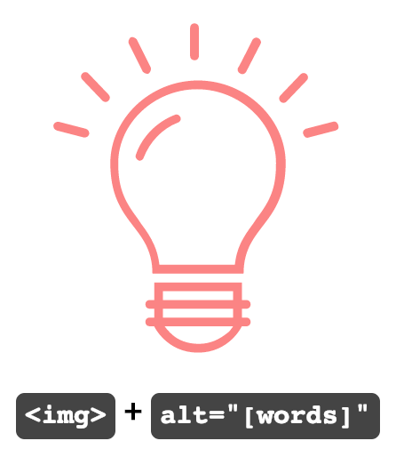

<h4>Code:</h4>
<code>&#60;img class="lightbulb" alt="Lightbulb moment!" src="https://upload.wikimedia.org/wikipedia/commons/2/2b/BulbIcon.svg"></code>

<h3>SVG pattern 2</h3>

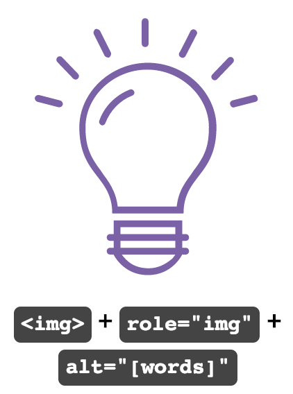

<h4>Code:</h4>
<code>&#60;img class="lightbulb" role="img" src="https://upload.wikimedia.org/wikipedia/commons/2/2b/BulbIcon.svg" alt="Lightbulb moment!" /></code>

<h3>SVG pattern 3</h3>

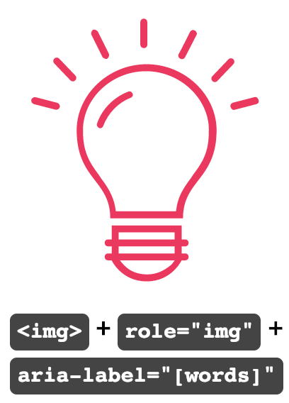

<h4>Code:</h4>
<code>&#60;img class="lightbulb" role="img" src="https://upload.wikimedia.org/wikipedia/commons/2/2b/BulbIcon.svg" aria-label="Lightbulb moment!" /></code>

<h3>SVG pattern 4</h3>

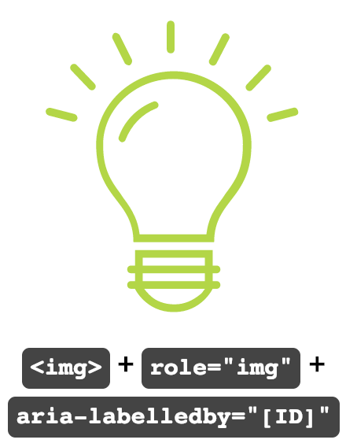

<h4>Code:</h4>
<code>&#60;p id="caption1" class="visually-hidden">Lightbulb moment!

&#60;img class="lightbulb" role="img" src="https://upload.wikimedia.org/wikipedia/commons/2/2b/BulbIcon.svg" aria-labelledby="caption1" /></code>

<table id="results"><caption><h3>Results for SVG Patterns using <code>&lt;img&gt;</code></h3></caption><thead><tr><th scope="col">Screen Reader + Browser</th><th scope="col">Pattern 1</th><th scope="col">Pattern 2</th><th scope="col">Pattern 3</th><th scope="col">Pattern 4</th></tr></thead><tbody><tr><th scope="row">Mac: Safari + VoiceOver  (v 12.0.2)</th><td>Lightbulb Moment! (group)</td><td>Lightbulb Moment! (image)</td><td>Lightbulb Moment! (image)</td><td>Lightbulb Moment! Lightbulb Moment! (image)</td></tr><tr><th scope="row">Windows: Firefox + NVDA  (FF v63.0.1 + NVDA v2018.4)</th><td>(graphic) Lightbulb moment!</td><td>(graphic) Lightbulb moment!</td><td>(graphic) Lightbulb moment!</td><td>Lightbulb moment! (graphic) Lightbulb moment!</td></tr><tr><th scope="row">Windows: Chrome + NVDA  (Chrome v71.0 + NVDA v2018.1.1)</th><td>(graphic) Lightbulb moment!</td><td>(graphic) Lightbulb moment!</td><td>(graphic) Lightbulb moment!</td><td>Lightbulb moment! (graphic) Lightbulb moment!</td></tr><tr><th scope="row">Windows: Edge + Narrator  (v42.17134)</th><td>(image) Lightbulb moment!</td><td>(image) Lightbulb moment!</td><td>(image) Lightbulb moment!</td><td>Lightbulb moment! (image) Lightbulb moment!</td></tr><tr><th scope="row">Windows: IE11 + JAWS  (IE 11 v11.111 + JAWS Prof 2018)</th><td>(graphic) Lightbulb moment!</td><td>(graphic) Lightbulb moment!</td><td>(graphic) Lightbulb moment!</td><td>Lightbulb moment! (graphic) Lightbulb moment!</td></tr><tr><th scope="row">Mobile (iOS): Safari + VoiceOver  (v12.1.2)</th><td><em>Not focusable</em></td><td>Lightbulb Moment! (image)</td><td>Lightbulb Moment! (image)</td><td>Lightbulb Moment! Lightbulb Moment! (image)</td></tr><tr><th scope="row">Mobile (Android): Chrome + TalkBack  (Google Pixel 2 + Android v9)</th><td>Lightbulb moment! (graphic)</td><td>Lightbulb moment! (graphic)</td><td>Lightbulb moment! (graphic)</td><td>Lightbulb moment! Lightbulb moment! (graphic)</td></tr><tr><th scope="row">Mobile (Android): Firefox + TalkBack  (Google Pixel 2 + Android v9)</th><td>Lightbulb moment! (graphic)</td><td>Lightbulb moment! (graphic)</td><td>Lightbulb moment! (graphic)</td><td>Lightbulb moment! (graphic)</td></tr></tbody></table>

<h2>Using the &lt;svg&gt; Tag</h2>
For more complex or essential SVGs, you should consider adding the SVG as markup into the HTML. Although adding the SVG into the markup makes the page potentially heavier and slower, you have more options with JavaScript and CSS to manipulate the styles and animations of the images.

<h3>SVG Pattern 5</h3>

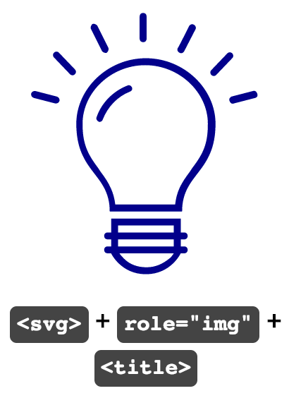

<h4>Code:</h4>
<code>&#60;svg role="img" version="1.1" xmlns="http://www.w3.org/2000/svg" xmlns:xlink="http://www.w3.org/1999/xlink" x="0px" y="0px" viewBox="0 0 48 48" style="enable-background:new 0 0 48 48;" xml:space="preserve">
      &#60;title>Lightbulb moment!</title>
&#60;path d="M19,39v-1h-0.5c-0.3,0-0.5-0.2-0.5-0.5s0.2-0.5,0.5-0.5H19v-2h10v2h0.5c0.3,0,0.5,0.2,0.5,0.5S29.8,38,29.5,38H29v1h0.5
    c0.3,0,0.5,0.2,0.5,0.5S29.8,40,29.5,40H29c0,0-1.4,3-5,3s-5-3-5-3h-0.5c-0.3,0-0.5-0.2-0.5-0.5s0.2-0.5,0.5-0.5H19z M20,39h8v-1h-8
    V39z M20.2,40c0.2,0.3,0.4,0.5,0.7,0.8c0.8,0.8,1.9,1.2,3.2,1.2s2.3-0.5,3.2-1.2c0.3-0.2,0.5-0.5,0.7-0.8H20.2L20.2,40z M20,37h8v-1
    h-8V37z M16.1,7.8c-0.1-0.2,0-0.5,0.2-0.7c0.2-0.1,0.5,0,0.7,0.2l1.6,3.2c0.1,0.2,0,0.5-0.2,0.7c-0.2,0.1-0.5,0-0.7-0.2
    C17.7,11,16.1,7.8,16.1,7.8z M30.2,7.4c0.1-0.2,0.4-0.4,0.7-0.2c0.2,0.1,0.4,0.4,0.2,0.7L29.5,11c-0.1,0.2-0.4,0.4-0.7,0.2
    c-0.2-0.1-0.4-0.4-0.2-0.7C28.6,10.6,30.2,7.4,30.2,7.4z M23.1,6c0-0.3,0.2-0.5,0.5-0.5s0.5,0.2,0.5,0.5v3.2c0,0.3-0.2,0.5-0.5,0.5
    s-0.5-0.2-0.5-0.5V6z M10.8,11.9c-0.2-0.2-0.2-0.5,0-0.7c0.2-0.2,0.5-0.2,0.7,0l2.3,2.4c0.2,0.2,0.2,0.5,0,0.7
    c-0.2,0.2-0.5,0.2-0.7,0C13.1,14.3,10.8,11.9,10.8,11.9z M7.9,17.7c-0.3-0.1-0.4-0.3-0.4-0.6c0.1-0.3,0.3-0.4,0.6-0.4c0,0,0,0,0,0
    l3.1,0.8c0.3,0.1,0.4,0.3,0.4,0.6c-0.1,0.3-0.3,0.4-0.6,0.4c0,0,0,0,0,0C11,18.5,7.9,17.7,7.9,17.7z M39.7,17.7l-3.1,0.8
    c-0.3,0.1-0.5-0.1-0.6-0.4c-0.1-0.3,0.1-0.5,0.3-0.6l3.1-0.8c0.3-0.1,0.5,0.1,0.6,0.4C40.1,17.4,40,17.6,39.7,17.7z M35.7,11.3
    c0.2-0.2,0.5-0.2,0.7,0c0.2,0.2,0.2,0.5,0,0.7c0,0,0,0,0,0l-2.3,2.4c-0.2,0.2-0.5,0.2-0.7,0c-0.2-0.2-0.2-0.5,0-0.7c0,0,0,0,0,0
    L35.7,11.3z M18.8,34c0-5.5-4.8-5.5-4.8-12.6c0-5,4.5-9.4,10-9.4s10,4.4,10,9.4c0,7.1-4.8,7.1-4.8,12.6H18.8z M28.2,33
    c0.2-1.8,0.8-3,2.1-4.7l0.4-0.6c1.6-2.1,2.2-3.5,2.2-6.3c0-4.5-4.1-8.4-9-8.4s-9,3.9-9,8.4c0,2.7,0.6,4.2,2.2,6.3l0.4,0.6
    c1.3,1.7,1.9,3,2.1,4.7C19.8,33,28.2,33,28.2,33z M21.4,15.9c0.3-0.1,0.5,0.1,0.6,0.3c0.1,0.2,0,0.5-0.3,0.6c-1.8,0.7-3.2,2.2-3.9,4
    c-0.1,0.3-0.4,0.4-0.6,0.3c-0.2-0.1-0.4-0.4-0.3-0.6C17.6,18.4,19.3,16.7,21.4,15.9z"/>
</svg>
 </code>

<h3>SVG pattern 6</h3>

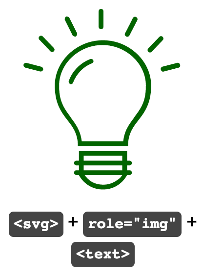

<h4>Code:</h4>
<code>&#60;svg role="img" version="1.1" xmlns="http://www.w3.org/2000/svg" xmlns:xlink="http://www.w3.org/1999/xlink" x="0px" y="0px" viewBox="0 0 48 48" style="enable-background:new 0 0 48 48;" xml:space="preserve">
      &#60;text>Lightbulb moment!</text>
&#60;path d="M19,39v-1h-0.5c-0.3,0-0.5-0.2-0.5-0.5s0.2-0.5,0.5-0.5H19v-2h10v2h0.5c0.3,0,0.5,0.2,0.5,0.5S29.8,38,29.5,38H29v1h0.5
    c0.3,0,0.5,0.2,0.5,0.5S29.8,40,29.5,40H29c0,0-1.4,3-5,3s-5-3-5-3h-0.5c-0.3,0-0.5-0.2-0.5-0.5s0.2-0.5,0.5-0.5H19z M20,39h8v-1h-8
    V39z M20.2,40c0.2,0.3,0.4,0.5,0.7,0.8c0.8,0.8,1.9,1.2,3.2,1.2s2.3-0.5,3.2-1.2c0.3-0.2,0.5-0.5,0.7-0.8H20.2L20.2,40z M20,37h8v-1
    h-8V37z M16.1,7.8c-0.1-0.2,0-0.5,0.2-0.7c0.2-0.1,0.5,0,0.7,0.2l1.6,3.2c0.1,0.2,0,0.5-0.2,0.7c-0.2,0.1-0.5,0-0.7-0.2
    C17.7,11,16.1,7.8,16.1,7.8z M30.2,7.4c0.1-0.2,0.4-0.4,0.7-0.2c0.2,0.1,0.4,0.4,0.2,0.7L29.5,11c-0.1,0.2-0.4,0.4-0.7,0.2
    c-0.2-0.1-0.4-0.4-0.2-0.7C28.6,10.6,30.2,7.4,30.2,7.4z M23.1,6c0-0.3,0.2-0.5,0.5-0.5s0.5,0.2,0.5,0.5v3.2c0,0.3-0.2,0.5-0.5,0.5
    s-0.5-0.2-0.5-0.5V6z M10.8,11.9c-0.2-0.2-0.2-0.5,0-0.7c0.2-0.2,0.5-0.2,0.7,0l2.3,2.4c0.2,0.2,0.2,0.5,0,0.7
    c-0.2,0.2-0.5,0.2-0.7,0C13.1,14.3,10.8,11.9,10.8,11.9z M7.9,17.7c-0.3-0.1-0.4-0.3-0.4-0.6c0.1-0.3,0.3-0.4,0.6-0.4c0,0,0,0,0,0
    l3.1,0.8c0.3,0.1,0.4,0.3,0.4,0.6c-0.1,0.3-0.3,0.4-0.6,0.4c0,0,0,0,0,0C11,18.5,7.9,17.7,7.9,17.7z M39.7,17.7l-3.1,0.8
    c-0.3,0.1-0.5-0.1-0.6-0.4c-0.1-0.3,0.1-0.5,0.3-0.6l3.1-0.8c0.3-0.1,0.5,0.1,0.6,0.4C40.1,17.4,40,17.6,39.7,17.7z M35.7,11.3
    c0.2-0.2,0.5-0.2,0.7,0c0.2,0.2,0.2,0.5,0,0.7c0,0,0,0,0,0l-2.3,2.4c-0.2,0.2-0.5,0.2-0.7,0c-0.2-0.2-0.2-0.5,0-0.7c0,0,0,0,0,0
    L35.7,11.3z M18.8,34c0-5.5-4.8-5.5-4.8-12.6c0-5,4.5-9.4,10-9.4s10,4.4,10,9.4c0,7.1-4.8,7.1-4.8,12.6H18.8z M28.2,33
    c0.2-1.8,0.8-3,2.1-4.7l0.4-0.6c1.6-2.1,2.2-3.5,2.2-6.3c0-4.5-4.1-8.4-9-8.4s-9,3.9-9,8.4c0,2.7,0.6,4.2,2.2,6.3l0.4,0.6
    c1.3,1.7,1.9,3,2.1,4.7C19.8,33,28.2,33,28.2,33z M21.4,15.9c0.3-0.1,0.5,0.1,0.6,0.3c0.1,0.2,0,0.5-0.3,0.6c-1.8,0.7-3.2,2.2-3.9,4
    c-0.1,0.3-0.4,0.4-0.6,0.3c-0.2-0.1-0.4-0.4-0.3-0.6C17.6,18.4,19.3,16.7,21.4,15.9z"/>
</svg></code>

<h3>SVG pattern 7</h3>

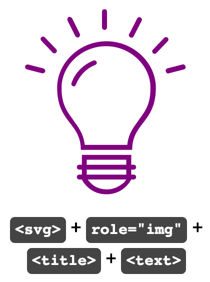

<h4>Code:</h4>
<code>&#60;svg role="img" version="1.1" xmlns="http://www.w3.org/2000/svg" xmlns:xlink="http://www.w3.org/1999/xlink" x="0px" y="0px" viewBox="0 0 48 48" style="enable-background:new 0 0 48 48;" xml:space="preserve">
      &#60;title>Lightbulb moment!</title>
      &#60;text class="visually-hidden" font-size="0">I have a great idea.</text>
&#60;path d="M19,39v-1h-0.5c-0.3,0-0.5-0.2-0.5-0.5s0.2-0.5,0.5-0.5H19v-2h10v2h0.5c0.3,0,0.5,0.2,0.5,0.5S29.8,38,29.5,38H29v1h0.5
    c0.3,0,0.5,0.2,0.5,0.5S29.8,40,29.5,40H29c0,0-1.4,3-5,3s-5-3-5-3h-0.5c-0.3,0-0.5-0.2-0.5-0.5s0.2-0.5,0.5-0.5H19z M20,39h8v-1h-8
    V39z M20.2,40c0.2,0.3,0.4,0.5,0.7,0.8c0.8,0.8,1.9,1.2,3.2,1.2s2.3-0.5,3.2-1.2c0.3-0.2,0.5-0.5,0.7-0.8H20.2L20.2,40z M20,37h8v-1
    h-8V37z M16.1,7.8c-0.1-0.2,0-0.5,0.2-0.7c0.2-0.1,0.5,0,0.7,0.2l1.6,3.2c0.1,0.2,0,0.5-0.2,0.7c-0.2,0.1-0.5,0-0.7-0.2
    C17.7,11,16.1,7.8,16.1,7.8z M30.2,7.4c0.1-0.2,0.4-0.4,0.7-0.2c0.2,0.1,0.4,0.4,0.2,0.7L29.5,11c-0.1,0.2-0.4,0.4-0.7,0.2
    c-0.2-0.1-0.4-0.4-0.2-0.7C28.6,10.6,30.2,7.4,30.2,7.4z M23.1,6c0-0.3,0.2-0.5,0.5-0.5s0.5,0.2,0.5,0.5v3.2c0,0.3-0.2,0.5-0.5,0.5
    s-0.5-0.2-0.5-0.5V6z M10.8,11.9c-0.2-0.2-0.2-0.5,0-0.7c0.2-0.2,0.5-0.2,0.7,0l2.3,2.4c0.2,0.2,0.2,0.5,0,0.7
    c-0.2,0.2-0.5,0.2-0.7,0C13.1,14.3,10.8,11.9,10.8,11.9z M7.9,17.7c-0.3-0.1-0.4-0.3-0.4-0.6c0.1-0.3,0.3-0.4,0.6-0.4c0,0,0,0,0,0
    l3.1,0.8c0.3,0.1,0.4,0.3,0.4,0.6c-0.1,0.3-0.3,0.4-0.6,0.4c0,0,0,0,0,0C11,18.5,7.9,17.7,7.9,17.7z M39.7,17.7l-3.1,0.8
    c-0.3,0.1-0.5-0.1-0.6-0.4c-0.1-0.3,0.1-0.5,0.3-0.6l3.1-0.8c0.3-0.1,0.5,0.1,0.6,0.4C40.1,17.4,40,17.6,39.7,17.7z M35.7,11.3
    c0.2-0.2,0.5-0.2,0.7,0c0.2,0.2,0.2,0.5,0,0.7c0,0,0,0,0,0l-2.3,2.4c-0.2,0.2-0.5,0.2-0.7,0c-0.2-0.2-0.2-0.5,0-0.7c0,0,0,0,0,0
    L35.7,11.3z M18.8,34c0-5.5-4.8-5.5-4.8-12.6c0-5,4.5-9.4,10-9.4s10,4.4,10,9.4c0,7.1-4.8,7.1-4.8,12.6H18.8z M28.2,33
    c0.2-1.8,0.8-3,2.1-4.7l0.4-0.6c1.6-2.1,2.2-3.5,2.2-6.3c0-4.5-4.1-8.4-9-8.4s-9,3.9-9,8.4c0,2.7,0.6,4.2,2.2,6.3l0.4,0.6
    c1.3,1.7,1.9,3,2.1,4.7C19.8,33,28.2,33,28.2,33z M21.4,15.9c0.3-0.1,0.5,0.1,0.6,0.3c0.1,0.2,0,0.5-0.3,0.6c-1.8,0.7-3.2,2.2-3.9,4
    c-0.1,0.3-0.4,0.4-0.6,0.3c-0.2-0.1-0.4-0.4-0.3-0.6C17.6,18.4,19.3,16.7,21.4,15.9z"/>
</svg></code>

<h3>SVG pattern 8</h3>

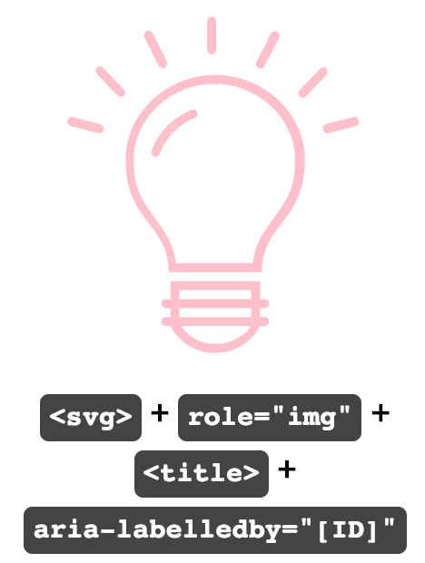

<h4>Code:</h4>
<code>&#60;svg role="img" aria-labelledby="lightbulb8" version="1.1" xmlns="http://www.w3.org/2000/svg" xmlns:xlink="http://www.w3.org/1999/xlink" x="0px" y="0px" viewBox="0 0 48 48" style="enable-background:new 0 0 48 48;" xml:space="preserve">
      &#60;title id="lightbulb8">Lightbulb moment!</title>
&#60;path d="M19,39v-1h-0.5c-0.3,0-0.5-0.2-0.5-0.5s0.2-0.5,0.5-0.5H19v-2h10v2h0.5c0.3,0,0.5,0.2,0.5,0.5S29.8,38,29.5,38H29v1h0.5
    c0.3,0,0.5,0.2,0.5,0.5S29.8,40,29.5,40H29c0,0-1.4,3-5,3s-5-3-5-3h-0.5c-0.3,0-0.5-0.2-0.5-0.5s0.2-0.5,0.5-0.5H19z M20,39h8v-1h-8
    V39z M20.2,40c0.2,0.3,0.4,0.5,0.7,0.8c0.8,0.8,1.9,1.2,3.2,1.2s2.3-0.5,3.2-1.2c0.3-0.2,0.5-0.5,0.7-0.8H20.2L20.2,40z M20,37h8v-1
    h-8V37z M16.1,7.8c-0.1-0.2,0-0.5,0.2-0.7c0.2-0.1,0.5,0,0.7,0.2l1.6,3.2c0.1,0.2,0,0.5-0.2,0.7c-0.2,0.1-0.5,0-0.7-0.2
    C17.7,11,16.1,7.8,16.1,7.8z M30.2,7.4c0.1-0.2,0.4-0.4,0.7-0.2c0.2,0.1,0.4,0.4,0.2,0.7L29.5,11c-0.1,0.2-0.4,0.4-0.7,0.2
    c-0.2-0.1-0.4-0.4-0.2-0.7C28.6,10.6,30.2,7.4,30.2,7.4z M23.1,6c0-0.3,0.2-0.5,0.5-0.5s0.5,0.2,0.5,0.5v3.2c0,0.3-0.2,0.5-0.5,0.5
    s-0.5-0.2-0.5-0.5V6z M10.8,11.9c-0.2-0.2-0.2-0.5,0-0.7c0.2-0.2,0.5-0.2,0.7,0l2.3,2.4c0.2,0.2,0.2,0.5,0,0.7
    c-0.2,0.2-0.5,0.2-0.7,0C13.1,14.3,10.8,11.9,10.8,11.9z M7.9,17.7c-0.3-0.1-0.4-0.3-0.4-0.6c0.1-0.3,0.3-0.4,0.6-0.4c0,0,0,0,0,0
    l3.1,0.8c0.3,0.1,0.4,0.3,0.4,0.6c-0.1,0.3-0.3,0.4-0.6,0.4c0,0,0,0,0,0C11,18.5,7.9,17.7,7.9,17.7z M39.7,17.7l-3.1,0.8
    c-0.3,0.1-0.5-0.1-0.6-0.4c-0.1-0.3,0.1-0.5,0.3-0.6l3.1-0.8c0.3-0.1,0.5,0.1,0.6,0.4C40.1,17.4,40,17.6,39.7,17.7z M35.7,11.3
    c0.2-0.2,0.5-0.2,0.7,0c0.2,0.2,0.2,0.5,0,0.7c0,0,0,0,0,0l-2.3,2.4c-0.2,0.2-0.5,0.2-0.7,0c-0.2-0.2-0.2-0.5,0-0.7c0,0,0,0,0,0
    L35.7,11.3z M18.8,34c0-5.5-4.8-5.5-4.8-12.6c0-5,4.5-9.4,10-9.4s10,4.4,10,9.4c0,7.1-4.8,7.1-4.8,12.6H18.8z M28.2,33
    c0.2-1.8,0.8-3,2.1-4.7l0.4-0.6c1.6-2.1,2.2-3.5,2.2-6.3c0-4.5-4.1-8.4-9-8.4s-9,3.9-9,8.4c0,2.7,0.6,4.2,2.2,6.3l0.4,0.6
    c1.3,1.7,1.9,3,2.1,4.7C19.8,33,28.2,33,28.2,33z M21.4,15.9c0.3-0.1,0.5,0.1,0.6,0.3c0.1,0.2,0,0.5-0.3,0.6c-1.8,0.7-3.2,2.2-3.9,4
    c-0.1,0.3-0.4,0.4-0.6,0.3c-0.2-0.1-0.4-0.4-0.3-0.6C17.6,18.4,19.3,16.7,21.4,15.9z"/>
</svg></code>

<table id="results2"><caption><h3>Results for SVG Patterns using <code>&lt;svg&gt;</code></h3></caption><thead><tr><th scope="col">Screen Reader + Browser</th><th scope="col">Pattern 5</th><th scope="col">Pattern 6</th><th scope="col">Pattern 7</th><th scope="col">Pattern 8</th></tr></thead><tbody><tr><th scope="row">Mac: Safari + VoiceOver (v 12.0.2)</th><td>Lightbulb Moment! (image)</td><td>Lightbulb Moment!</td><td>I have a great idea.

&lt;<em>title&gt; ignored</em>
</td><td>Lightbulb Moment! (image)</td></tr><tr><th scope="row">Windows: Firefox + NVDA (FF v63.0.1 + NVDA v2018.4)</th><td>Lightbulb moment! (graphic) Lightbulb moment!</td><td><em>Not focusable</em></td><td>Lightbulb moment! (graphic) Lightbulb moment!

&lt;<em>text&gt; ignored</em>
</td><td>Lightbulb moment! (graphic) Lightbulb moment!</td></tr><tr><th scope="row">Windows: Chrome + NVDA (Chrome v71.0 + NVDA v2018.1.1)</th><td>(graphic) Lightbulb moment!</td><td><em>Not focusable</em></td><td>(graphic) Lightbulb moment!

&lt;<em>text&gt; ignored</em>
</td><td>(graphic) Lightbulb moment!</td></tr><tr><th scope="row">Windows: Edge + Narrator (v42.17134)</th><td>(image) Lightbulb moment!</td><td>(image) Lightbulb moment!</td><td>(image) Lightbulb moment! I have a great idea.</td><td>(image) Lightbulb moment!</td></tr><tr><th scope="row">Windows: IE11 + JAWS (IE 11 v11.111 + JAWS Prof 2018)</th><td>(graphic) Lightbulb moment!</td><td>(graphic) Lightbulb moment!</td><td>(graphic) Lightbulb moment! (graphic) I have a great idea.</td><td>(graphic) Lightbulb moment!</td></tr><tr><th scope="row">Mobile (iOS): Safari + VoiceOver (v12.1.2)</th><td>Lightbulb Moment! (image)</td><td>(image)</td><td>Lightbulb Moment! (image)

&lt;<em>text&gt; ignored</em>
</td><td>Lightbulb Moment! (image)</td></tr><tr><th scope="row">Mobile (Android): Chrome + TalkBack (Google Pixel 2 + Android v9)</th><td>Lightbulb moment! (graphic)</td><td><em>Not focusable</em></td><td>Lightbulb moment! (graphic)

&lt;<em>text&gt; ignored</em>
</td><td>Lightbulb moment! (graphic)</td></tr><tr><th scope="row">Mobile (Android): Firefox + TalkBack (Google Pixel 2 + Android v9)</th><td>Lightbulb moment! (graphic) (graphic)</td><td>(graphic) Lightbulb moment! (graphic)</td><td>Lightbulb moment! (graphic) I have a great idea. (graphic)</td><td>Lightbulb moment! (graphic) (graphic)</td></tr></tbody></table>

<h3>SVG Pattern 9</h3>

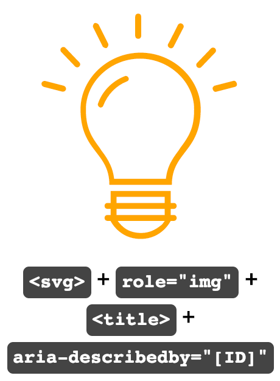

<h4>Code:</h4>
<code>&#60;svg role="img" aria-describedby="lightbulb9" version="1.1" xmlns="http://www.w3.org/2000/svg" xmlns:xlink="http://www.w3.org/1999/xlink" x="0px" y="0px" viewBox="0 0 48 48" style="enable-background:new 0 0 48 48;" xml:space="preserve">
      &#60;title id="lightbulb9">Lightbulb moment!</title>
&#60;path d="M19,39v-1h-0.5c-0.3,0-0.5-0.2-0.5-0.5s0.2-0.5,0.5-0.5H19v-2h10v2h0.5c0.3,0,0.5,0.2,0.5,0.5S29.8,38,29.5,38H29v1h0.5
    c0.3,0,0.5,0.2,0.5,0.5S29.8,40,29.5,40H29c0,0-1.4,3-5,3s-5-3-5-3h-0.5c-0.3,0-0.5-0.2-0.5-0.5s0.2-0.5,0.5-0.5H19z M20,39h8v-1h-8
    V39z M20.2,40c0.2,0.3,0.4,0.5,0.7,0.8c0.8,0.8,1.9,1.2,3.2,1.2s2.3-0.5,3.2-1.2c0.3-0.2,0.5-0.5,0.7-0.8H20.2L20.2,40z M20,37h8v-1
    h-8V37z M16.1,7.8c-0.1-0.2,0-0.5,0.2-0.7c0.2-0.1,0.5,0,0.7,0.2l1.6,3.2c0.1,0.2,0,0.5-0.2,0.7c-0.2,0.1-0.5,0-0.7-0.2
    C17.7,11,16.1,7.8,16.1,7.8z M30.2,7.4c0.1-0.2,0.4-0.4,0.7-0.2c0.2,0.1,0.4,0.4,0.2,0.7L29.5,11c-0.1,0.2-0.4,0.4-0.7,0.2
    c-0.2-0.1-0.4-0.4-0.2-0.7C28.6,10.6,30.2,7.4,30.2,7.4z M23.1,6c0-0.3,0.2-0.5,0.5-0.5s0.5,0.2,0.5,0.5v3.2c0,0.3-0.2,0.5-0.5,0.5
    s-0.5-0.2-0.5-0.5V6z M10.8,11.9c-0.2-0.2-0.2-0.5,0-0.7c0.2-0.2,0.5-0.2,0.7,0l2.3,2.4c0.2,0.2,0.2,0.5,0,0.7
    c-0.2,0.2-0.5,0.2-0.7,0C13.1,14.3,10.8,11.9,10.8,11.9z M7.9,17.7c-0.3-0.1-0.4-0.3-0.4-0.6c0.1-0.3,0.3-0.4,0.6-0.4c0,0,0,0,0,0
    l3.1,0.8c0.3,0.1,0.4,0.3,0.4,0.6c-0.1,0.3-0.3,0.4-0.6,0.4c0,0,0,0,0,0C11,18.5,7.9,17.7,7.9,17.7z M39.7,17.7l-3.1,0.8
    c-0.3,0.1-0.5-0.1-0.6-0.4c-0.1-0.3,0.1-0.5,0.3-0.6l3.1-0.8c0.3-0.1,0.5,0.1,0.6,0.4C40.1,17.4,40,17.6,39.7,17.7z M35.7,11.3
    c0.2-0.2,0.5-0.2,0.7,0c0.2,0.2,0.2,0.5,0,0.7c0,0,0,0,0,0l-2.3,2.4c-0.2,0.2-0.5,0.2-0.7,0c-0.2-0.2-0.2-0.5,0-0.7c0,0,0,0,0,0
    L35.7,11.3z M18.8,34c0-5.5-4.8-5.5-4.8-12.6c0-5,4.5-9.4,10-9.4s10,4.4,10,9.4c0,7.1-4.8,7.1-4.8,12.6H18.8z M28.2,33
    c0.2-1.8,0.8-3,2.1-4.7l0.4-0.6c1.6-2.1,2.2-3.5,2.2-6.3c0-4.5-4.1-8.4-9-8.4s-9,3.9-9,8.4c0,2.7,0.6,4.2,2.2,6.3l0.4,0.6
    c1.3,1.7,1.9,3,2.1,4.7C19.8,33,28.2,33,28.2,33z M21.4,15.9c0.3-0.1,0.5,0.1,0.6,0.3c0.1,0.2,0,0.5-0.3,0.6c-1.8,0.7-3.2,2.2-3.9,4
    c-0.1,0.3-0.4,0.4-0.6,0.3c-0.2-0.1-0.4-0.4-0.3-0.6C17.6,18.4,19.3,16.7,21.4,15.9z"/>
</svg>
 
 </code>

<h3>SVG pattern 10</h3>

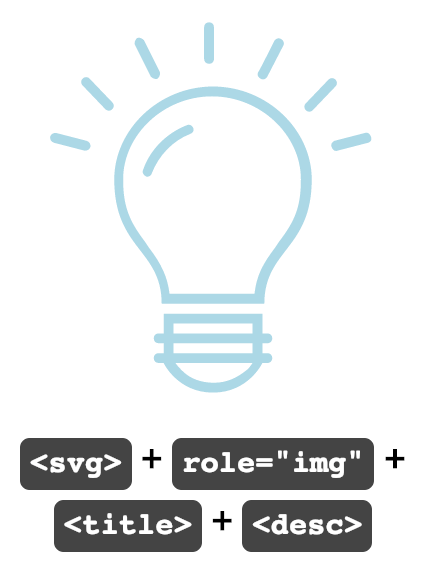

<h4>Code:</h4>
<code>&#60;svg role="img" version="1.1" xmlns="http://www.w3.org/2000/svg" xmlns:xlink="http://www.w3.org/1999/xlink" x="0px" y="0px" viewBox="0 0 48 48" style="enable-background:new 0 0 48 48;" xml:space="preserve">
      &#60;title>Lightbulb moment!</title>
      &#60;desc>I have a great idea.</desc>
&#60;path d="M19,39v-1h-0.5c-0.3,0-0.5-0.2-0.5-0.5s0.2-0.5,0.5-0.5H19v-2h10v2h0.5c0.3,0,0.5,0.2,0.5,0.5S29.8,38,29.5,38H29v1h0.5
    c0.3,0,0.5,0.2,0.5,0.5S29.8,40,29.5,40H29c0,0-1.4,3-5,3s-5-3-5-3h-0.5c-0.3,0-0.5-0.2-0.5-0.5s0.2-0.5,0.5-0.5H19z M20,39h8v-1h-8
    V39z M20.2,40c0.2,0.3,0.4,0.5,0.7,0.8c0.8,0.8,1.9,1.2,3.2,1.2s2.3-0.5,3.2-1.2c0.3-0.2,0.5-0.5,0.7-0.8H20.2L20.2,40z M20,37h8v-1
    h-8V37z M16.1,7.8c-0.1-0.2,0-0.5,0.2-0.7c0.2-0.1,0.5,0,0.7,0.2l1.6,3.2c0.1,0.2,0,0.5-0.2,0.7c-0.2,0.1-0.5,0-0.7-0.2
    C17.7,11,16.1,7.8,16.1,7.8z M30.2,7.4c0.1-0.2,0.4-0.4,0.7-0.2c0.2,0.1,0.4,0.4,0.2,0.7L29.5,11c-0.1,0.2-0.4,0.4-0.7,0.2
    c-0.2-0.1-0.4-0.4-0.2-0.7C28.6,10.6,30.2,7.4,30.2,7.4z M23.1,6c0-0.3,0.2-0.5,0.5-0.5s0.5,0.2,0.5,0.5v3.2c0,0.3-0.2,0.5-0.5,0.5
    s-0.5-0.2-0.5-0.5V6z M10.8,11.9c-0.2-0.2-0.2-0.5,0-0.7c0.2-0.2,0.5-0.2,0.7,0l2.3,2.4c0.2,0.2,0.2,0.5,0,0.7
    c-0.2,0.2-0.5,0.2-0.7,0C13.1,14.3,10.8,11.9,10.8,11.9z M7.9,17.7c-0.3-0.1-0.4-0.3-0.4-0.6c0.1-0.3,0.3-0.4,0.6-0.4c0,0,0,0,0,0
    l3.1,0.8c0.3,0.1,0.4,0.3,0.4,0.6c-0.1,0.3-0.3,0.4-0.6,0.4c0,0,0,0,0,0C11,18.5,7.9,17.7,7.9,17.7z M39.7,17.7l-3.1,0.8
    c-0.3,0.1-0.5-0.1-0.6-0.4c-0.1-0.3,0.1-0.5,0.3-0.6l3.1-0.8c0.3-0.1,0.5,0.1,0.6,0.4C40.1,17.4,40,17.6,39.7,17.7z M35.7,11.3
    c0.2-0.2,0.5-0.2,0.7,0c0.2,0.2,0.2,0.5,0,0.7c0,0,0,0,0,0l-2.3,2.4c-0.2,0.2-0.5,0.2-0.7,0c-0.2-0.2-0.2-0.5,0-0.7c0,0,0,0,0,0
    L35.7,11.3z M18.8,34c0-5.5-4.8-5.5-4.8-12.6c0-5,4.5-9.4,10-9.4s10,4.4,10,9.4c0,7.1-4.8,7.1-4.8,12.6H18.8z M28.2,33
    c0.2-1.8,0.8-3,2.1-4.7l0.4-0.6c1.6-2.1,2.2-3.5,2.2-6.3c0-4.5-4.1-8.4-9-8.4s-9,3.9-9,8.4c0,2.7,0.6,4.2,2.2,6.3l0.4,0.6
    c1.3,1.7,1.9,3,2.1,4.7C19.8,33,28.2,33,28.2,33z M21.4,15.9c0.3-0.1,0.5,0.1,0.6,0.3c0.1,0.2,0,0.5-0.3,0.6c-1.8,0.7-3.2,2.2-3.9,4
    c-0.1,0.3-0.4,0.4-0.6,0.3c-0.2-0.1-0.4-0.4-0.3-0.6C17.6,18.4,19.3,16.7,21.4,15.9z"/>
</svg>
 </code>

<h3>SVG pattern 11</h3>

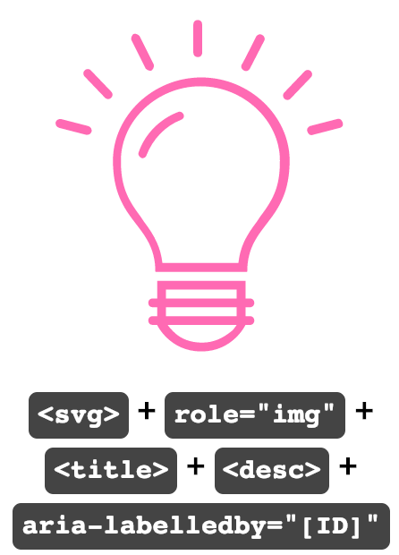

<h4>Code:</h4>
<code>&#60;svg role="img" aria-labelledby="lightbulb11 description11" version="1.1" class="hotpink" xmlns="http://www.w3.org/2000/svg" xmlns:xlink="http://www.w3.org/1999/xlink" x="0px" y="0px" viewBox="0 0 48 48" style="enable-background:new 0 0 48 48;" xml:space="preserve">
      &#60;title id="lightbulb11">Lightbulb moment!</title>
      &#60;desc id="description11">I have a great idea.</desc>
&#60;path d="M19,39v-1h-0.5c-0.3,0-0.5-0.2-0.5-0.5s0.2-0.5,0.5-0.5H19v-2h10v2h0.5c0.3,0,0.5,0.2,0.5,0.5S29.8,38,29.5,38H29v1h0.5
    c0.3,0,0.5,0.2,0.5,0.5S29.8,40,29.5,40H29c0,0-1.4,3-5,3s-5-3-5-3h-0.5c-0.3,0-0.5-0.2-0.5-0.5s0.2-0.5,0.5-0.5H19z M20,39h8v-1h-8
    V39z M20.2,40c0.2,0.3,0.4,0.5,0.7,0.8c0.8,0.8,1.9,1.2,3.2,1.2s2.3-0.5,3.2-1.2c0.3-0.2,0.5-0.5,0.7-0.8H20.2L20.2,40z M20,37h8v-1
    h-8V37z M16.1,7.8c-0.1-0.2,0-0.5,0.2-0.7c0.2-0.1,0.5,0,0.7,0.2l1.6,3.2c0.1,0.2,0,0.5-0.2,0.7c-0.2,0.1-0.5,0-0.7-0.2
    C17.7,11,16.1,7.8,16.1,7.8z M30.2,7.4c0.1-0.2,0.4-0.4,0.7-0.2c0.2,0.1,0.4,0.4,0.2,0.7L29.5,11c-0.1,0.2-0.4,0.4-0.7,0.2
    c-0.2-0.1-0.4-0.4-0.2-0.7C28.6,10.6,30.2,7.4,30.2,7.4z M23.1,6c0-0.3,0.2-0.5,0.5-0.5s0.5,0.2,0.5,0.5v3.2c0,0.3-0.2,0.5-0.5,0.5
    s-0.5-0.2-0.5-0.5V6z M10.8,11.9c-0.2-0.2-0.2-0.5,0-0.7c0.2-0.2,0.5-0.2,0.7,0l2.3,2.4c0.2,0.2,0.2,0.5,0,0.7
    c-0.2,0.2-0.5,0.2-0.7,0C13.1,14.3,10.8,11.9,10.8,11.9z M7.9,17.7c-0.3-0.1-0.4-0.3-0.4-0.6c0.1-0.3,0.3-0.4,0.6-0.4c0,0,0,0,0,0
    l3.1,0.8c0.3,0.1,0.4,0.3,0.4,0.6c-0.1,0.3-0.3,0.4-0.6,0.4c0,0,0,0,0,0C11,18.5,7.9,17.7,7.9,17.7z M39.7,17.7l-3.1,0.8
    c-0.3,0.1-0.5-0.1-0.6-0.4c-0.1-0.3,0.1-0.5,0.3-0.6l3.1-0.8c0.3-0.1,0.5,0.1,0.6,0.4C40.1,17.4,40,17.6,39.7,17.7z M35.7,11.3
    c0.2-0.2,0.5-0.2,0.7,0c0.2,0.2,0.2,0.5,0,0.7c0,0,0,0,0,0l-2.3,2.4c-0.2,0.2-0.5,0.2-0.7,0c-0.2-0.2-0.2-0.5,0-0.7c0,0,0,0,0,0
    L35.7,11.3z M18.8,34c0-5.5-4.8-5.5-4.8-12.6c0-5,4.5-9.4,10-9.4s10,4.4,10,9.4c0,7.1-4.8,7.1-4.8,12.6H18.8z M28.2,33
    c0.2-1.8,0.8-3,2.1-4.7l0.4-0.6c1.6-2.1,2.2-3.5,2.2-6.3c0-4.5-4.1-8.4-9-8.4s-9,3.9-9,8.4c0,2.7,0.6,4.2,2.2,6.3l0.4,0.6
    c1.3,1.7,1.9,3,2.1,4.7C19.8,33,28.2,33,28.2,33z M21.4,15.9c0.3-0.1,0.5,0.1,0.6,0.3c0.1,0.2,0,0.5-0.3,0.6c-1.8,0.7-3.2,2.2-3.9,4
    c-0.1,0.3-0.4,0.4-0.6,0.3c-0.2-0.1-0.4-0.4-0.3-0.6C17.6,18.4,19.3,16.7,21.4,15.9z"/>
</svg></code>

<h3>SVG pattern 12</h3>

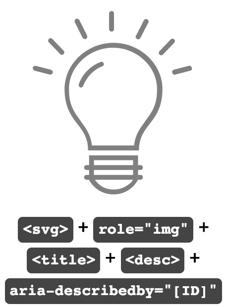

<h4>Code:</h4>
<code>&#60;svg role="img" aria-describedby="lightbulb12 description12" version="1.1" class="ltgray" xmlns="http://www.w3.org/2000/svg" xmlns:xlink="http://www.w3.org/1999/xlink" x="0px" y="0px" viewBox="0 0 48 48" style="enable-background:new 0 0 48 48;" xml:space="preserve">
      &#60;title id="lightbulb12">Lightbulb moment!</title>
      &#60;desc id="description12">I have a great idea.</desc>
&#60;path d="M19,39v-1h-0.5c-0.3,0-0.5-0.2-0.5-0.5s0.2-0.5,0.5-0.5H19v-2h10v2h0.5c0.3,0,0.5,0.2,0.5,0.5S29.8,38,29.5,38H29v1h0.5
    c0.3,0,0.5,0.2,0.5,0.5S29.8,40,29.5,40H29c0,0-1.4,3-5,3s-5-3-5-3h-0.5c-0.3,0-0.5-0.2-0.5-0.5s0.2-0.5,0.5-0.5H19z M20,39h8v-1h-8
    V39z M20.2,40c0.2,0.3,0.4,0.5,0.7,0.8c0.8,0.8,1.9,1.2,3.2,1.2s2.3-0.5,3.2-1.2c0.3-0.2,0.5-0.5,0.7-0.8H20.2L20.2,40z M20,37h8v-1
    h-8V37z M16.1,7.8c-0.1-0.2,0-0.5,0.2-0.7c0.2-0.1,0.5,0,0.7,0.2l1.6,3.2c0.1,0.2,0,0.5-0.2,0.7c-0.2,0.1-0.5,0-0.7-0.2
    C17.7,11,16.1,7.8,16.1,7.8z M30.2,7.4c0.1-0.2,0.4-0.4,0.7-0.2c0.2,0.1,0.4,0.4,0.2,0.7L29.5,11c-0.1,0.2-0.4,0.4-0.7,0.2
    c-0.2-0.1-0.4-0.4-0.2-0.7C28.6,10.6,30.2,7.4,30.2,7.4z M23.1,6c0-0.3,0.2-0.5,0.5-0.5s0.5,0.2,0.5,0.5v3.2c0,0.3-0.2,0.5-0.5,0.5
    s-0.5-0.2-0.5-0.5V6z M10.8,11.9c-0.2-0.2-0.2-0.5,0-0.7c0.2-0.2,0.5-0.2,0.7,0l2.3,2.4c0.2,0.2,0.2,0.5,0,0.7
    c-0.2,0.2-0.5,0.2-0.7,0C13.1,14.3,10.8,11.9,10.8,11.9z M7.9,17.7c-0.3-0.1-0.4-0.3-0.4-0.6c0.1-0.3,0.3-0.4,0.6-0.4c0,0,0,0,0,0
    l3.1,0.8c0.3,0.1,0.4,0.3,0.4,0.6c-0.1,0.3-0.3,0.4-0.6,0.4c0,0,0,0,0,0C11,18.5,7.9,17.7,7.9,17.7z M39.7,17.7l-3.1,0.8
    c-0.3,0.1-0.5-0.1-0.6-0.4c-0.1-0.3,0.1-0.5,0.3-0.6l3.1-0.8c0.3-0.1,0.5,0.1,0.6,0.4C40.1,17.4,40,17.6,39.7,17.7z M35.7,11.3
    c0.2-0.2,0.5-0.2,0.7,0c0.2,0.2,0.2,0.5,0,0.7c0,0,0,0,0,0l-2.3,2.4c-0.2,0.2-0.5,0.2-0.7,0c-0.2-0.2-0.2-0.5,0-0.7c0,0,0,0,0,0
    L35.7,11.3z M18.8,34c0-5.5-4.8-5.5-4.8-12.6c0-5,4.5-9.4,10-9.4s10,4.4,10,9.4c0,7.1-4.8,7.1-4.8,12.6H18.8z M28.2,33
    c0.2-1.8,0.8-3,2.1-4.7l0.4-0.6c1.6-2.1,2.2-3.5,2.2-6.3c0-4.5-4.1-8.4-9-8.4s-9,3.9-9,8.4c0,2.7,0.6,4.2,2.2,6.3l0.4,0.6
    c1.3,1.7,1.9,3,2.1,4.7C19.8,33,28.2,33,28.2,33z M21.4,15.9c0.3-0.1,0.5,0.1,0.6,0.3c0.1,0.2,0,0.5-0.3,0.6c-1.8,0.7-3.2,2.2-3.9,4
    c-0.1,0.3-0.4,0.4-0.6,0.3c-0.2-0.1-0.4-0.4-0.3-0.6C17.6,18.4,19.3,16.7,21.4,15.9z"/>
</svg></code>

<table id="results3"><thead><tr><th scope="col">Screen Reader + Browser</th><th scope="col">Pattern 9</th><th scope="col">Pattern 10</th><th scope="col">Pattern 11</th><th scope="col">Pattern 12</th></tr></thead><tbody><tr><th scope="row">Mac: Safari + VoiceOver (v 12.0.2)</th><td>Lightbulb Moment! (image)</td><td>Lightbulb Moment! (image) I have a great idea.</td><td>Lightbulb Moment! I have a great idea. (image) I have a great idea.</td><td>Lightbulb Moment! (image) Lightbulb Moment! I have a great idea.</td></tr><tr><th scope="row">Windows: Firefox + NVDA (FF v63.0.1 + NVDA v2018.4)</th><td>Lightbulb moment! (graphic) Lightbulb moment!</td><td>Lightbulb moment! (graphic) Lightbulb moment!

&lt;<em>desc&gt; ignored</em>
</td><td>Lightbulb Moment! I have a great idea. (graphic) Lightbulb Moment! I have a great idea.</td><td>Lightbulb moment! (graphic) Lightbulb moment!

&lt;<em>desc&gt; ignored</em>
</td></tr><tr><th scope="row">Windows: Chrome + NVDA (Chrome v71.0 + NVDA v2018.1.1)</th><td>(graphic) Lightbulb moment!</td><td>(graphic) Lightbulb moment!

&lt;<em>desc&gt; ignored</em>
</td><td>(graphic) Lightbulb Moment! I have a great idea.</td><td>(graphic) Lightbulb moment!

&lt;<em>desc&gt; ignored</em>
</td></tr><tr><th scope="row">Windows: Edge + Narrator (v42.17134)</th><td>(image) Lightbulb moment!</td><td>(image) Lightbulb moment!

&lt;<em>desc&gt; ignored</em>
</td><td>(image) Lightbulb moment!

&lt;<em>desc&gt; ignored</em>
</td><td>(image) Lightbulb moment!

&lt;<em>desc&gt; ignored</em>
</td></tr><tr><th scope="row">Windows: IE11 + JAWS (IE 11 v11.111 + JAWS Prof 2018)</th><td>(graphic) Lightbulb moment!</td><td>(graphic) Lightbulb moment! (graphic) I have a great idea.</td><td>(graphic) Lightbulb moment! (graphic) I have a great idea.</td><td>(graphic) Lightbulb moment! (graphic) I have a great idea.</td></tr><tr><th scope="row">Mobile (iOS): Safari + VoiceOver (v12.1.2)</th><td>Lightbulb Moment! (image)</td><td>Lightbulb Moment! (image) I have a great idea.</td><td>Lightbulb Moment! I have a great idea. (image) I have a great idea.</td><td>Lightbulb Moment! (image) Lightbulb Moment! I have a great idea.</td></tr><tr><th scope="row">Mobile (Android): Chrome + TalkBack (Google Pixel 2 + Android v9)</th><td>Lightbulb moment! (graphic) Lightbulb moment!</td><td>Lightbulb moment! (graphic)

&lt;<em>desc&gt; ignored</em>
</td><td>Lightbulb moment! I have a great idea. (graphic)</td><td>Lightbulb moment! (graphic) Lightbulb moment! I have a great idea.</td></tr><tr><th scope="row">Mobile (Android): Firefox + TalkBack (Google Pixel 2 + Android v9)</th><td>Lightbulb moment! (graphic) (graphic)</td><td>Lightbulb moment! (graphic) (graphic)

&lt;<em>desc&gt; ignored</em>
</td><td>Lightbulb moment! I have a great idea. (graphic) (graphic)</td><td>Lightbulb moment! (graphic) (graphic)

&lt;<em>desc&gt; ignored</em>
</td></tr></tbody></table>

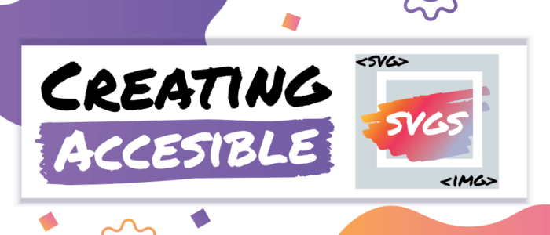

<h2>SVG Pattern Test Results</h2>
Results time! As shown in the tables, there were a few patterns that were not clean and caused the screen reader to repeat the alternative content. And while certainly annoying to users, it is better to hear duplicate content than none at all. Other patterns were much more problematic. For example, pattern 7 was missing the <code>&lt;title&gt;</code> or the&nbsp;<code>&lt;text&gt;</code> element for many browser/screen reader combinations. Likewise, pattern 10 was often missing the&nbsp;<code>&lt;desc&gt;</code>&nbsp;element. Worse still was pattern 6 which caused major issues, like not being able to even focus on the image, with NVDA and some mobile screen readers. For best AT coverage, it is probably best to avoid those three patterns until there is more support for them.

On the flip side, there was no clear frontrunner for “best in show” for the different patterns when relaying basic alternative content. This is actually good news! Since many of the patterns were able to render the alt content, that equates to more pattern choices for designers and developers. For SVGs needing more descriptive alternative content, pattern 11 <code>&lt;svg&gt; + role="img" + &lt;title&gt; + &lt;desc&gt; + aria-labelledby="[ID]"</code> was the most reliable choice for the different browser and screen readers that were tested.

Based on these results, it is clear that not all SVG patterns are created equal when it comes to accessibility. Which pattern you choose to implement depends on many factors like how difficult it is to modify baked-in&nbsp;framework code and which browsers/screen readers you are targeting. But no matter which pattern you choose to use, be sure to set aside some time to do your own accessibility/user testing. As SVGs continue to dominate the visual world, it is important not to leave AT users in the dark!
