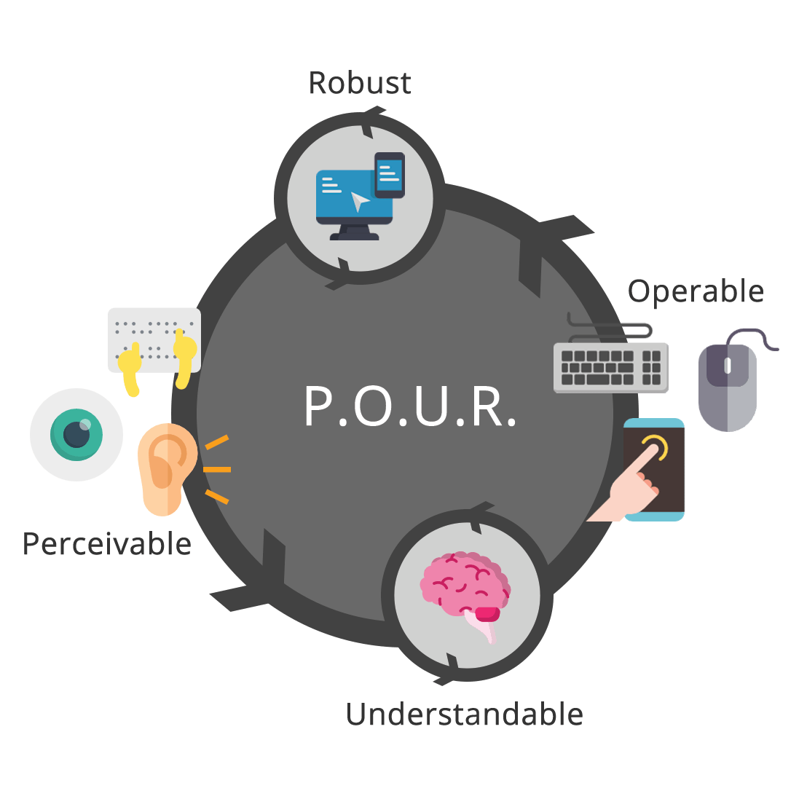
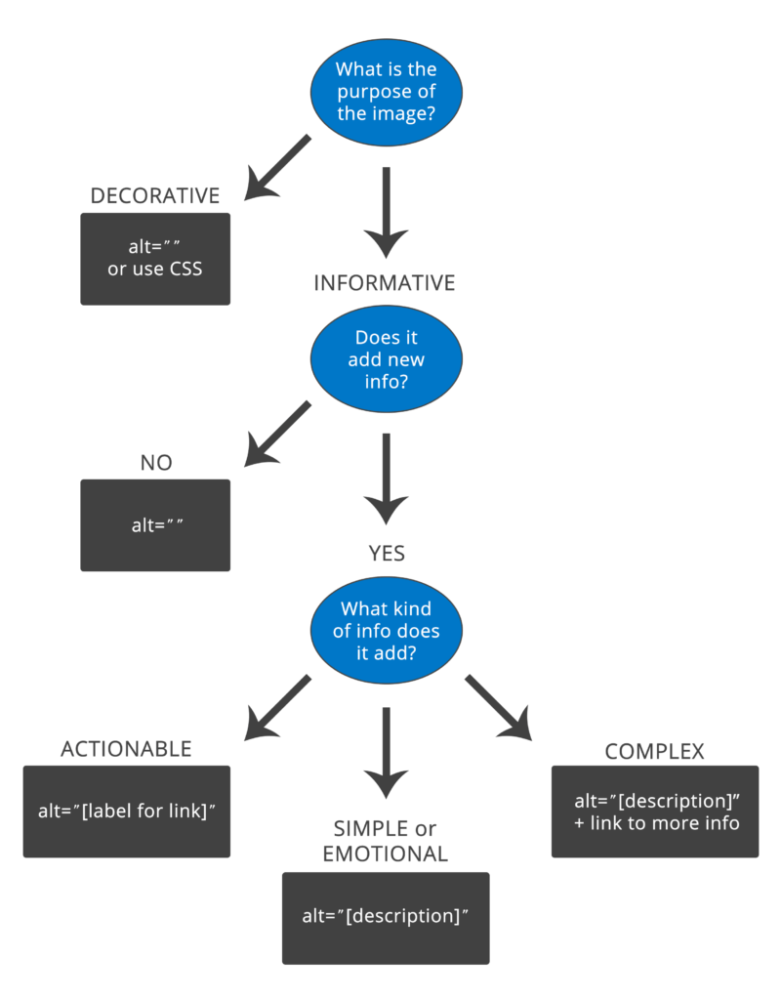
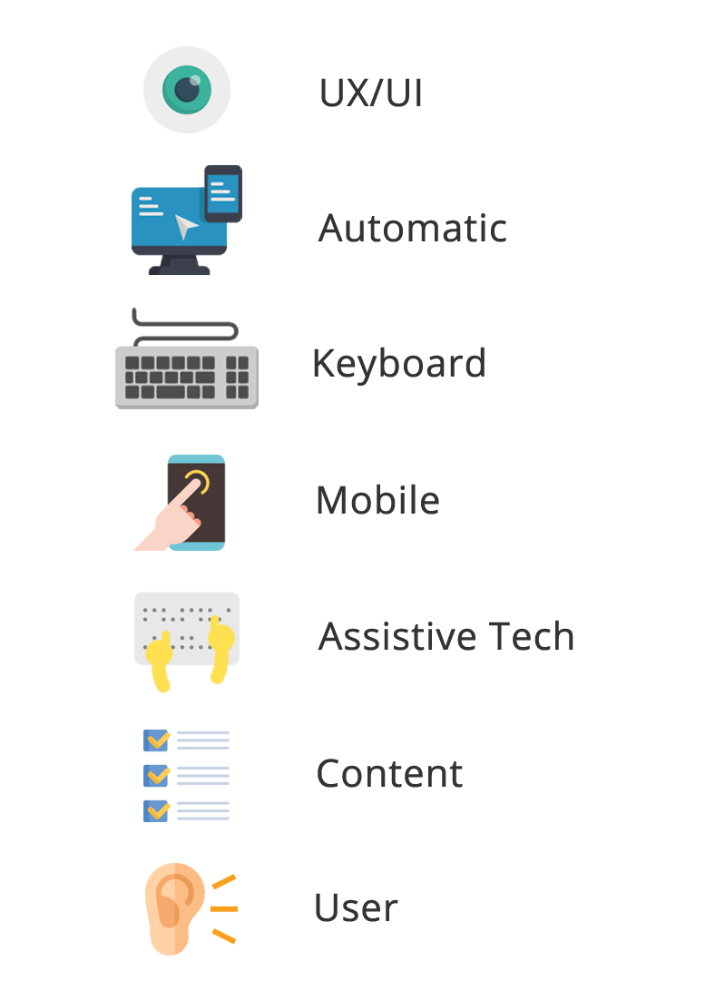

<em class="published">Originally published on <a href="https://www.deque.com/blog/top-5-questions-asked-in-accessibility-trainings/" target="_blank">Deque Systems</a></em>

It’s an exciting time to work in the world of digital accessibility! It was only a few years ago that finding an open role as an accessibility specialist could prove difficult – especially if you were looking at companies in the private sector. In some cases, there may have been open positions, but they were either part-time roles tacked on to a “regular” technical jobs and/or lumped in with the UX department. Now I’m seeing many more stand-alone opportunities in digital accessibility at Fortune 500 companies like Microsoft, Google, Target, JPMorgan Chase, Prudential, and many others.

I feel this shift in accessibility efforts is in one part due to awareness and one part due to education. Of course, I’m not naive to think lawsuits haven’t played a part in this – <a href="https://blog.usablenet.com/2018-ada-web-accessibility-lawsuit-recap-report" target="_blank" rel="noopener noreferrer">according to Usable Net</a> there are over 40 new accessibility lawsuits per week with over 2200 total lawsuits filed in 2018 – but I’d like to hope that is just a small part of the equation. While lawsuits may initially unlock the door for digital accessibility, once more tech professionals and companies learn about the value of adding inclusivity to their products, the hope is that the door remains unlocked and open to change for all – not just when forced by litigation.

But regardless of why digital accessibility seems to be growing so rapidly, one thing is certain: as the number of jobs in digital accessibility increases, so does the need to train these future accessibility professionals. As part of my job at Deque, I have been lucky enough to be a member of the <a href="https://www.deque.com/training/instructor-led-training/">instructor-led training (ILT) program</a>. The ILT program is made up of a team of accessibility experts that educate technical professionals about different aspects of digital accessibility. We cover a wide range of topics including mobile, design, and developer accessibility.

Deque’s ILT team has been very busy giving both in-person and virtual training sessions all over the world. In the past few months, I alone have traveled over 8000 miles and led a total of 25 days of training sessions (with even more on the way)…and I am not even close to being the busiest member of our group! Throughout my recent travels, I have gathered a list of questions from the designers and developers on the ground. Regardless of the company size or industry, you might be surprised to learn that many of their questions overlap. Below are the top five questions that I hear most often and some context/resources to learn a bit more about each.

<h2>What accessibility rules should I pay attention to?</h2>
To kick-off each training session, we like to ask the audience: “What is the first thing you think of when you hear the word accessibility?” We ask this question to establish a rapport with the audience and get them engaged from the start, but also we do this to gauge their familiarity with accessibility. Of course, there is a wide variety of responses, but the one thing I always seem to hear is: “I’m confused about which guidelines to follow.” There is some major confusion on what accessibility regulations companies are required to follow in general, but specifically in regards to WCAG. With the release of WCAG 2.1 into the mix this past year, it is even more perplexing to beginners. 

First, let’s take a quick step back…<a href="https://www.deque.com/blog/what-is-wcag-2-1-history/">what is WCAG even</a>? WCAG is an acronym for Web Content Accessibility Guidelines and <a href="https://www.w3.org/TR/WCAG10/">version 1.0</a> was published way back in 1999 by the World Wide Web Consortium (W3C). The original focus was only on HTML and ultimately created to bring standardization to accessibility on the emerging web. In late 2008, <a href="https://www.w3.org/TR/WCAG20/">version 2.0</a> of WCAG was released into the wild. This version was not technology-specific and covered many more aspects of disabilities, including blindness and low vision, deafness and hearing loss, learning disabilities, cognitive limitations, limited movement, speech disabilities, photosensitivity, and more.

WCAG 2.0 was a major step in the evolution of the accessibility standards. In fact, by October 2012, the International Standards Organization (ISO) established WCAG 2.0 as the digital standard for accessibility and became the “gold standard” for many countries and organizations worldwide. Of course, there are also country-specific and industry-specific regulations (ex. US section 508) that have created <a href="https://www.w3.org/WAI/policies/">separate rulebooks for accessibility</a> as well. The full list of regulations is varied and ever-changing and can be different for each client, so we tend to focus on the basic WCAG rules when training.

Fast forward a few years to 2018 and we see another evolution in WCAG with <a href="https://www.w3.org/TR/WCAG21/">version 2.1</a>. Due to technological advancements and deeper understanding of user needs, the changes to WCAG 2.1 were focused on accessibility with mobile/tablet devices, users with low vision, and users with cognitive disabilities. WCAG 2.1 is considered to be an extension of WCAG 2.0, not a replacement. Our very own Glenda Sims wrote a <a href="https://www.deque.com/blog/author/gsims/">great series of articles on WCAG 2.1</a> that I highly recommend them to people/organizations wanting to do a deeper dive on the subject.

As we all know, the WCAG guidelines can get really complicated, really fast…so for newbies, I try to focus on the actionable parts of the guidelines, namely the <a href="https://webaim.org/articles/pour/">P.O.U.R. concepts</a> – Perceivable, Operable, Understandable, and Robust.

The first category in P.O.U.R. is <b>Perceivable</b>. This means that users must be able to perceive the information being presented – it cannot be invisible to all of their senses.
<ul><li style="font-weight: 400;">Questions: Is there anything on our website or app that a person with a disability would not be able to perceive? Does this work with different types of assistive technology devices? Make sure to think of all the different types of disabilities – visual, mobility, hearing, cognitive, and speech impairments, vestibular and seizure disorders, and many more.</li><li style="font-weight: 400;">Examples: adding text alternatives to non-decorative images, adding captions and transcripts to videos, making sure the color is not the only method to convey meaning.</li></ul>
The second category is <b>Operable</b>. Users must be able to operate the interface – the interface cannot require interaction that a user cannot perform.
<ul><li style="font-weight: 400;">Questions: Can users control interactive elements of our website/app? Does our website have any traps?</li><li style="font-weight: 400;">Examples: using keyboard only navigation, making sure slideshows have all of the controls shown, making sure users have enough time to fill out a form.</li></ul>
The third category is <b>Understandable</b>. Users must be able to understand the information as well as the operation of the user interface – the content or operation cannot be beyond their understanding.
<ul><li style="font-weight: 400;">Questions: Is all of the content clearly written? Are all of the interactions easy to understand? Does the order of the page make sense?</li><li style="font-weight: 400;">Examples: write content at a 9th-grade reading level – don’t use a $10 word when a $1 word will do, make sure your website is predictable, make sure any error messages on your website are clear and easy to resolve.</li></ul>
The last category is <b>Robust</b>. It means that users must be able to access the content as technologies advance – as technologies and user agents evolve, the content should remain accessible.
<ul><li style="font-weight: 400;">Questions: Does our website only support the newest browsers or operating systems? Is our website developed with best practices? Does this work in both landscape and portrait orientations?</li><li style="font-weight: 400;">There are no real examples of this…just test your website/app! Be sure to use all types of tools – automatic, manual, AT, and user tests. After your initial accessibility testing, do more tests when new features or functionality are added.</li></ul>
The underlying spirit of P.O.U.R. isn’t about rigidly adhering to hard and fast rules; it’s about understanding and meeting the diverse needs of your users. Once you are on board with that, following the WCAG guidelines become more of a roadmap than a to-do list.

<h2>What is ARIA and do I really need it?</h2>
After WCAG, the next most popular question always revolves around ARIA. Depending on the audience’s level of accessibility and/or development knowledge, I get questions that range from: “What is it? Do I really need it? Why can’t I just use HTML?” Truth be told, when I first heard the term ARIA, I assumed it was just another stand-alone programming language. With all the different flavors of JavaScript and CSS floating out there, it makes sense that ARIA would follow suit. But, ARIA is a bit different.

First off, ARIA an acronym for “Accessible Rich Internet Applications” and is formally called <a href="https://www.w3.org/WAI/standards-guidelines/aria/">WAI-ARIA</a> (but many people call it by its abbreviated name). It was first developed in 2008 by the <a href="https://www.w3.org/WAI/">Web Accessibility Initiative (WAI)</a> group – a subset of the overarching World Wide Web Consortium (W3C) who govern and regulate the accessible internet.

ARIA is defined as a collection of attributes to help modify incorrect markup and to bridge gaps in HTML to create more accessible experience those using assistive technology (AT). Correctly incorporating ARIA into your code ensures that assistive technology device users will have all of the information they need to use your website or app. Or put more simply, ARIA is helper code that bridges the gap between the website/app and the AT user.

ARIA can be broken down into:
<ul><li style="font-weight: 400;"><b>Roles</b> — define what an element is or does.</li><li style="font-weight: 400;"><b>Properties</b> — express characteristics or relationship of an object.</li><li style="font-weight: 400;"><b>States and Values</b> — define the current conditions or data values associated with the element.</li></ul>
Do you need ARIA? Well like a lot of digital accessibility<i> It Depends™</i>. ARIA used to be the best choice to make code fully accessible, but HTML elements have taken over a bit. To keep it simple for beginners, at Deque training sessions we repeat the <a href="https://www.w3.org/TR/using-aria/#rule1">first rule of ARIA</a> created by the W3C:

“If you can use a native HTML element or attribute with the semantics and behavior you require already built in, instead of repurposing an element and adding an ARIA role, state or property to make it accessible, then do so.”

Or as I like to rephrase it (as I try my best to sound like Brad Pitt in the 1999 movie Fight Club): “First rule of ARIA is: do not use ARIA.”

When in doubt, use *supported* HTML elements, then use ARIA. To check for browser compliance, I often reference websites like <a href="https://www.html5accessibility.com/">HTML5 Accessibility</a>, <a href="https://caniuse.com/">Can I Use</a>, or W3C’s list of <a href="https://www.w3.org/TR/html-aria">ARIA in HTML attributes</a>&nbsp;before making my choice of whether I can use HTML or ARIA elements for a particular pattern. To learn more about ARIA and see some examples, check out <a href="https://www.deque.com/blog/much-ado-about-aria/">Much Ado About ARIA</a> and pretty much anything <a href="https://www.scottohara.me/">Scott O’Hara</a> writes or codes.

<h2>What is the best way to add alternative content to images?</h2>
The third most popular question usually revolves around alternative text. I am so excited the message is out – images need descriptions! But of course, it can’t be that simple. Depending on the type of image, you might need to modify your approach to adding alternative content. The first step is to think about the purpose of your image. Is it to inform a user? Set the “feeling” of the website? Does it perform a function? Figuring out the “class” of your image his is not always an easy task, but using <a href="https://www.w3.org/WAI/tutorials/images/decision-tree/">image alt decision trees</a> can help.

If an image is decorative, you need to hide it from assistive technology devices (ATs). You can use different methods like CSS background images or web fonts. You can also use the &lt;img&gt; tag, but then the decorative image needs to have an empty/null alternative text attribute. This sends a signal to the AT to ignore this image as it is not necessary for understanding the content or action on the page. An empty/null alternative text attribute is not the same as a missing alternative text attribute. If the alternative text is just missing, the AT might read out the file name or surrounding content in an attempt to give the user more information about the image.

On the other hand, if you decide an image is informative, make sure you include alternative information about the image. There are a lot of <a href="https://www.deque.com/blog/creating-accessible-svgs/">different accessible patterns for images</a> you can use to achieve this goal, pick the one(s) that works best in your framework or CMS. Regardless of the pattern you choose, make sure your alt content is meaningful and descriptive and does not repeat. Additionally, do not use phrases like “image of” or “graphic of” to describe an image. A screen reader already tells the user this information.

When talking about how to write good alternative content, I often use the telephone analogy. If you called up a friend and just said “Brown dog,” and hung up the phone your friend might be confused. If you called a friend and said “The brown dog is sitting on the beach,” that would paint a more vivid picture without adding too much complexity or work. Of course, a screen reader user will have to listen to your alternative content, so don’t go overboard. That is why we suggest that your alt content does not exceed 250 characters. If you need to add more context to the image (ex. complex graph), there are other, more descriptive patterns or methods you can use to add more detail.

Another kind of informative image is an “actionable” image – which is a tricky one for a lot of people. This is where an image acts as a link or performs a functionality. If your image is actionable you need to provide information about the function of the image instead of describing the image. For example, if you use a magnifying glass as your “submit” button on a search form, that is completely fine. But the alternative text should *not* read &lt;img alt=“magnifying glass”&gt; but something about the action that will happen when you click or press on it &lt;img alt=“Search this website”&gt;.

<h2>Why isn’t running an automated accessibility tool enough?</h2>
People who work in tech love tools. It makes sense. Many of us can remember when we first used a computer (shout out to my <a href="https://hackernoon.com/confessions-of-a-middle-aged-techie-21e704cda942">Commodore 64</a>) and think back fondly on those flip phone days. I don’t like to wear jewelry so I never bought an Apple watch…but I remember when they were first launched and the crazy lines that formed to get one.

So when people ask me about accessibility tools at trainings and conferences, I am not surprised. They want to push a few buttons and *poof!* summon magical creatures that can go in and find and fix all of their issues. Of course, they don’t like my answer that regardless of the tool, automatic testing can only <a href="https://accessibility.blog.gov.uk/2017/02/24/what-we-found-when-we-tested-tools-on-the-worlds-least-accessible-webpage/">reliably pick-up 30-40% of all accessibility issues</a>. And some tools are better at picking up some accessibility issues, while others might be better suited for catching other errors, so you really need to run a suite of tools. On top of that, of the issues automatic testing tools do find, many still require a human to interpret the results and prioritize the issues. For example, an automated testing tool might tell you that your image is missing alternative text, but it cannot tell you what alternative text to write. Whew…it’s exhausting just thinking about it!

But it is not all bad news! The good news is automated testing tools are truly amazing and getting “smarter” with each new version. There may be a day soon where these tools can reliably catch closer to 100% of all issues and even fix them for you. But until then, you can add UX/UI tests, manual keyboard tests, mobile touch tests, <a href="https://alistapart.com/article/semantics-to-screen-readers">screen reader tests</a> (and other ATs), content readability tests, and (I think, most important) user tests to your workflow to cover the gaps automatic testing leaves behind. Also, don’t forget adding an accessibility statement and an accessible way for users to contact you about any issues they may have with your website/app, go a long way in terms of overall user experience and satisfaction.

To get you started, here are some helpful automatic testing tools that we recommend:
<ul><li><a href="https://www.deque.com/axe/axe-for-web/">axe for Web</a></li><li><a href="https://www.deque.com/axe/axe-for-ios/">axe for iOS</a></li><li><a href="https://www.deque.com/axe/axe-for-android/">axe for Android</a></li><li><a href="https://accessibilityinsights.io/">Accessibility Insights</a></li></ul>

<h2>What’s the deal with mobile accessibility?</h2>
Mobile can be very confusing to people new to accessibility and is a topic often brought up in our training sessions. Some people are surprised that visually impaired people use mobile devices for things like surfing the web and checking email. Many had no idea that mobile devices have screen readers – many built right in. Truth be told, I was in that same camp not that long ago.

I still remember the first time I saw someone use a mobile screen reader in person. I was walking to lunch with Rachel Olivero at a tech conference when I noticed an earbud in Rachel’s left ear and her phone in her hand. She was furiously tapping away at a blacked out screen. Knowing Rachel was blind, I paused and asked her if she needed help turning on her phone. She laughed and said there was nothing wrong with her phone and she had just activated the <a href="https://www.apple.com/accessibility/iphone/vision/">screen curtain on her iOS device</a>, which gave her more privacy from random prying eyes.

According to <a href="https://webaim.org/projects/screenreadersurvey7/#mobile">WebAIM’s latest screen reader survey</a>, 88% of the people who responded use mobile screen readers on their mobile devices, and that number has grown significantly over the past few years. Of those surveyed, 75.6% preferred iOS devices (ex. iPad, iPhone) with the VoiceOver screen reader followed by Android devices at 22.0% using the TalkBack screen reader. Not only are the numbers of mobile users increasing, but 54% of respondents responded that they use both mobile and desktop screen readers about the same amount of time, making mobile, not just a novelty – but essential to everyday life. On top of the increase in users, many of the <a href="https://www.deque.com/blog/understanding-wcag-2-1-reviewing-mobile-success-criteria-2/">new WCAG 2.1 guidelines focus on mobile</a> issues, so mobile is a significant area to get right when it comes to accessibility.

But how do you get started with mobile accessibility? Well, the easiest thing to do is simply grab your smartphone and activate the screen reader! Unlike most desktop screen readers, mobile screen readers typically come installed on your device and are pretty intuitive once you learn a few swipes and tap gestures.
<h3>Using VoiceOver on iOS</h3><h4>Turning VoiceOver on</h4><ul><li style="font-weight: 400;">You can turn VoiceOver on by going to “Settings” &gt; “General” &gt; “Accessibility” &gt; and toggling “VoiceOver” to ON.</li><li style="font-weight: 400;">Or you can activate the screen reader with Siri. Go to “Settings” &gt; “Siri &amp; Search” &gt; Set the Listen for “Hey Siri” to on. Then say “Hey, Siri. Turn VoiceOver ON.”</li></ul><h4>Quick demo using VoiceOver</h4><ul><li style="font-weight: 400;">Touch one finger to your iPhone screen to focus on your main app screen and swipe left to right. VoiceOver will announce the name of the app in focus.</li><li style="font-weight: 400;">Once you are on an app you want to open, double tap with one finger anywhere on the screen to launch the app.</li></ul><h4>Turning VoiceOver off</h4><ul><li style="font-weight: 400;">You can turn VoiceOver off by going to “Settings” &gt; “General” &gt; “Accessibility” &gt; and toggling “VoiceOver” to OFF.</li><li style="font-weight: 400;">Or you can turn off the screen reader with Siri. Just say “Hey, Siri. Turn VoiceOver OFF.”</li></ul><h4>iOS VoiceOver Resources</h4><ul><li style="font-weight: 400;">VoiceOver shortcut and gesture guides – <a href="https://dequeuniversity.com/screenreaders/voiceover-ios-shortcuts">https://dequeuniversity.com/screenreaders/voiceover-ios-shortcuts</a></li><li style="font-weight: 400;">Full list of commands – <a href="http://tinyurl.com/commands-voiceover-ios">http://tinyurl.com/commands-voiceover-ios</a></li></ul><h3><b>Using TalkBack on Android</b></h3><h4>Turning TalkBack on</h4><ul><li style="font-weight: 400;">You can turn TalkBack on by going to “Settings” &gt; “Accessibility” &gt; “TalkBack” and toggle the switch to ON. <i>Note: some Android devices require you to install the TalkBack app first.</i></li></ul><h4>Quick demo using Talkback</h4><ul><li style="font-weight: 400;">Navigate to an accessible website like the <a href="https://www.w3.org/">W3C main website</a> using either the Chrome or FireFox web browser.</li><li style="font-weight: 400;">Swipe one finger from up to down to cycle through the element you want to browse by in TalkBack. In this demo choose “Headings.”</li><li style="font-weight: 400;">With one finger, swipe left to right to listen to the page headings in order from the top of the page to the bottom. You might notice a tone that gets higher in pitch as you navigate down the page. This helps the AT user get a sense of how long the page is. </li><li style="font-weight: 400;">Double click on any heading that can be activated to navigate to a new page.</li></ul><h4>Turning TalkBack off</h4><ul><li style="font-weight: 400;">You can turn TalkBack off by going to “Settings” &gt; “Accessibility” &gt; “TalkBack”</li><li style="font-weight: 400;">Tap the TalkBack once to select it then double tap the to move the toggle to OFF.</li></ul><h4>TalkBack Resources</h4><ul><li style="font-weight: 400;">TalkBack shortcuts and gesture guide – <a href="https://dequeuniversity.com/screenreaders/talkback-shortcuts">https://dequeuniversity.com/screenreaders/talkback-shortcuts</a></li><li style="font-weight: 400;">Full list of commands – <a href="http://tinyurl.com/commands-talkback">http://tinyurl.com/commands-talkback</a></li></ul>
Once you are more comfortable using mobile screen readers, take a tour of some of your favorite websites or apps and you will quickly notice the difference between those that are accessible and those that are not. Once you have that mastered, you can move on to screen reader testing on mobile. Deque has a few tools that can help with that too (mentioned above)! Of course, using your mobile screen reader occasionally won’t make you an expert. But hopefully running some of these demos and tests will help build more empathy and understanding that digital accessibility isn’t just something nice to have, or something you do if you have time/budget for it – but it is something that is essential to many of your users.

<h2>Recap</h2>
As you can tell from these five ILT questions/answers, there is a lot to know when it comes to digital accessibility…and this is just the tip of the iceberg! I do hope this article has helped answer some basic questions you might have had about digital accessibility and spurred you to learn more. I encourage you to leave a comment below or on <a href="https://twitter.com/cariefisher">Twitter</a> with any questions of your own. Of course, I don’t know all the answers myself, but there are so many awesome people in the accessibility community that I am sure we can find an answer (or two, or three) to any question asked.

Finally, I just want to leave you with a note of encouragement. I understand digital accessibility can be overwhelming sometimes, but it is important not to give up hope and to continue to ask questions.

“Alone we can do so little, together we can do so much.” –Helen Keller

