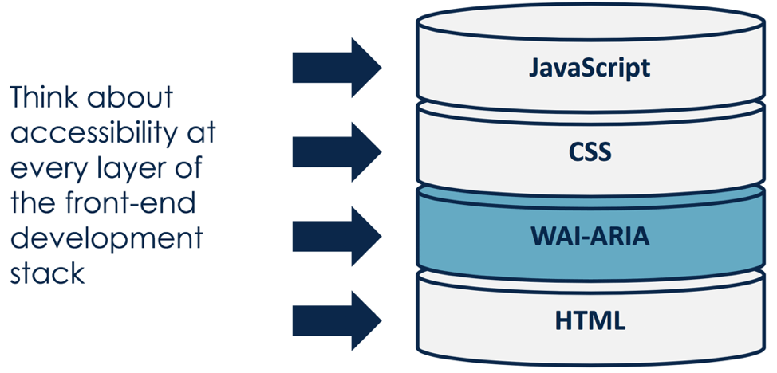
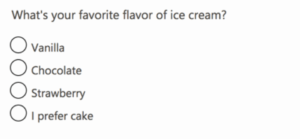
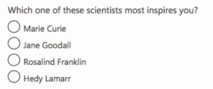
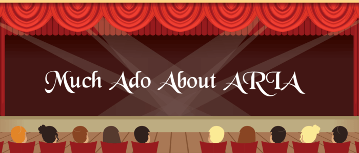

##ARIA Act One

###Scene 1: The Foundation

ARIA was first developed in 2008 by the <a href="https://www.w3.org/WAI" target="_blank" rel="noopener noreferrer">Web Accessibility Initiative (WAI)</a> group – a subset of the overarching World Wide Web Consortium (W3C) who govern and regulate the internet. ARIA is an acronym for “Accessible Rich Internet Applications” and is formally called <a href="https://www.w3.org/WAI/standards-guidelines/aria" target="_blank" rel="noopener noreferrer">WAI-ARIA</a> (but many people call it by its abbreviated name).

The WAI group defines ARIA as:

<blockquote>"A way to make Web content and Web applications more accessible to people with disabilities. It especially helps with dynamic content and advanced user interface controls developed with Ajax, HTML, JavaScript, and related technologies."</blockquote>

Put more simply, ARIA defines a collection of attributes to help modify incorrect markup and to bridge gaps in HTML to create more accessible experience those using assistive technology (AT). Correctly incorporating ARIA into your code ensures that assistive technology device users will have all of the information they need to use your website or app.

There are three main features of ARIA as defined by the guidelines:
1. <a href="https://www.w3.org/WAI/PF/aria/usage#usage_intro" target="_blank" rel="noopener noreferrer"><strong>Roles</strong></a> - defines what an element is or does. Roles can help identify landmarks, document structure, and widgets as well.

<div class="kg-card kg-image-card kg-width-medium">



</div>

An example of this is:<br>
``<div role="button">Here is a snazzy button</div>``

2. <a href="https://www.w3.org/WAI/PF/aria/usage#introstates" target="_blank" rel="noopener noreferrer"><strong>Properties</strong></a> — express characteristics or relationship of an object.

An example of this using <strong>aria-describedby</strong> is:<br>
``<div role="button" aria-describedby="some-other-element">Here is a snazzy button</div><div id="some-other-element">This page will self destruct in 10 seconds.</div>``

3. <a href="https://www.w3.org/WAI/PF/aria/usage#managingfocus" target="_blank" rel="noopener noreferrer"><strong>States or Values</strong></a> — define the current conditions or data values associated with the element. An example of this using.

An example of this using <strong>aria-pressed</strong> is:<br>
``<div role="button" aria-describedby="some-other-element" aria-pressed="false">Here is a snazzy button</div> <div id="some-other-element">This page will self destruct in 10 seconds.</div>``

Of course, this is a simplified explanation of ARIA and the code examples above are pretty streamlined to illustrate the functionality of ARIA (i.e. there is additional code you would want to include on a real button). As your code gets more complex, ARIA roles, properties, and states can be layered until the final accessibility goal is reached. Knowing the basic rules of each ARIA role, property, and state can help you figure out what elements need to go where in your markup.

At this point you might be worried ARIA will change your web page functionality and overall look and feel – don’t be! ARIA does not actually change anything with the native browser functionality. Think of ARIA as an additional layer of understanding between the HTML and ATs. Similarly, ARIA does not change your web page from a visual perspective, unless you add styling to your CSS that specifically targets ARIA. This means that no one except ATs (and the people using them) will notice any differences between a web page or app with ARIA and one without it.

<hr>

##Scene 2: ARIA vs HTML

In 2014, the W3C officially published the HTML5 recommendation to the world. With it came some big changes, including the addition of elements such as <code><span class="s2">&lt;main&gt;</span></code><span class="s1">, </span><code><span class="s2">&lt;header&gt;</span></code><span class="s1">, </span><code><span class="s2">&lt;footer&gt;</span></code><span class="s1">, </span><code><span class="s2">&lt;aside&gt;</span></code><span class="s1">, </span><code><span class="s2">&lt;nav&gt;</span></code><span class="s1"> and attributes like </span><code><span class="s2">hidden</span></code><span class="s1"> and </span><code><span class="s2">required</span></code><span class="s1">. With the addition of these new HTML5 elements and attributes coupled with increased browser support, parts of ARIA are now obsolete – or at least less critical than before.

In cases where the browser supports an HTML tag with an implicit role that has an ARIA equivalent, there is usually no need to also add ARIA to the element. However, ARIA still includes many roles, states, and properties that aren’t available in any version of HTML so these will continue to be useful for some time.

To keep it simple for beginners, at Deque trainings we repeat the <a href="https://www.w3.org/TR/using-aria/#rule1" target="_blank" rel="noopener noreferrer">first rule of ARIA</a> created by the W3C:

<blockquote>"If you can use a native HTML element or attribute with the semantics and behavior you require already built in, instead of repurposing an element and adding an ARIA role, state or property to make it accessible, then do so."</blockquote>

So if we look back at the earlier coding example, instead of using ARIA to define the role of our button element, we can use the HTML <code><span class="s2">&lt;button&gt;</span></code> element instead.

<strong>Original code (using ARIA only):</strong><br>
```<div role="button">Here is a snazzy button</div>```

<strong>New code (using HTML only):</strong><br>
```<button>Here is a snazzy button</button>```

<strong>New code (using HTML + ARIA):</strong><br>
```<button aria-describedby="some-other-element">Here is a snazzy button</button> <div id="some-other-element">This page will self destruct in 10 seconds.</div>```

Technically, each example conveys the same semantics, but the big difference is the ARIA only version requires us to define the functionality of the button role with additional code, while the HTML versions work right out of the box for browsers that support the </span><code><span class="s2">&lt;button&gt;</span></code><span class="s1"> element.* When we combine the powers of HTML and ARIA as shown in the last example, we provide additional information about the button’s purpose.

<i>*Note: since the <code>&lt;button&gt;</code> element was introduced in HTML4, I can reasonably speculate that it is fully supported by the latest versions of all the major browsers and will play nicely with most ATs. However, the same cannot be said of all of the newer HTML5 elements and attributes. To check for browser compliance, I often reference websites such as <a href="https://www.html5accessibility.com" target="_blank" rel="noopener noreferrer">HTML5 Accessibility</a>, <a href="https://caniuse.com" target="_blank" rel="noopener noreferrer">Can I Use</a>, or W3C’s list of <a href="https://www.w3.org/TR/html-aria" target="_blank" rel="noopener noreferrer">ARIA in HTML attributes</a> before making my choice of whether I can use HTML or ARIA elements for a particular pattern. I will go into this topic a bit deeper in a follow-up blog post on ARIA.</i>

Accessibility experts and users of ATs all have differing opinions on the subject of ARIA vs HTML and will probably be discussing this topic for a very long time. These discussions are great in a theoretical world, where a developer focused on accessibility would have full control of the markup, styling, and functionality of a website or app. But the reality is often more complex.

For example, there may be times where you cannot change all the </span><code><span class="s4">&lt;div role="button"&gt;</span></code><span class="s3">’s on your page to </span><code><span class="s4">&lt;button&gt;</span></code><span class="s3">’s and that is maybe not ideal, but it is OK. If you do have more control over your website or app code, by all means, add in fully supported HTML elements (and any ARIA helpers you may need) from the beginning. But from a practical sense, I encourage other developers to just do what works for your particular situation and be sure to test your code before releasing it. Even if you only change one small piece of code at a time – every little bit helps!

<hr>

##Scene 3: ARIA in Action

As mentioned earlier in this article, it is best practice to use native HTML elements when the browser support is good. But when coded correctly, ARIA elements can and should act like native HTML elements. So you have some flexibility when making your pattern more accessible!

<p class="p1"><span class="s1">I find it more useful to see code examples rather than explain them, so let’s break down a typical pattern you might find on a website or app in more detail. For this article, we will look at radio buttons and groups. All radio groups require a group label of some kind. The classic method is using </span><code><span class="s2">&lt;fieldset&gt;</span></code><span class="s1"> and </span><code><span class="s2">&lt;legend&gt;</span></code><span class="s1">. The ARIA method of </span><code><span class="s2">role="radiogroup"</span><span class="s1"></span></code> and <code><span class="s2">aria-labelledby</span><span class="s1"></span></code> can also be used. Both are technically correct, so depending on your situation you could use either method and that would result in a similar experience for the user.</p>

<p class="p1"><span class="s1"><strong>Method 1</strong>: Using HTML </span><code><span class="s2">&lt;fieldset&gt;</span></code><span class="s1"> and </span><code><span class="s2">&lt;legend&gt;</span></code><span class="s1"> elements:<br>
<code>&lt;fieldset class="deque-radio-group"><br>
         &lt;legend class="deque-radio-group-label">What's your favorite flavor of ice cream?</legend><br>
         &lt;div id="radioGroup"><br>
           &lt;span id="Whatsyourfavoriteflavor_0" class="deque-radio" aria-labelledby="vanilla"></span><br>
           &lt;span id="vanilla">Vanilla&lt;/span><br>
           &lt;span id="Whatsyourfavoriteflavor_1" class="deque-radio" aria-labelledby="chocolate"></span><br>
           &lt;span id="chocolate">Chocolate</span><br>
           &lt;span id="Whatsyourfavoriteflavor_2" class="deque-radio" aria-labelledby="strawberry"></span><br>
           &lt;span id="strawberry">Strawberry</span><br>
           &lt;span id="Whatsyourfavoriteflavor_3" class="deque-radio" aria-labelledby="none"></span><br>
           &lt;span id="none">I prefer cake</span><br>
         &lt;/div><br>
        &lt;/fieldset><br>
</code></p>
<br>
<p class="p1"><span class="s1"><b>Option 2</b>: Using ARIA </span><code><span class="s2">role="radiogroup"</span></code><span class="s1"> and </span><code><span class="s2">aria-labelledby</span></code><span class="s1"> elements:<br>
<code>&lt;div class="deque-radio-group" role="radiogroup" aria-labelledby="inspire"><br>
 &lt;div class="deque-radio-group-label" id="inspire"><br>
   Which one of these scientists most inspires you?</div><br>
 &lt;div id="radioGroup"><br>
 
   &lt;span id="Whichoneofthesescientistsmostinspiresyou_0" class="deque-radio" aria-labelledby="curie"></span><br>
 
   &lt;span id="curie">Marie Curie</span><br>
 
   &lt;span id="Whichoneofthesescientistsmostinspiresyou_1" class="deque-radio" aria-labelledby="goodall"></span><br>
 
   &lt;span id="goodall">Jane Goodall</span><br>
 
   &lt;span id="Whichoneofthesescientistsmostinspiresyou_2" class="deque-radio" aria-labelledby="franklin"></span><br>
 
   &lt;span id="franklin">Rosalind Franklin</span><br>
 
   &lt;span id="Whichoneofthesescientistsmostinspiresyou_3" class="deque-radio" aria-labelledby="lamarr"></span><br>
 
   &lt;span id="lamarr">Hedy Lamarr</span><br>
 
 &lt;/div>
 
&lt;/div>
</code></p>

<p class="p1"><span class="s1">You can see from the screenshots that the visual output from either the HTML or ARIA radio patterns is the same. From a functionality perspective, they should be essentially the same as well, but there are some variances between each browser and assistive technology device combinations. One size doesn’t necessarily fit all, so each pattern might need to be modified to suit your accessibility needs. For a live example of the above code see my <a href="https://codepen.io/cariefisher/pen/VGPEBo" target="_blank" rel="noopener noreferrer"><span class="s2">Accessible Radio Buttons CodePen</span></a>.</span></p>

<div class="kg-card kg-image-card kg-width-small">



</div>

<div class="kg-card kg-image-card kg-width-small">



</div>

<hr>

##Scene 4: Complexities of ARIA

Of course, this article wouldn’t be complete without a couple of warnings about ARIA. First, you must use caution when adding ARIA to your markup! This is a time where a little bit of coding knowledge can be detrimental (or just plain annoying) if used incorrectly. A mentor once told me that “Bad ARIA is worse than no ARIA at all” – words of wisdom I try to live by with each line of code I write. Sometimes in an effort to help, we add too many ARIA attributes or the wrong ARIA attributes. Remember to keep it simple.

<p class="p1"><span class="s1">Second, although the button and radio button/group patterns we reviewed are fairly straightforward, creating accessible custom patterns can get very complicated very quickly. There are a lot of things to pay attention to (including but not limited to) – keyboard, mobile, and touch interactions, <a href="https://www.w3.org/TR/wai-aria-practices-1.1" target="_blank" rel="noopener noreferrer">ARIA authoring best practices</a>, or even the basic choice of whether to choose HTML or ARIA in the first place. Try to anticipate the needs of your users and be sure to test your code for accessibility. If you can find (and pay) users of ATs to help test – that is even better. At the very least, make sure there is an accessible way a user could submit a bug ticket if they find an issue.</span></p>

Those warnings aside, digital accessibility really is not an all-or-nothing situation – it is a spectrum that allows for some gray areas such as this where multiple coding solutions can be seen as “correct” depending on the situation. What is important is that you keep learning, testing, and trying to make our digital world more open to all!

<hr>

<div class="kg-card kg-image-card kg-width-medium">



</div>

##ARIA Act One: Recap

Hopefully, this article gave you a quick glimpse into the rich world of ARIA. Here are some takeaways:
<ul class="ul1"><li class="li1"><span class="s1">ARIA defines a collection of attributes to help modify incorrect markup and to bridge gaps in HTML to create more accessible experience those using assistive technology (AT).<br> </span></li><li class="li1"><span class="s1">Correctly incorporating ARIA into your code ensures that all users will have the information that they need to use your website or app.<br> </span></li><li class="li1"><span class="s1">ARIA can be broken down into:</span><ul class="ul2"><li class="li2"><b></b><span class="s3"><b>Roles&nbsp;</b>— define what an element is or does.</span><span class="s4"><br> </span></li><li class="li2"><b></b><span class="s3"><b>Properties&nbsp;</b>— express characteristics or relationship of an object.</span><span class="s1"><br> </span></li><li class="li2"><b></b><span class="s3"><b>States and Values</b> — define the current conditions or data values associated with the element.</span><span class="s1"><br> </span></li></ul></li><li class="li2"><span class="s3">ARIA on its own does <b>not</b> change the functionality and overall look and feel of your website or app.</span><span class="s1"><br> </span></li><li class="li1"><span class="s1">There is more than one way to write accessible code. HTML can oftentimes replace or be supplemented by ARIA – but you need to check for browser support first.<br> </span></li><li class="li1"><span class="s1">When in doubt, use a browser supported HTML element and skip the ARIA. Bad ARIA can be worse than no ARIA at all!<br> </span></li><li class="li1"><span class="s1">Test your code – preferably with the help of users of assistive technology devices. At the very least, provide an accessible way for these bugs to be reported.<br> </span></li></ul>

Since this article was targeted at beginners, there were a few important topics I intentionally glossed over. In the next article on ARIA, I plan to explore some more intermediate questions such as:
<ul class="ul1"><li class="li1"><span class="s1">How do I know what ARIA or HTML element to choose?<br> </span></li><li class="li1"><span class="s1">Where is ARIA supported?<br> </span></li><li class="li1"><span class="s1">How do I test for ARIA?<br> </span></li></ul>

<p class="p4"><span class="s1">If there are other general ARIA questions you want to see, please let me know in the comments! In the meantime, to get even deeper knowledge about ARIA and see additional pattern examples in action, you can enroll in our <a href="https://dequeuniversity.com" target="_blank" rel="noopener noreferrer">Deque University</a> courses.</span></p>