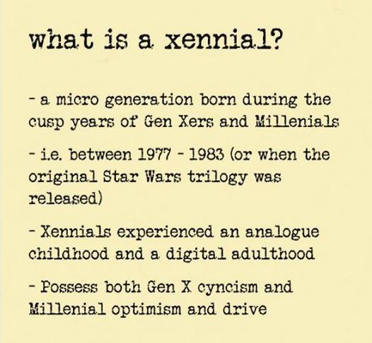
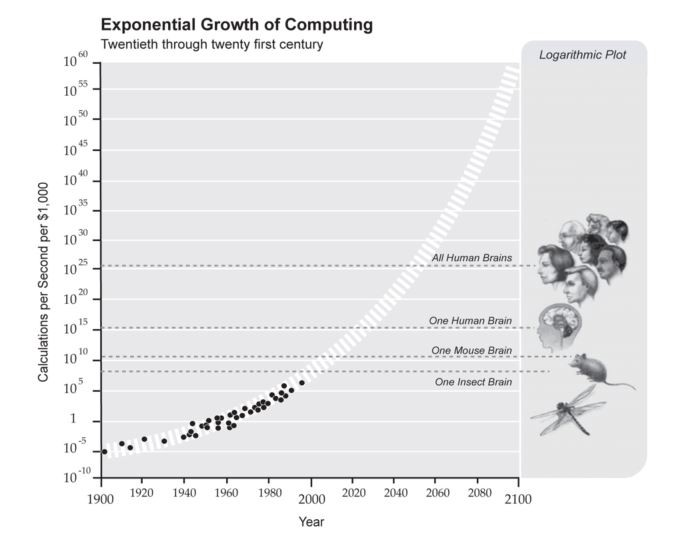
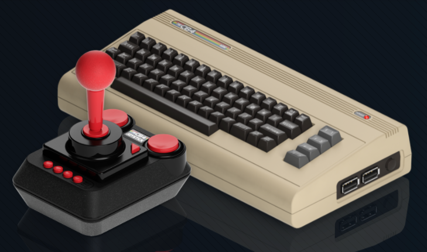

<em>Originally published on <a href="https://hackernoon.com/confessions-of-a-middle-aged-techie-21e704cda942" target="_blank">Hackernoon</a></em>

##In a Galaxy Far, Far Away

Even though I am just barely on the edge of my fourth decade on this earth and do not check off any of the “<a href="http://www.huffingtonpost.com/2014/05/01/signs-of-middle-age_n_5234201.html" target="_blank">25 Surefire Signs You’ve Finally Hit Middle Age</a>” boxes (okay maybe a couple), I got my tech start back in the early 1980s. In tech-years that puts me squarely at middle age, or more accurately 100111.

My father was an engineer and a technophile. I still remember the day he showed up with the grayish-tannish Commodore 64 and proudly proclaimed that this was the wave of the future. Once the computer was set-up, the first thing he showed my brothers and I was how to program it using BASIC to guess your number. It was amazing! How did it know what number we were thinking of? What evil wizardry was afoot? Looking back, the Commodore was even more astounding considering how much it did with just 64 KB RAM and 20 KB ROM, which is less processing power than your <a href="https://www.engadget.com/2017/01/04/griffin-connects-your-toast-to-your-phone/" target="_blank">smart toaster</a>. We were all hooked from day one — fast forward 35 years and you might (not) be surprised that my brothers and I all are programmers.

##Coming of Age in the Digital Era

The Commodore 64 came into existence during a small window in time that saw the death of the analog and the rise of the digital. Its official release date was in August 1982, at just the right time for the tiny micro-generation of people called the Xennials to gobble it up. Sandwiched between Generation X and Millennials, it has been said that <a href="http://www.dailymail.co.uk/femail/article-4630930/Xennials-new-generation-born-1977-1983.html" target="_blank">Xennials</a> do not have the deep apathy and cynicism associated with the Generation X-ers, but also do not share the endless optimism of the Millennials either.

We are the <a href="https://en.wikipedia.org/wiki/Spork" target="_blank">spork</a> generation — not really a spoon, not really a fork, arguably just as useful, but slightly perplexing. Of course, I am generalizing a bit. One size does not fit all. But it can be agreed upon that Xennials were born into a world where technology was not the driving force, but saw the exponential growth, evolution, and potential of technology in a way that few others did.

I guess you can say that (arguably) gives us Xennials a unique perspective on technology. So what have I learned so far?

##Technology Moves Fast and You Need to Adapt to Stay Alive

With computer processing power doubling every two years and constant innovation in the world of technology, it is only a matter of time before computers become our overlords. Okay, maybe that is a stretch, but every joke contains a kernel of truth.

It is projected that by the year 2020, that the speed at which computers run calculations will be faster than the average human brain. In 2050, it will <a href="https://www.linkedin.com/pulse/technology-evolving-faster-than-our-ability-adapt-chris-hooper/" target="_blank">exceed all human brain power</a> combined. This speed coupled with mass automation, big data, and artificial intelligence means that we are quickly entering into a new era of technology. Which is both frightening and exciting at the same time.

The Commodore 64 failed drastically at adaption. In the article <a href="https://arstechnica.com/gaming/2017/01/a-history-of-the-amiga-part-10-the-downfall-of-commodore/" target="_blank"><em>The Downfall of Commodore</em></a> author Jeremy Reimer speculates that the failure of the Commodore “…rests with Commodore management, who not only failed to adapt to a changing marketplace, but in many cases were actively hostile to their own company.” Being able to adapt is essential to tech survival.

##Not All Tech Innovations Come from Youth

Some days it seems like all the new tech innovations are developed and spearheaded by the new kids on the block. According to an article in <a href="https://techcrunch.com/2011/04/30/internet-entrepreneurs-are-like-professional-athletes-they-peak-around-25/" target="_blank">Tech Crunch</a>, the peak age of technological innovation is 25. If you are over that age — too bad, you missed your shot. In fact, if I had a dime for every story of a 20-year-old brogrammer becoming the next tech super giant…well I would be as rich as said brogrammer.

Not that I am bitter, I welcome ideas from the younger generations — but good ideas can come from all walks of life and <a href="https://www.fastcompany.com/3051030/is-27-the-tech-worlds-new-middle-age" target="_blank">agism in technology</a> is a real issue. Contrary to the naysayers, my fellow tech middle agers and I still have <a href="https://www.washingtonpost.com/national/on-innovations/the-case-for-old-entrepreneurs/2011/12/02/gIQAulJ3KO_story.html" target="_blank">time to contribute</a>, for we have something that the younger generations does not — experience.

The Commodore failed at this when they kicked out their founder and “man with the experience” <a href="https://en.wikipedia.org/wiki/Chuck_Peddle" target="_blank">Chuck Peddle</a>, much like Apple kicked out founder Steve Wozniak. Coincidentally, Steve Wozniak claims in his book <a href="https://www.amazon.com/iWoz-Computer-Invented-Personal-Co-Founded/dp/0393330435" target="_blank">iWoz</a> that he invented the personal computer and provided Chuck Peddle with the idea for the first Commodore PET — but history actually shows that Chuck Peddle designed the chip that made the Apple II possible. According to the <a href="https://dfarq.homeip.net/steve-jobs-and-the-commodore-pet/" target="_blank">Silicon Underground</a>, “Peddle was capable of adding a keyboard and a video circuit to his KIM-1 without Steve Wozniak’s help.” Nerdy arguments aside, experience can certainly lead to deeper innovations in the tech market.

##Girls Are the Key to Our Tech Future

The statistics are depressing. The percentage of young women concentrating on computer science keeps decreasing, even though the total number of women attending college increases. Why is this happening? Of course, I do not have the answer to that formidable question, but the good news is there are a myriad of articles and blogs and organizations like <a href="https://girlswhocode.com/" data-href="https://girlswhocode.com/" target="_blank">Girls Who Code</a> dedicated to solving this issue or at least bringing awareness to this plight.

But speaking personally, as a girl who grew up in the 80s and loved computers, I wonder if some of this comes down to perception and stereotypes — boys like to play video games and use computers, while girls like to do art projects and read? Obviously, this is over-simplifying it a bit, but that was the underlying message at the time.

For example, If you peruse the list of 2021 <a href="https://en.wikipedia.org/wiki/List_of_Commodore_64_games" target="_blank">Commodore 64 games</a> available, you will notice that a very large percentage of the games were based on subjects more typically associated with “masculine” interests— aliens, war, race cars, boxing, ninjas, pirates, etc. With the most popular games having titles like: Zak McKracken, Pirates!, and the Alien Mindbenders and Enforcer: Fullmetal Megablaster. While games like FaceMaker, Barbie’s Dream Date and Barbie’s Dream House were marketed towards girls and never seem to crack the top 100 nostalgia lists (probably for good reason).

Fast forward to 2017 and this trend to focus on masculine computer programs/games seems to be reversing itself. I have many more options for my own daughter, including gender-neutral code-learning games like <a href="https://scratch.mit.edu/" target="_blank">Scratch</a> and <a href="https://www.playosmo.com/en/" target="_blank">Osmo</a>. It will be interesting to see how/if this makes an impact on women entering computer science programs.

##The Return of the Commodore 64
So this article ended up being less confessions and more musings, spurred by the exciting announcement that much like the revival of the <a href="https://www.fatherly.com/gear/video-games-gear/the-nintendo-classic-is-finally-coming-back-to-stores/" target="_blank">NES Classic</a> and the <a href="https://www.fatherly.com/gear/nintendos-super-nes-classic-finally-hits-stores-tonight-at-midnight/" target="_blank">Nintendo SNES</a>, the Commodore 64 will be miniaturized and <a href="https://thec64.com/" data-href="https://thec64.com/" target="_blank">available for purchase</a> soon! Although I am disappointed at the list of games it comes with (what, no Winter Games?!) you better believe I will be one of the first people in line to purchase it. I mean, what else is tech middle age good for, if not nostalgia?
