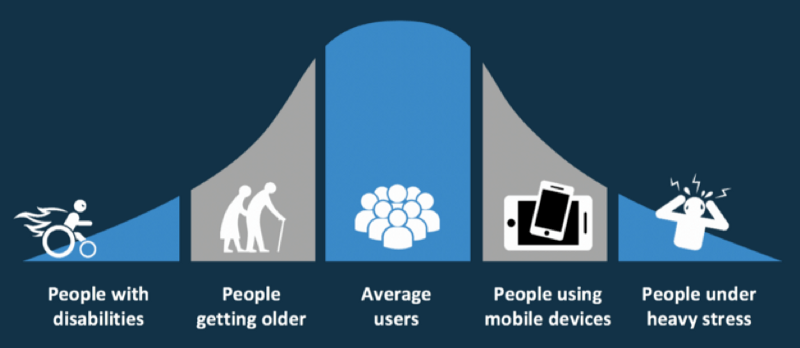
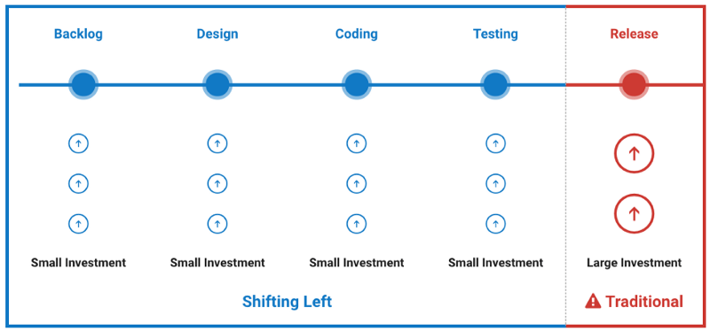
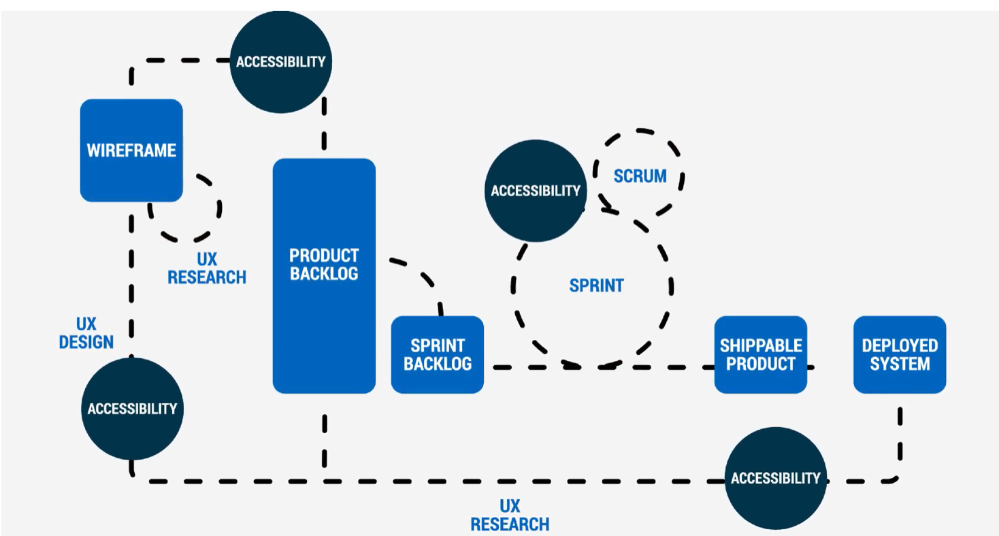
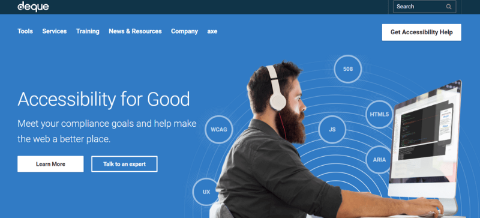
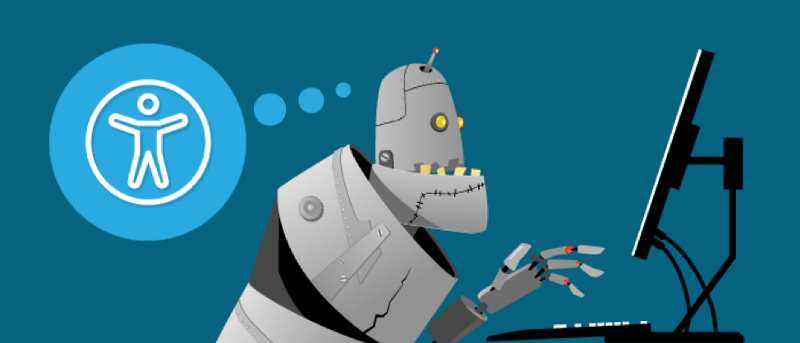

<em>Originally published on <a href="https://www.deque.com/blog/5-digital-accessibility-myths-busted" target="_blank">Deque Systems</a></em>
##Accessibility fact vs fiction

By now you have most likely have heard the term <a href="https://www.deque.com/accessibility-beginners-guide" target="_blank">digital accessibility</a> and may have an inkling about what it is — but have you bought into the hype? Or are you secretly asking yourself questions like:

- “How many people visiting my website or app actually need these accessibility features?”
- “Won’t it take too much time/effort/money to make my website or app accessible?”
- “Will my website or app be ugly if I make it accessible?”

If you or your client have pondered these (or similar) thoughts, I am here to challenge your thinking by busting some myths around digital accessibility!

##Myth #1: Only a small percentage of my users need an accessible website or app

Nope, not even close!

According to last US census results, about <a href="https://www.census.gov/newsroom/releases/archives/miscellaneous/cb12-134.html" target="_blank">19% of the United States population</a> identifies as having a disability. That works out to roughly 57 million individual people. Thinking of these numbers in a different way, there are more people with disabilities than populations of New York and California combined. If you consider a global audience, you are talking about <a href="http://www.who.int/disabilities/world_report/2011/report/en/" target="_blank">15% of the world’s population</a> according to the World Health Organization (WHO). That is over one billion people worldwide!

Of course, the number of people who consider themselves disabled is huge on its own. But there is also a large percentage of the population who could benefit from an accessible website or app, but who do not identify as having a disability.

Examples of these communities include:

- <strong>Aging population</strong> — may need captioning on videos or larger font sizes to read the text
- <strong>Users whose native or primary language is not English</strong> — may need more time to read text on auto-rotating slideshows
- <strong>Users with cognitive limitations</strong> — may need accessibility-friendly fonts or bulleted content to help focus
- <strong>Users with limited or low vision</strong> — may need to zoom in on content to be able to read and understand it
- <strong>Users with situational disabilities</strong> — may need better color contrast so glare on a screen does not interfere with them reading the content
- <strong>Users with temporary disabilities</strong> — may need to access everything with only their keyboard because they are unable to use a mouse

So when you consider these additional groups, the number of people needing websites and apps built in an accessible way is much higher than the number of people reporting that they are disabled. And of course, that number will continue to grow as people live longer and technology becomes even more prevalent and important to our daily lives.

##Myth #2: It will take too much time/effort/money to make our website or app accessible

Not really!

A lot of companies test accessibility at the end of the development cycle, right before their new website or app is launched to the public. But if you wait to test accessibility at the end — then you are late to the party. The tiny accessibility bugs that could have been squished with one line of code, have morphed into giant Mothra-sized bugs that may require major rewrites that can frustrate the entire team. But by being a little proactive about accessibility and building it in from the beginning, you will stomp the bugs as you find them and thus save time, effort, and money in the long run.

This “<a href="https://www.24a11y.com/2017/accessibility-first/" target="_blank">accessibility first</a>” or “<a href="https://www.deque.com/shift-left/" target="_blank">shift left</a>” approach may seem a little daunting. It might even seem like a radical shift in thinking to some, but we’ve been here before. In fact, the way you might feel about digital accessibility today is much like how a lot of us felt when we first heard about the “<a href="https://en.wikipedia.org/wiki/Responsive_web_design" target="_blank">mobile first</a>” approach. In the beginning, the “mobile first” approach was confusing and sometimes frustrating (remember pixel perfect breakpoints?!). But we struggled through it and now it is a normal part of our daily workflow. In fact, it’s hard to image designing or developing a website or app without considering multiple devices now. I predict that is what digital accessibility will feel like in a few years — just a normal part of the workflow process that doesn’t require much additional time or effort.

##Myth #3: Digital accessibility is a one-time-only task for the developers

No way!

If we wait to incorporate accessibility best practices at the code level, then we’ve missed the point of making accessibility a priority (see Myth #2). It is true that developers have a lot of influence on how accessible a website or app is in general. But there are a lot of other people that _should_ be responsible for digital accessibility as well including:

- <strong>Clients/Shareholders</strong> — This group holds the money and dictates the timeline of the project (which is usually the cheapest product in the fastest amount of time). They need to understand that taking some extra time and budget to build accessibility into the beginning of the project will help them in the long-run — especially if they are one of the unlucky ones who gets sued for not having an accessible website or app in the first place.
- <strong>Marketing/Sales</strong> — This group should understand that making websites and apps more usable can directly lead to more sales/web traffic for the client. By pointing out that some SEO techniques are directly related to accessibility best practices, they can maximize their client’s time and money.
- <strong>Web Architects/Designers/UI and UX Specialists</strong> — This group inspires the code that will be written and is a big influence on a website or app’s accessibility. In some organizations, a developer will not (or cannot) question what is sent to them from this group, so designers and UI/UX specialists must ensure their wireframes and mockups are accessible before a developer even writes one line of code.
- <strong>Digital Strategists/Editors/Content creators</strong> — This group has more influence on accessibility than some might realize. Even if the website or app has been optimized, designed, and developed with accessibility in mind the actual content on the page can break all of that down. Content is fundamental to the overall accessibility of your website or app.
- <strong>Users</strong> — This group is really what it is all about. Let’s say you did your job and your website or app is as accessible as you could possibly make it — awesome! But guess what? Users are people. And people are varied and so are the browsers, devices, environments, and assistive technologies that they use. It is impossible to make your website or app 100% accessible to all of that variety, so users should have a place to report issues that they encounter with your website or app and you should _listen_ and make those changes.

For a deeper dive on this subject, check out Dennis Lembree’s series on <a href="https://www.deque.com/blog/empowering-equipping-workforce-a11y-success-2/" target="_blank">building accessibility into your organization</a>.

##Myth #4: Accessible websites and apps are plain or ugly

Not true!

A lot goes into designing a website or app — idea/sketch phase, prototyping, UI/UX considerations, wireframes, mockups, style guides, etc. With so much already going on, it can feel daunting to add more thing to the mix — especially something like digital accessibility which many feel is the opposite direction of modern website/app design. But fear not! Accessible websites and apps do not have to be <a href="https://www.deque.com/blog/fact-fiction-accessible-websites-ugly-design/" target="_blank">plain or ugly</a>.

There are so many examples now of beautiful and mostly accessible websites including (but not limited to):

<ul class="postList"><li name="3870" id="3870" class="graf graf--li graf-after--p"><a href="https://24ways.org/" target="_blank">24 Ways</a></li><li name="304d" id="304d" class="graf graf--li graf-after--li"><a href="https://www.chase.com/" target="_blank">Chase Bank</a></li><li name="0b32" id="0b32" class="graf graf--li graf-after--li"><a href="https://www.deque.com" target="_blank">Deque Systems</a></li><li name="b887" id="b887" class="graf graf--li graf-after--li"><a href="https://www.funka.com/en/" target="_blank">Funka</a></li><li name="c0c1" id="c0c1" class="graf graf--li graf-after--li"><a href="https://www.iu.edu/" data-href="https://www.iu.edu/" target="_blank">Indiana University</a></li><li name="e41f" id="e41f" class="graf graf--li graf-after--li"><a href="https://www.jiffylube.com/" target="_blank">Jiffy Lube</a></li><li name="1170" id="1170" class="graf graf--li graf-after--li"><a href="http://www.noaa.gov/" target="_blank">National Oceanic and Atmospheric Administration (NOAA)</a></li><li name="c862" id="c862" class="graf graf--li graf-after--li"><a href="https://www.whitehouse.gov/" target="_blank">The White House</a></li><li name="6c76" id="6c76" class="graf graf--li graf-after--li"><a href="http://www.washington.edu/" target="_blank">University of Washington</a></li><li name="1806" id="1806" class="graf graf--li graf-after--li"><a href="https://designsystem.digital.gov/" target="_blank">U.S. Web Design System</a></li></ul>

There are more examples I could list, but you get the point — websites and apps of any genre can be both modern _and_ accessible. By mentally reframing digital accessibility as a kind of “design challenge” and less of a forced requirement, you can open the door to many possible solutions that are both beautiful and accessible.

<strong>Disclaimer:</strong> most of the sites on this list do have some outstanding accessibility issues, but the overall number of issues are low or the infractions are minor compared to the majority of websites out in the wild. Also, keep in mind that website/app designs and features continuously change so this list may be outdated by the time you read this article! Do your own testing please and let us know if we need to update the list.

If making websites and apps more inclusive wasn’t enough, a side benefit to knowing about digital accessibility — more job opportunities! If you are a design professional or student looking for a job, having accessible design experience or knowledge will most definitely set you apart from your competition.

If you are new to the field, there are a lot of great resources to help you start your journey, including:

<ul><li><a href="https://www.deque.com/blog/current-design-trends-affect-web-accessibility/" target="_blank">How Current Design Trends Affect Web Accessibility</a> (article)</li><li><a href="https://www.deque.com/blog/design-code-thinking-accessibility-ground/" target="_blank">Design Before Code: Thinking About Accessibility from the Ground Up</a> (article)</li><li><a href="https://accessibility.deque.com/live-webinar-accessibility-heuristics" target="_blank">Intro to Accessibility Heuristics</a> (recorded webinar)</li></ul>

##Myth #5: I used some automated testing tools, so my website or app is now accessible

Hold your horses, partner!

According to a study on the <a href="https://accessibility.blog.gov.uk/2017/02/24/what-we-found-when-we-tested-tools-on-the-worlds-least-accessible-webpage/" target="_blank">world’s most inaccessible website</a>, automated testing tools can reliably catch up to 41% of _some_ types of errors. There is a lot of heated discussion around these kinds of studies and which are the “best” automated tools — but regardless of the automated tool(s) you choose to use, there are other testing factors to consider as well.

Some automated testing related questions include:
- Which browsers or operating systems do I test on?
- What devices should I test — desktop, tablet, mobile?
- How reliable is the automated tool I am using?
- What if different tools give me different results?
- How do I prioritize the accessibility bugs the tool reports out?
- What errors did the tool miss?

So while automated tools are truly amazing and getting “smarter” with each new version, as of today they cannot find all of your accessibility issues and still require a human to interpret the results and prioritize the issues they do find. For example, an automated testing tool might tell you that your image is missing alternative text, but it cannot tell you what alternative text to write. Or in the case of a decorative image, it may flag it as needing alternative text, when it actually may not.

That said, most accessibility experts agree that automated testing tools are a great first step towards accessible websites and apps?. Just don’t stop there! Automated testing tools most effective when coupled with manual testing.

Manual testing can include:
- Reviewing website or app structure/architecture (ex. reviewing heading order)
- Keyboard compatibility tests (ex. logical reading/tab order)
- Media review (ex. audio and/or text description for video)
- Assistive technology device testing (ex. screen readers and beyond)
- Real user testing!

##Recap: Accessibility Myths Busted!
Hopefully, I helped “bust” some of your myths around accessibility with this article. Together we can help spread the word that:

- Digital accessibility helps more people than you might realize
- Think about accessibility early and often in the design and development process to save time, effort, and money on the overall project
- Digital accessibility is the job of every single person in your company — not just the developers or QA
- Websites and apps can be both beautiful and accessible
- Using automated testing tools is a great first step, but you must also include manual tests in order for your website or app to be truly accessible

Of course, these are just a few accessibility myths that are floating around — let me know if you have others for another round of myth busting! In the meantime, remember that digital accessibility is NOT an all or nothing game. Even incorporating a small change into you or your company’s workflow can have exponential benefits. So get out there and bust some accessibility myths of your own!
