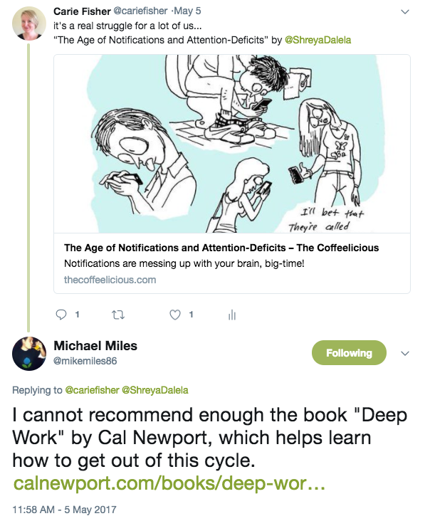
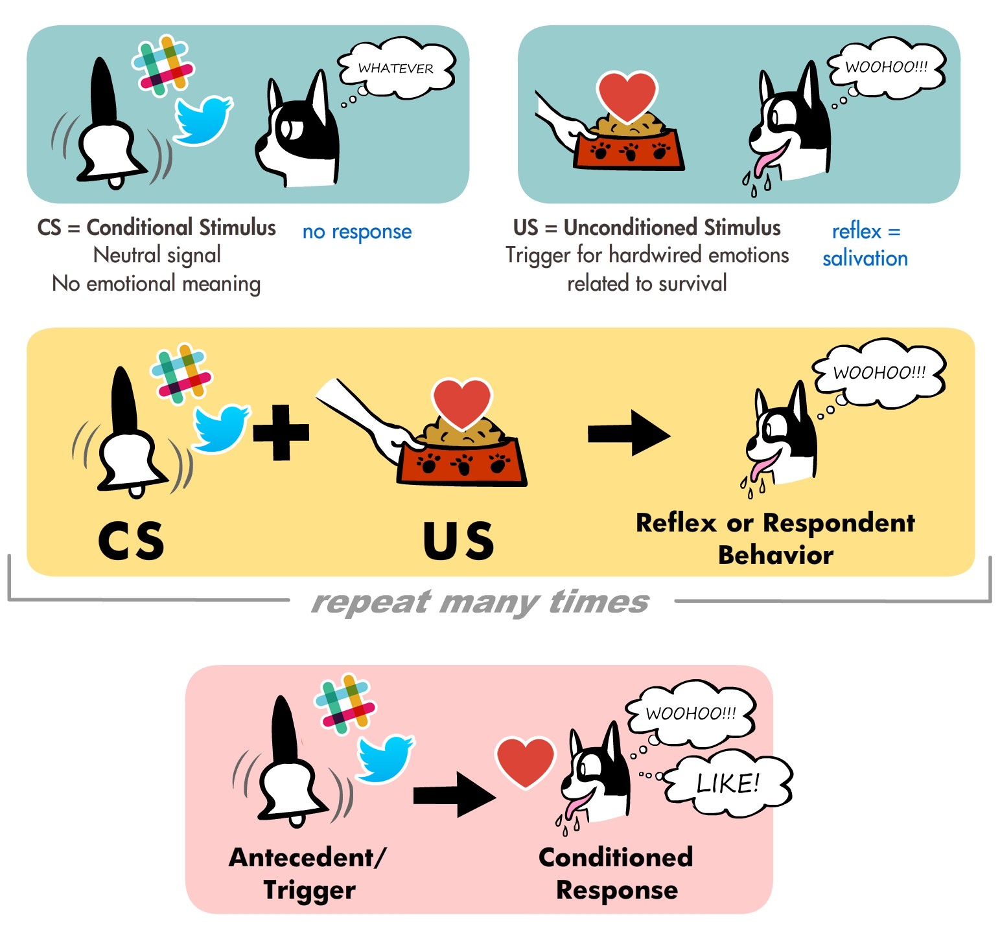

<em>Originally published on <a href="https://medium.com/swlh/want-to-be-more-productive-take-time-to-smell-the-roses-3606297fffb3" target="_blank">The Startup</a></em>

## Screaming into the Void
I consider myself a fairly productive person, but when I made a personal goal to write every day I struggled. Every time I got a spare moment to write, some text, some ping, some something more urgent always came up. For months, I hardly formed more than a few sentences and certainly did not finish a story.

I quickly came to realize that changing up a daily routine can be tricky, especially when life and work and so many <a href="https://media.giphy.com/media/hjMQLE1cnmGR2/giphy.gif" target="_blank">sloth gifs</a> seem to get in your way. But instead of making a plan of action, I did what any reasonable xennial would do — I complained about the struggle on Twitter.

Luckily when I screamed into the void that time, someone responded.

My colleague <a href="https://twitter.com/mikemiles86" data-href="https://twitter.com/mikemiles86" target="_blank">Mike Miles</a> recommended I read the book <a href="https://www.goodreads.com/book/show/25744928-deep-work" target="_blank">Deep Work</a> by Cal Newport, to gain some more insight into how to focus on tasks/problems in our distracted, technologically-obsessed world. In the book, Newport offers many different ways to unplug and become a deeper thinker.

While some ways Newport suggested to unplug were impractical for most people—taking months off and secluding oneself in a cabin deep in the woods à la <a href="https://en.wikipedia.org/wiki/Walden" data-href="https://en.wikipedia.org/wiki/Walden" class="markup--anchor markup--p-anchor" rel="noopener nofollow" target="_blank">Henry David Thoreau</a>; other methods were a bit more reasonable — dedicating a certain time of the day to unplugging or setting aside a specific number of hours to work on deeper thoughts and projects.

I decided to try the ladder option to see if my writing productivity level would increase, assuming my family would rather I not become a woodsy hermit.

##Deep Thinking Leads to Productivity
At the heart of Newton’s book and many complimentary articles I read on the subject, the basic law of productivity states:

<strong>(Time Spent) x (Intensity of Focus) = High-Quality Work Produced</strong>

If you subscribe to this theory, you could hypothetically increase your focus and decrease the time spent on a task, while not sacrificing the quality.

<blockquote>“To produce at your peak level you need to work for extended periods with full concentration on a single task free from distraction.” — <a href="http://knowledge.wharton.upenn.edu/faculty/grantad/" data-href="http://knowledge.wharton.upenn.edu/faculty/grantad/" class="markup--anchor markup--pullquote-anchor" rel="noopener nofollow noopener" target="_blank">Adam&nbsp;Grant</a></blockquote>

This is especially good news since productivity experts have found that our capacity for thinking deeply is a <a href="https://thecoffeelicious.com/heres-exactly-how-long-you-can-retain-insane-productivity-for-591820b83258" data-href="https://thecoffeelicious.com/heres-exactly-how-long-you-can-retain-insane-productivity-for-591820b83258" class="markup--anchor markup--p-anchor" rel="noopener nofollow noopener" target="_blank">limited resource</a> and our brains are not built to focus for an entire <a href="http://www.businessinsider.com/this-is-the-perfect-amount-of-time-to-work-each-day-2016-1" data-href="http://www.businessinsider.com/this-is-the-perfect-amount-of-time-to-work-each-day-2016-1" class="markup--anchor markup--p-anchor" rel="noopener nofollow noopener" target="_blank">eight hours a day</a>. Some studies show that even the most advanced deep thinkers only have four good hours in them per day&#8202;—&#8202;so what does that mean for the rest of us? Assuming we all want to maximize our time and increase our productivity&#8202;—&#8202;how do we go from novice to expert deep thinkers?

<em class="footnotes">Adapted image showing a Pavlovian response to notifications. Get the real poster here from <a href="https://www.doggiedrawings.net/freeposters" data-href="https://www.doggiedrawings.net/freeposters" class="markup--anchor markup--figure-anchor" rel="nofollow noopener" target="_blank">Get the real poster here from Lili&nbsp;Chin</a>.</em>

##Take a Break From Distractions
The zen of technology is hard to obtain. I can admit that Slack pings and Twitter notifications illicit a <a href="https://en.wikipedia.org/wiki/Classical_conditioning" data-href="https://en.wikipedia.org/wiki/Classical_conditioning" class="markup--anchor markup--p-anchor" rel="nofollow noopener" target="_blank">Pavlovian response</a> in me. Just like the dog in the famous experiment, I have been conditioned to respond to a noise/visual clue as quickly as possible in order to get my reward. Your distraction mechanism might be different, but your response is probably similar.

Always being connected is an addiction for some people—a carrot at the end of a stick that you will never eat; a Sisyphean boulder you push uphill, only to watch it roll back down again. This endless cycle of one more post, one more text, one more message, can be exhausting — but we keep on doing it, partially because of our unconscious conditioning. How is this being productive?

<blockquote>“To succeed with deep work you must rewire your brain to be comfortable resisting distracting stimuli. This doesn’t mean that you have to eliminate distracting behaviors…instead eliminate the ability of such behaviors to hijack your attention.” — <a href="http://calnewport.com/" data-href="http://calnewport.com/" class="markup--anchor markup--pullquote-anchor" rel="noopener nofollow noopener" target="_blank">Cal&nbsp;Newport</a></blockquote>
According to a popular productivity study, researchers found that the ideal work-to-break ratio was 52 minutes of focused work, followed by 17 minutes of rest. During those 52 minutes of work, there is one basic rule — “go dark” from any and all technological distractions that you can. That means, do not check social media, email, texts, voice messages, or instant messages. Basically, act as though the apocalypse happened and all communication lines are down.

It might sound easy, but fully unplugging in a consistent way is very difficult, especially if you have been conditioned to jump at each notification that comes your way. It takes conscious effort to take breaks, but after doing it for a few months, I can say it gets easier with time.

The most surprising thing I found when I unplugged, was how productive I became when working on more complex tasks. By unplugging from the world’s minor distractions, you will allow yourself to dive deeper into a subject or problem at hand. Subsequently, this will boost your overall productivity. Or at the very least, keep you a bit more sane.

Learn to Be Bored
What is the number one thing people do when they are bored? Check their phones. Admit it, you do it. I do it. We all do it. Standing in line at a store, waiting for the next meeting to start, working out at the gym, even sitting on the toilet…really during any mundane task, we are on our phones. In fact, the average person spends 23 full days on their phone in a year. Whatever happened to the art of being bored?

Learning to be bored enhances our attention span, regulates our emotions, and increases compassion according to numerous neurological studies. In addition to those benefits, when you put down your phone, you allow your brain to rest and work on problems subconsciously, which can ultimately lead to higher productivity.

“Idleness is not just a vacation, an indulgence or a vice; it is as indispensable to the brain as vitamin D is to the body, and deprived of it we suffer a mental affliction as disfiguring as rickets…it is, paradoxically, necessary to getting any work done.”— Tim Kreider
The link between subconscious problem-solving and boredom is not a new phenomenon, rather it is something philosophers and scientists have been discussing for some time now.

One of the main reasons our subconscious mind is often better at solving problems than our conscious mind is because it is significantly less constrained by rules and protocol. How many stories have you read about where an inventor/scientist/artist came up with their brilliant idea while doing something mundane like taking a shower? How many genius ideas are born while not actively thinking about the actual problem? I would wager quite a few.

By allowing your brain some boredom, some quiet, some mindfulness, you just may come up with a novel solution to that complex problem that has been gnawing at you. Try being bored for a moment. It is harder than it seems. Once you have mastered a few minutes, try an hour, a day, a week and see what problems you can solve and how your daily productivity benefits.

Reconnect with Your Non-Virtual Life
Finding real work/life balance can be difficult. It is something I personally struggle with a lot — that balance between my online life and my actual real life. The line where one starts and where one ends is often confusing and blurred, even more so when you work on a remote team and your office is also your home. One easy way to reconnect with real life is to go out in nature.

According to an ecopsychology experiment from the University of Michigan, taking time to commune with nature can increase your productivity. In the experiment, students were asked to study lists of random numbers and recite them from memory in reverse order and to memorize the locations of certain words arranged in a grid.

“Look deep into nature, and then you will understand everything better.” — Albert Einstein
After these deep-thinking tasks, half the students were allowed to stroll down a path in an arboretum, while the other half walked around a bustling Ann Arbor street. When retested, the students that strolled amongst trees recalled 1.5 more digits than the first time they took the test; while those who had walked through the city improved by only 0.5 digits. There are a lot of wonderful reasons for connecting with nature, but who knew that productivity was one of them?

A big part of the whole work/life balance equation is the life part. So it is important to unplug and spend time with actual living creatures. When you reconnect with nature, you develop deeper thinking skills that will help you be more productive, which in turn allows you more time to spend outside. It is a cyclical pattern that is beneficial to your mental, physical, and emotional well-being — and just might make you more productive at work. So stop making excuses and go outside and fly a kite.
