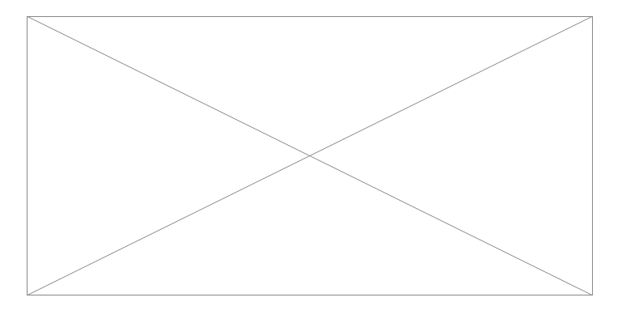
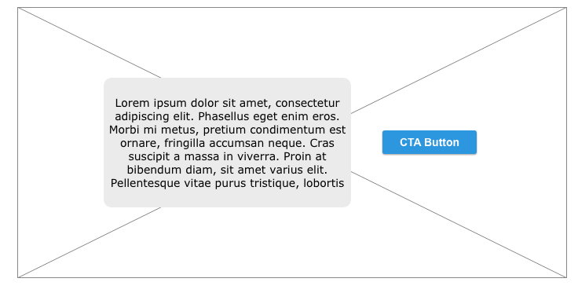
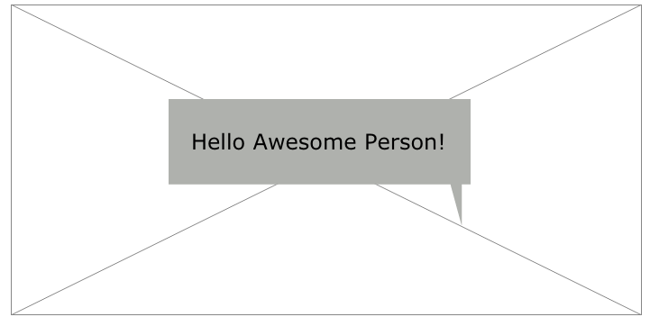
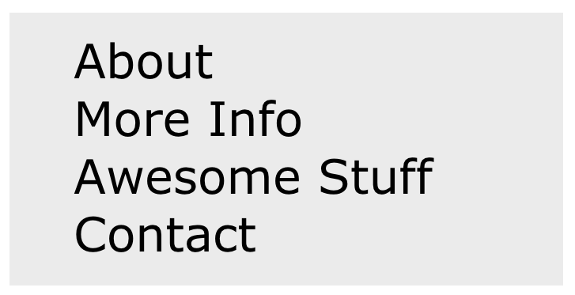

## Slideshows *are* Evil
Slideshows, sliders, carousels: no matter what you call them, in terms of web design they are just evil. Do a quick Google search and you will see that most frontend developers and UX/UI designers can agree on this point and have been talking about it for years. But why do we still constantly see them?

Part of the issue is that slideshows, especially in the hero region, are so ubiquitous that many clients see them as necessary and keep asking for them. They have essentially become a “home page standard.”

A design element that is so prevalent can’t be all that bad, right? Wrong. The next time a client asks for a slideshow, resist the temptation to go off on why they will kill a website, and propose one of these alternatives.

##So Why Are Slideshows Evil?

Okay, so slideshows are not inherently evil, but they do not really accomplish the goals that clients believe they will. At best, they are expensive, overlooked sections of your site. At worst, they can actually hurt conversion rates and damage the user experience. There are many articles that address why slideshows do more harm than good, but here is a quick overview:
<ul class="c7 lst-kix_f73wywtqumq2-0 start"><li class="c1">Slideshows have poor accessibility — most slideshows are lacking in their support for users with accessibility issues, including users with language or motor skill issues.</li><li class="c1">Slideshows are a blindspot&nbsp;— multiple eye tracking tests show that slideshows get little attention by site users. Users just ‘gloss-over’ these very important sections of your site.</li><li class="c1">Slideshows induce apathy&nbsp;— often a user thinks that the slideshow is not relevant to them so they just ignore it.</li><li class="c1">Slideshows are distracting — if users do look at the slideshows they often find them visually annoying and this can distract from the important content.</li><li class="c1">Slideshows are heavy&nbsp;— slideshows do not always work well on mobile devices and they can even slow down your site due to the amount of bandwidth they use.</li></ul>

##Option 1: Stand-Alone Image

Instead of a slideshow, why not choose a perfect image that represents your brand? A single image, with or without overlay text, can have a powerful and direct impact on your users. With a single image, your message is very clear. If you need to change that message for any reason, just change the image or overlay text.

Example Sites with Stand-Alone Images:

<a class="c3" href="https://www.google.com/url?q=http://christianwoo.com/&amp;sa=D&amp;ust=1560198286442000" target="_blank" rel="noopener noreferrer">Christian Woo</a>

<a class="c3" href="https://www.google.com/url?q=https://www.nike.com/us/en_us/&amp;sa=D&amp;ust=1560198286442000" target="_blank" rel="noopener noreferrer">Nike</a>

##Option 2: Stand-Alone Image with CTA

You can take the stand-alone image one step further by providing a call-to-action (CTA) button/link to further engage your users. This single action is direct and obvious to your users and can help with the overall user experience and conversion rates.

Example Sites with Stand-Alone Images with CTA:

<a class="c3" href="https://www.google.com/url?q=https://www.artistsweb.com/&amp;sa=D&amp;ust=1560198286443000" target="_blank" rel="noopener noreferrer">Artists Web</a>

<a class="c3" href="https://www.google.com/url?q=http://www.careaction.org/&amp;sa=D&amp;ust=1560198286444000" target="_blank" rel="noopener noreferrer">Care Action Now</a>

##Option 3: Image Grids

Instead of having one image, why not display an image grid? Using an image grid allows you to include more visuals without adding in a slideshow. Making these images links or adding CTA buttons within each section will further enhance the user experience with your site. There are infinite image grid layout possibilities, the ones pictured in this article are a few examples of potential layouts. The only limit is your imagination.

Example Sites with Image Grids:

<a class="c3" href="https://www.google.com/url?q=http://mikekus.com/&amp;sa=D&amp;ust=1560198286444000" target="_blank" rel="noopener noreferrer">Mike Kus</a>

<a class="c3" href="https://www.google.com/url?q=http://www.pinstripealley.com/&amp;sa=D&amp;ust=1560198286445000" target="_blank" rel="noopener noreferrer">SB Nation Pinstripe Alley</a>

##Option 4: Engaging Video/Animated Hero

There are times where an image alone cannot convey your message. In these cases, adding an engaging video or animated hero to your site is a great alternative to a slideshow. It is important not to just add a video/animated hero just for the coolness factor, but because it brings some depth or voice that a single image cannot. Just be sure to have video transcripts or other alternative methods of viewing your video/animation content for users with screen readers.

Example Sites with Engaging Video/Animated Hero:

<a class="c3" href="https://www.google.com/url?q=http://www.species-in-pieces.com/&amp;sa=D&amp;ust=1560198286446000" target="_blank" rel="noopener noreferrer">Species in Pieces</a>

<a class="c3" href="https://www.google.com/url?q=http://taotajima.jp/&amp;sa=D&amp;ust=1560198286446000" target="_blank" rel="noopener noreferrer">Tao Tajima</a>

##Option 5: Focused Landing Pages for Different User Types

Instead of relying on a slideshow to convey all the information you want to highlight on your site, why not narrow the focus a bit and personalize the experience? With focused landing pages when a user comes to your site, they are presented with information that is pertinent to them and not overloaded with all of the information. This is a great way to engage your users without using a slideshow.

Example Sites with Focused Landing Pages:

<a class="c3" href="https://www.google.com/url?q=https://muckrack.com/&amp;sa=D&amp;ust=1560198286447000" target="_blank" rel="noopener noreferrer">Muck Rack </a>

<a class="c3" href="https://www.google.com/url?q=https://www.codecademy.com/&amp;sa=D&amp;ust=1560198286447000" target="_blank" rel="noopener noreferrer">Code Academy</a>

##Option 6: Streamlined Design

Why not take all traditional design elements out of the hero region and simply present a streamlined design? This option might be too drastic a move for most clients, but this direct approach is great for user experience. With a streamlined design, there is less to distract a user from accomplishing the site goals you set.

Example Sites with Streamlined Design:

<a class="c3" href="https://www.google.com/url?q=http://www.codeandtheory.com/&amp;sa=D&amp;ust=1560198286448000" target="_blank" rel="noopener noreferrer">Code &amp; Theory</a>

<a class="c3" href="https://www.google.com/url?q=http://www.intuition-events.be/index.php&amp;sa=D&amp;ust=1560198286448000" target="_blank" rel="noopener noreferrer">Intuition</a>

##When All Else Fails

If you simply cannot convince your client not to use a slideshow, at least use one that is accessibility/UX focused. Some ways to make your slideshow more accessible and user-friendly include:
<ul class="c7 lst-kix_bw06zvd0iroc-0 start"><li class="c1">Show the first slide by default and allow a user to navigate through the rest of the slides manually (not auto-rotating).</li><li class="c1">Limit the number of slides and make sure the load time is fast.</li><li class="c1">Create navigation buttons that are highly visible and large enough to be useful on all devices.</li><li class="c1">Include all the controls available (next, previous, stop/pause, play, etc.) and make sure you can use the controls with a mouse, keyboard, and by touch.</li><li class="c1">Provide alternative ways to access the content (ex. text transcripts).</li></ul>
By providing<a class="c3" href="https://www.google.com/url?q=https://www.w3.org/WAI/tutorials/carousels/&amp;sa=D&amp;ust=1560198286450000" target="_blank" rel="noopener noreferrer">accessible and user-focused slideshows</a>, we enable more users to access the important content of the site and this enhances the overall user experience. See my article <a href="https://cariefisher.com/a11y-design/"> 5 Ways to Make Your Next Website Design More Accessible</a> for more tips on accessible and UX-friendly design.
