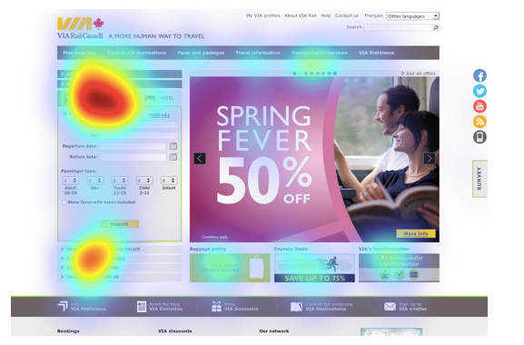
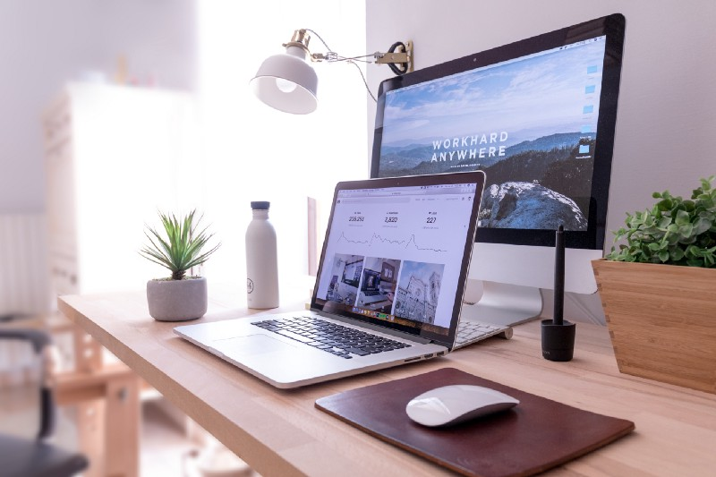

## No Really, Slideshows are Evil
In my previous blog post, 6 Design Alternatives to Avoid (Evil) Slideshows, I outlined six design alternatives to avoid slideshows. The response to that blog post was great &mdash; who knew there were so many kindred spirits who disliked slideshows?

From the feedback I received, the number one question was why are slideshows so bad in the first place? Followed by the question, if slideshow are so bad why do we still see them everywhere? This companion blog post will hopefully give you a deeper understanding of why alternatives to slideshows are the way to go and maybe help convince your next client of that point too.

##Why Do We Not Like Slideshows Again?

My original blog post focused on the design and UI/UX aspects of slideshows. The research that supported those ideas came from the many other blog posts on the subject. Try Googling &ldquo;Are Website Slideshows Bad&rdquo; and you will get over 15,400,000 results.

Obviously, no one can read and give overviews of all the blog posts about slideshows, but below are some of the main arguments I saw and links to specific blog posts that support each point, for further reading.
<ul class="c9 lst-kix_shdhg12pn6e0-0 start"><li class="c3">Slideshows are not effective&nbsp;&mdash; Studies have shown that people look at and <a class="c1" href="https://www.google.com/url?q=https://erikrunyon.com/2013/01/carousel-stats/&amp;sa=D&amp;ust=1560197092035000" target="_blank" rel="noopener noreferrer">take action only on the first slide</a>. If you do want them to look at more than one slide, make the first slide interesting or useful. The first slide has to sell the next slide to the user.</li><li class="c3">Slideshows are a blindspot&nbsp;&mdash; multiple <a class="c1" href="https://www.google.com/url?q=http://beantin.se/sliding-banner-content-slider-carousel-rotator/&amp;sa=D&amp;ust=1560197092036000" target="_blank" rel="noopener noreferrer">eye tracking tests</a>&nbsp;show that slideshows get little attention by website users. Users just &ldquo;gloss-over&rdquo; these very important sections of your website.</li><li class="c3">Slideshows can distract or induce user apathy&nbsp;&mdash; having constant stimulation from slideshows <a class="c1" href="https://www.google.com/url?q=https://conversionxl.com/blog/dont-use-automatic-image-sliders-or-carousels/&amp;sa=D&amp;ust=1560197092037000" target="_blank" rel="noopener noreferrer">distracts a user</a>&nbsp;from a website&rsquo;s more important stationary content.</li><li class="c3">Slideshows will not increase conversion rates&nbsp;&mdash; in theory, a slideshow should entice a user to take an action or otherwise become informed about a website goal or mission, but studies show that slideshows can actually <a class="c1" href="https://www.google.com/url?q=https://instapage.com/blog/6-reasons-why-image-sliders-are-bad-for-conversions&amp;sa=D&amp;ust=1560197092039000" target="_blank" rel="noopener noreferrer">decrease conversion rates</a>&nbsp;due to the frustration of use.</li><li class="c3">Slideshows can be bad for SEO/UX&nbsp;&mdash; improper header tags, slow page load due to high bandwidth images or videos, lack of alternative image tags, all can have a <a class="c1" href="https://www.google.com/url?q=https://instapage.com/blog/6-reasons-why-image-sliders-are-bad-for-conversions&amp;sa=D&amp;ust=1560197092040000" target="_blank" rel="noopener noreferrer">negative impact</a>&nbsp;on your website&rsquo;s SEO and user experience.</li><li class="c3">Slideshows can have poor accessibility&nbsp;&mdash; most slideshows are lacking in their support for <a class="c1" href="https://www.google.com/url?q=https://www.w3.org/WAI/EO/Drafts/tutorials/sliders/&amp;sa=D&amp;ust=1560197092041000" target="_blank" rel="noopener noreferrer">users with accessibility issues</a>, including users with language or motor skill issues. That means your slideshow is having less impact on users than you think.</li><li class="c3">Slideshows on mobile devices can be tricky&nbsp;&mdash; slideshows do not always work well on <a class="c1" href="https://www.google.com/url?q=https://www.smashingmagazine.com/2015/02/carousel-usage-exploration-on-mobile-e-commerce-websites/&amp;sa=D&amp;ust=1560197092041000" target="_blank" rel="noopener noreferrer">mobile devices</a>&nbsp;and they can even slow down your website due to the amount of bandwidth they use. This can result in lower SEO rankings and poor user experience.</li></ul>
Note: All that being said, I will admit that as a former scientist, I am dissatisfied the lack of hard empirical and recent data to support the good vs. bad argument of website slideshow &mdash; although the limited data that is available is compelling. It would be amazing to find even more studies on the effectiveness of website slideshows.

##Why Do People Still Use Slideshows?

The hero/banner section is arguably the most important region of real-estate on the homepage of your website. It is a place where your website goals are displayed &mdash; whether that is promoting a specific event, convincing users to buy your product, or listing your mission statement. It should be put to best use. So why do most websites clutter it with ineffective slideshows?
<ul class="c9 lst-kix_tcsl8o9eafjo-0 start"><li class="c3">Slideshows are what everyone is doing&nbsp;&mdash; politics, marketing trends, and inadequate research cater to this misconception.</li><li class="c3">Clients still believe in the &lsquo;above the fold&rsquo; mentality &mdash; and insist that the most important content belongs at the top of the page. This is true of newspapers, but not necessarily the case in website design.</li><li class="c3">Slideshows display a lot of content&nbsp;&mdash; clients want to use a slideshow to get as much content on the screen at one time. Remember less is sometimes more.</li><li class="c3">Slideshows add a &ldquo;wow factor&rdquo; or &ldquo;add to user experience&rdquo;&mdash;like moths to a flame, clients just really like to see flashy visual eye-candy. It is hard for them to imagine that users might disagree.</li></ul>

##So What Can We Do About It?

If you are a designer, first try creating a website design that does not include a slideshow. It may take you a bit out of your comfort zone, but that is the point. The article 6 Design Alternatives to Avoid (Evil) Slideshows will give you some basic ideas, but there are numerous other resources and inspiration websites you can reference as well.

If you are a client, be open to the idea that your website does not need to include a big splashy slideshow as its main focus. Embrace the change that will likely set you apart from your competitors. If you have the time and resources, do A/B testing to see what your users actually prefer. Do not assume that a slideshow is something your users want or need.

But if none of that convinces you, at least use a slideshow that is accessibility friendly and user-focused. Some ways to optimize your slideshow include:
<ul class="c9 lst-kix_5fefjmm0xxzh-0 start"><li class="c3">Show the first slide by default and allow a user to navigate through the rest of the slides manually (not auto-rotating).</li><li class="c3">Limit the number of slides and make sure the load time is fast.</li><li class="c3">Create navigation buttons that are highly visible and large enough to be useful on all devices.</li><li class="c3">Include all the controls available (next, previous, stop/pause, play, etc.) and make sure you can use the controls with a mouse, keyboard, and by touch.</li><li class="c3">Provide alternative ways to access the content (ex. text transcripts, audio files, closed caption) for your slideshows.</li></ul>
By providing accessible and user focused slideshows, we enable more users to access the important content of the website, thereby enhancing the overall user experience.
