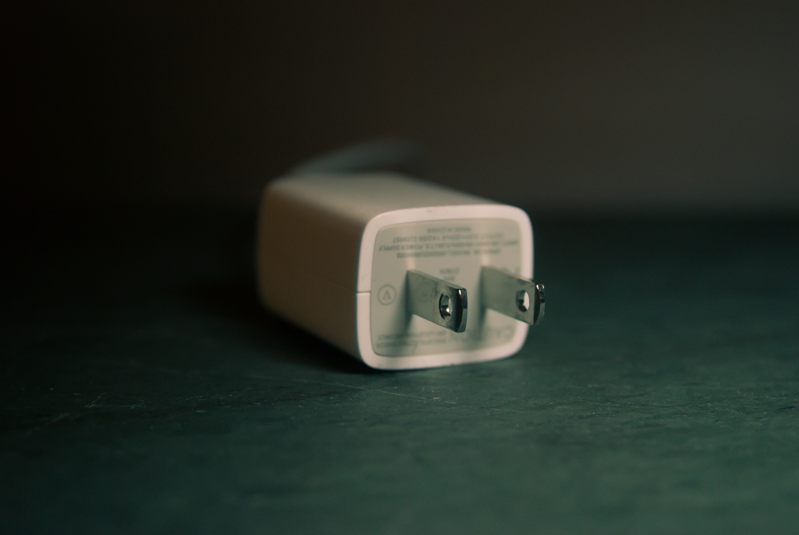

Today is my 10th anniversary...of working remotely!

Some people think remote working is "living the life" - but it's not always a vacation. Over the years, I've had both good and bad experiences, so I decided to compile some pro-tips to shed some light on how to effectively work from home while maintaining a good work/life balance.

##1. Get dressed every day

There is a huge temptation to roll out of bed and just wear whatever you slept in the night before. Don't.

By getting dressed in "real" clothes, you are sending a signal to your mind that it is time to begin the workday. Of course, this doesn't mean you have to wear a suit and tie (unless that is your thing), but it does mean putting on something you wouldn't be embarrassed to be seen out in public wearing.

Myself, I often rock a "work mullet" - nice shirt, combed hair, and minimal make-up on top - but usually comfy pants, silly socks, and moccasins on the bottom. It's not for everyone but seems like a nice balance of the two worlds.

##2. See people IRL

Yes, people can be overrated and annoying sometimes. But when you work remotely, they are essential.

I suggest you find a public spot to work and go there at least once a week. This change of scenery is vital, especially for us extroverts or creatives needing some inspiration or just more environmental energy. Some people are lucky that they live in cities large enough to have co-working spaces. If so, that is a great option! If not, the local library or a coffee shop should suffice.

Just be careful to not overdo it on the caffeine and scones....arguably one of the most delicious occupational hazards for a remote worker.

##3. Move it or lose it (your brain, that is)

Exercise. I'm pretty sure that is a doubled-up four-letter word. But for the remote worker IMHO, it is one of the keys to mental health.

Studies have shown exercise can help decrease stress, increase memory, and also boost overall brain cognition. What's not to love? I'm no brogrammer, but I make it a point to run/walk every day I can. On weeks when I'm lucky, I find time for yoga as well.

If running/walking is not your thing, think about buying an under-the-desk bike you can peddle in the middle of meetings, while Karen drones on about the latest sales projections. Or start even smaller and swap out your boring old office chair with a stability ball chair. You might not end up with abs of steel, but it will at least help improve your balance and posture.

##4. Set aside some office space

You don't need much to make an office. Usually a desk and a chair, and some random office supplies. But in reality, your home office might be your couch, or your dining room table, or a chair on your patio.

Whatever your "office" might look like, it is important to designate that space as the "office space" and try to only use it when you are working. By deeming certain physical spaces as work vs living spaces, your mind can be triggered to think differently in these spaces.

For me, I need a room and a desk and a DOOR. That way, at the end of the day, I can just close that door and shut down the working part of my brain. I realize not everyone is lucky enough to have an office space with a door, but if you can turn that spare guest/closet/craft room into an office as well, it might help you achieve some more balance inside your home...and mind.

##5. Utilize videos at meetings

Admittedly, I'm the worst at taking my own advice on this one...but use videos whenever you can during meetings. By doing this, you are reminding the voice on the other end that you are a HUMAN. That simple change goes a long way in building relationships and connecting beyond just tasks and deliverables.

For people who multi-task - yes, I am talking to you - turning your video on will help you stay focused. It is very obvious when people are checking their email or slack messages, or just playing on their phone when you have a video on...not so much when you don't.

Just don't forget it is on and accidentally roll your eyes at something...not saying I've done that, but my "friend" has!

##6. Establish clear work/life boundaries

I'm a fan of schedules. I have a work calendar, a personal calendar, a calendar for each member of my family, even a calendar for my dogs! So you'd think I would also be good at scheduling boundaries - but you would be wrong.

One big issue with working from home is that you never really leave the office. So besides having a space for your office (see #4) it is imperative to create set hours when you are at work and when you are off the clock.

One easy way you can establish boundaries is to utilize a setting like Google's "working hours" to let people know what times you're working and when you're available for meetings. This will warn people if they try to invite you to a meeting outside of these hours. The hard part - not responding during your "off hours" when someone sends you an email or meeting invite.

##7. Here comes the sun

I live in the arctic tundra...I mean, Wisconsin. The urge to stay indoors is strong during certain times of the year.

But I have found that when I dedicate at least 15 mins of my day to go outside, breathe in the air, and reconnect to the living world, I increase my concentration power when back in the office. Not only that but seeing the sun boosts my vitamin D, which positively impacts my mood.

Understanding the benefits of going outside is one thing, but forcing yourself to leave the comforts of your own home is another thing. For me, owning a dog is imperative to motivating me to leave the house. For others, there might be something else that can lure you outside - going to the mailbox, walking to a nearby coffee shop, picking your kids up from school - use whatever you can to stick to this rule.

##8. Engage with your community

If you are one of the lucky ones whose company is generous enough to give "continued education" monies and time off - use it! I know so so so many people who don't use this benefit and I can't figure out why.

An excuse I often hear is: I'm too busy. Well, think how productive you would be if you went to a conference and learned about a new tool/technique that could help you in your daily workflow? Or maybe you meet someone new at an event who would be an asset to your team? You never know until you go.

For those of you less lucky - you still have a lot of great options! Besides local or semi-local events, there are so many wonderful virtual conferences, meetings, and webinars nowadays. For networking, you have the usual places like Twitter and LinkedIn, but also many professional organizations have their own networking websites and/or Slack channels where you can connect to like-minded people.

##9. Remove "helpful" distractions

Tech is a blessing and a curse for a lot of us - but especially the remote worker. In lieu of seeing people in the office, we have all these "helpful" tools to connect electronically. Some of these tools are essential to getting daily stuff done, but some are just noise that make our brains more disjointed. Some tools meant to help us connect, actually make things worse.

For me, unplugging these helpers occasionally helps me concentrate on getting my work done. I call this "going dark" - where I unplug for an hour or two to go into deep thought/work. I suggest you do it at least a couple of times a week - or as your schedule allows. You will be amazed at how much you can accomplish without the constant pings.

For someone working in tech for as long as I have (15+ years), I honestly avoid tech as much as I possibly can. I am not very active on social media/Slack, I don't have any work apps on my phone, and I refuse to check email after 5 pm. I don't do this because I'm a secret tech curmudgeon, but because I have learned what tools are helpful to me and which just add to the noise.

##10. One size does not fit all
Finally, you need to realize that working remotely is a skill. And like any skill it takes practice, patience, and perseverance before you are good at it. The pro-tips in this article are things that work for me - but they might not work for you. Make sure you take some time to figure out what works best for you before you run back to office life.

Conversely, working from home isn't for everyone. It is OK to admit if remote working doesn't work for you. We all have different needs - both personally and professionally. Taking some time to step back and reevaluate what works for you and what doesn't is imperative to both your short- and long-term happiness.

<blockquote>It is common sense to take a method and try it. If it fails, admit it frankly and try another. But above all, try something. 
- Franklin D. Roosevelt
</blockquote>
