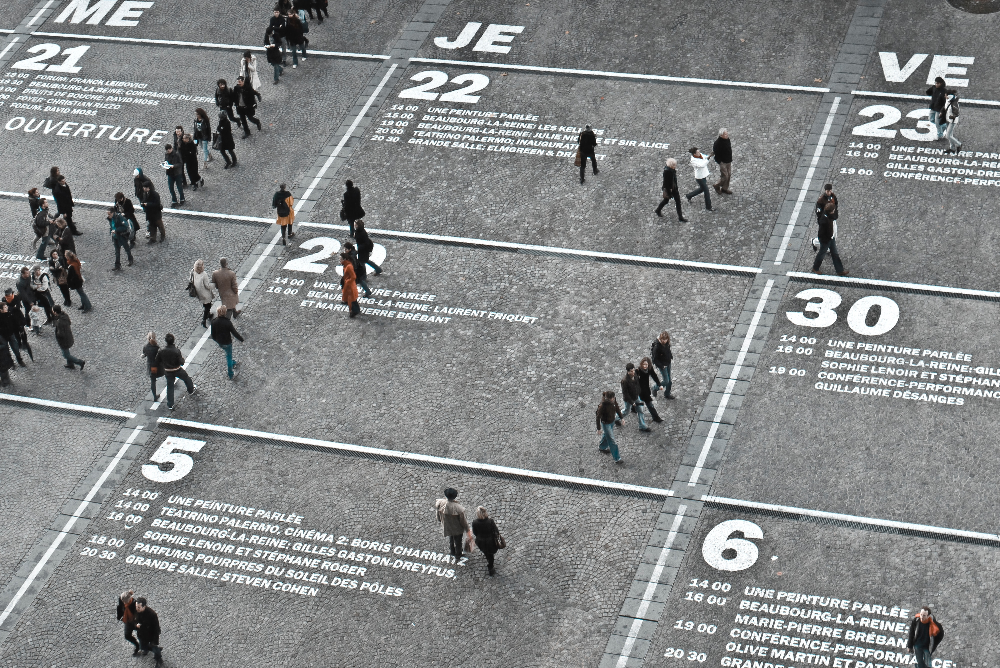

Today is my 10th anniversary...of working remotely!

Some think remote working is "living the life" - but it's not always a vacation. Over the years, I've had both good and bad experiences while working from home, so I decided to compile some "pro-tips" to shed some light for people just starting their remote work journeys.

##1. Get dressed every day

There is a huge temptation to roll out of bed and just wear whatever you slept in the night before. Don't.

By getting dressed in "real" clothes, you are sending a signal to your mind that it is time to begin the work day. Of course, this doesn't mean you have to wear a suit and tie (unless that is your thing), but it does mean putting on something you wouldn't be embarrassed to be seen out in public wearing.

Myself, I often rock a "work mullet" - nice shirt, combed hair, and minimal make-up on top - but usually comfy pants, silly socks, and moccasins on the bottom. It's not for everyone, but seems like a nice balance of the two worlds.

##2. See people IRL

Yes, people can be overrated and annoying sometimes. But when you work remotely, they are essential.

I suggest you find a public spot to work and go there at least once a week. This change of scenery is vital, especially for us extroverts or creatives needing some inspiration or just more environmental energy. Some people are lucky in that they live in cities large enough to have co-working spaces. If so, that is a great option! If not, the local library or a coffee shop should suffice.

Just be careful to not overdo it on the caffeine and scones....arguably one of the most delicious occupational hazards for a remote worker.

##3. Move it or lose it (your brain, that is)

Exercise. I'm pretty sure that is doubled-up four-letter word. But for the remote worker IMHO, it is one of the keys to mental health.

Studies have shown exercise can help decrease stress, increase memory, and also boost overall brain cognition. What's not to love? I'm no brogrammer, but I make it a point to run/walk every day I can. On weeks when I'm lucky, I find time for yoga as well.

If running/walking is not your thing, think about buying an under-the-desk bike you can peddle in the middle of meetings, while Karen drones on about the latest sales projections. Or start even smaller and swap out your boring old office chair with a stability ball chair. You might not end up with abs of steel, but it will at least help your balance and posture.

##4. Set aside some office space

You don't need much to make an office. Usually a desk and a chair, and some random office supplies. But in reality, your office could be your couch or your dining room table or your patio table. Whatever your "office" might look like, it is important to designate that space as the "office space" and try to only use it when you are working. By deeming certain physical spaces as work vs living spaces, your mind can be triggered to think differently in these spaces.

For me, I need a room and a desk and a DOOR. That way, at the end of the day, I can just close that door and shut down the working part of my brain (until I check my phone). I realize not everyone is lucky enough to have a space with a door, but if you can turn that spare guest/closet/craft room into an office space as well, it might help you achieve some more balance inside your home...and mind.

##5. Utilize videos at meetings

Admittedly, I'm the worst at taking my own advice on this one...but use videos whenever you can during meetings. By doing this, you are reminding the voice on the other end that you are a HUMAN and it goes a long way in building relationships and connecting beyond just tasks and deliverables.

For people who multi-task - yes, I am talking to you - turning your video on will help you stay focused. It is very obvious when people are checking their email or slack messages, or just playing on their phone when you have a video on...not so much when you don't. Just don't forget it is on and accidentally roll your eyes at something (not saying I've done that, but my "friend" has)! 

##6. Keep a schedule

put your schedule on a calendar and try and stick with it - do not respond "off hours" if you can; Establish clear work/life boundaries

lines of technology/life

take off all communication apps on your mobile

##7. Here comes the sun

Owning a dog helps motivate me to leave the house.

##8. go to professional events/conferences

##9. Find a tech balance. Remove distractions

Unplug for deeper thought or to concentrate

Unplug "go dark" for deeper thought
disconnect from technology once in awhile

##10. One size does not fit all
Realize remote working takes practice, patience, and perseverance. But also, it isn't for everyone.
