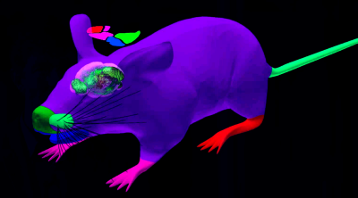
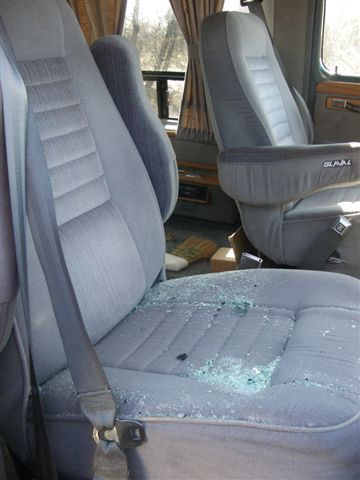
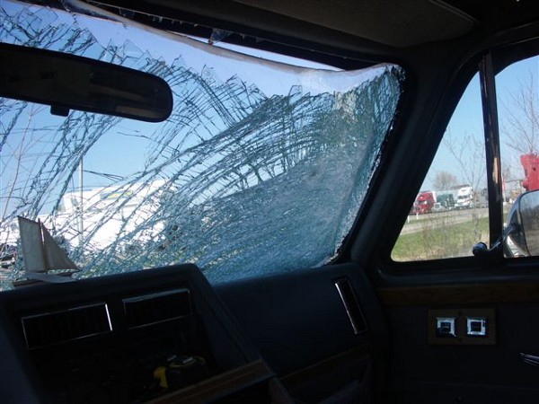
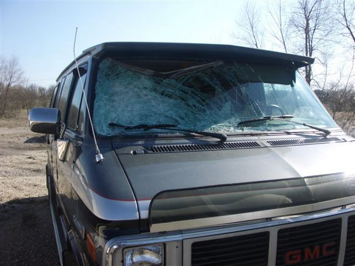
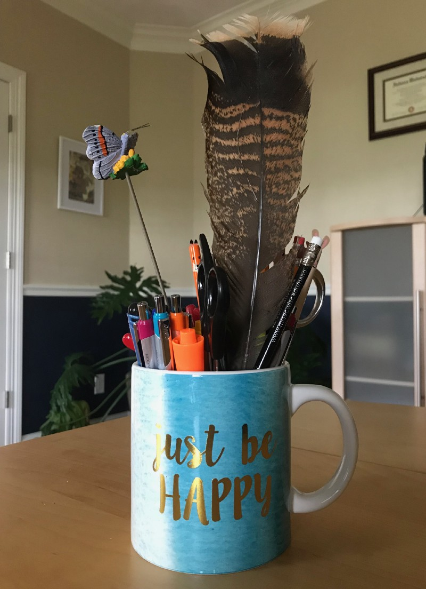

<em class="hidden">Originally published on <a href="https://medium.com/the-mission/taking-time-to-be-thankful-surviving-a-wild-turkey-attack-34d75e6a12c6" target="_blank" rel="noopener noreferrer">Mission.org</a></em>
##Not That Kind of Turkey

Ten years ago a wild turkey tried to kill me. No, I am not talking about the <a href="http://wildturkeybourbon.com/" data-href="http://wildturkeybourbon.com/" class="markup--anchor markup--p-anchor" rel="nofollow noopener" target="_blank">Kentucky bourbon</a> or the catchy country ditty by <a href="https://www.youtube.com/watch?v=C6aazMNVMv4" data-href="https://www.youtube.com/watch?v=C6aazMNVMv4" class="markup--anchor markup--p-anchor" rel="nofollow noopener" target="_blank">Lacy J. Dalton</a> of the same name (although both could be considered deadly), but an actual real-life wild turkey. Although the encounter happened in the spring there is something about this time of year, with Thanksgiving looming and all the harvest decorations, that triggers the memory of my run-in with a turkey and the essential life lesson it taught me.

##The Story Begins
This story starts back in 2007&#8202;—&#8202;the year that <a href="https://www.wired.com/2015/01/todays-iphone-anniversary-reminds-us-real-innovation-looks-like/" data-href="https://www.wired.com/2015/01/todays-iphone-anniversary-reminds-us-real-innovation-looks-like/" class="markup--anchor markup--p-anchor" rel="noopener nofollow noopener" target="_blank">Steve Jobs</a> announced the very <a href="https://en.wikipedia.org/wiki/IPhone_%281st_generation%29" data-href="https://en.wikipedia.org/wiki/IPhone_(1st_generation)" class="markup--anchor markup--p-anchor" rel="noopener nofollow noopener" target="_blank">first iPhone</a>, supercomputers were creating <a href="http://news.bbc.co.uk/2/hi/technology/6600965.stm" data-href="http://news.bbc.co.uk/2/hi/technology/6600965.stm" class="markup--anchor markup--p-anchor" rel="noopener nofollow noopener" target="_blank">virtual mouse brains</a>, and over 60% of all browser users were using Internet Explorer in a world where Microsoft ruled supreme. I had just begun my career shift from the biological sciences to computer sciences and had landed my first full-time website developer job, working for a tiny company that manufactured <a href="https://www.tormach.com/" data-href="https://www.tormach.com/" class="markup--anchor markup--p-anchor" rel="noopener nofollow noopener" target="_blank">mid-sized CNC machines</a>. This was back when “<a href="https://en.wikipedia.org/wiki/Webmaster" data-href="https://en.wikipedia.org/wiki/Webmaster" class="markup--anchor markup--p-anchor" rel="noopener nofollow noopener" target="_blank">webmaster</a>” was still a professional job title.

About a month into my job, I was asked to help pick out furnishings for our new office space. It was not exactly what I was hired to do, but in small companies, you wear many hats&#8202;—&#8202;so I put on my interior designer hat and drew up some plans. If I am being honest, it was a fun departure from the daily website tasks I had to do. Plus, could I really pass on the opportunity to take a work-sponsored trip to Ikea? The Swedish fish alone are worth the time. So, I eagerly jumped into the shotgun position of the 1980s-era GMC van (picture a less-cool version of the <a href="http://www.superchevy.com/news/1602-got-40-grand-to-join-the-a-team-buy-this-tribute-van" data-href="http://www.superchevy.com/news/1602-got-40-grand-to-join-the-a-team-buy-this-tribute-van" class="markup--anchor markup--p-anchor" rel="noopener nofollow" target="_blank">A-Team van</a> complete with curtains on the windows) and my boss Greg and I headed to Chicagoland to load up on cheap Scandinavian office furniture.

##The Turkey Attacks

About 30 minutes into our trip, a <em class="markup--em markup--p-em">fowl</em> beast in the form of a wild turkey disrupted our plans. Some people might not know this&#8202;—&#8202;<a href="https://youtu.be/T1_hra--u3M" target="_blank" rel="noopener noreferrer">wild turkeys can fly</a>. Being a vegetarian and a non-hunter, I really had not put much thought into the lifestyle of a wild turkey. It had not occurred to me that unlike their farm-raised brethren, wild turkeys can not only fly, but they can <a href="https://www.thespruce.com/fun-facts-about-wild-turkeys-387112" data-href="https://www.thespruce.com/fun-facts-about-wild-turkeys-387112" class="markup--anchor markup--p-anchor" rel="noopener nofollow" target="_blank">reach speeds up to 55 miles an hour</a> and heights of 400 meters or more. I had no need to know these wacky turkey facts, until the day when one came barreling down the interstate, past a semi-truck in the right lane, only to find itself in the left lane in a space previously occupied by the van’s windshield.

What happened next was a bit of a blur, but I do remember a loud popping noise, a sprinkling of glass, and then warm blood oozing down my forehead. I could not hear well for several days after the accident and I think some glass particles are still embedded in my skin to this day&#8202;—&#8202;but thanks to “modern” automotive technology and the fact I was wearing my seatbelt, I was relatively unscathed. The turkey, on the other hand, was not so lucky.

After confirming I was OK, Greg went to check on the turkey. I am not sure why he did this exactly (I never asked), but I assume it was because he was in shock and not quite sure what had just happened. Maybe he was trying to make sense of the situation like I was? By the time he found the turkey, it had already passed away and someone who saw the event unfold, was scraping it off the road and putting into their truck (a little gross, but true). Greg plucked two feathers off the turkey and put them in his jacket.

Meanwhile, back at the scene of the accident, a police officer had arrived to help us. As he surveyed the carnage, he commented on how very lucky we were. In his estimate, if the turkey had been a few pounds heavier or we had been driving a bit faster, the turkey would have gone all the way through the windshield and I would have been in much worse shape, perhaps even dead. At that comment, I started laughing…not ordinary laughing, but ribs-hurting, old-lady-cackling, pee-my-pants type laughing. It might have been partially the fault of the concussion, but is there not just a tiny bit of humor/irony in my potential obituary headline:

<blockquote name="4f4d" id="4f4d" class="graf graf--pullquote graf-after--p">Carie Fisher &#8202;—&#8202; Life-Long Vegetarian and Pacifist Tragically Murdered by a Wild Turkey on Road Trip to&nbsp;Ikea with her boss Greg</blockquote>

##The Life Lesson the Turkey Taught Me

I have been in a few other car accidents in my life, both before and after the wild turkey one. I had an accident once where I drove up an embankment and then flipped my car on its side — only seconds after I had buckled my seatbelt. And another accident where a deer T-boned my car on New Year’s Eve — only made worse by my then three-year-old daughter tearfully asking the police officer if her mommy had just killed one of Santa’s reindeers. But there is something about the turkey accident that is so jarring to me — one more pound, one more mile per hour, a shift in the wind essentially, and I would not be writing this story.

Feeling a bit like a cat that had just lost one of its nine lives, from that day forward, I decided to jump at any opportunity I could, to not be so afraid all the time, to seize what I could out of life while I had it to live. A bit morbid perhaps, but I do not know of a motivator stronger than looking into the eyes of death itself. Of course, I struggle some days with keeping a positive outlook on life and doing the things I am scared to do (and know I should do), but even the worst days are still days I am alive. So I cherish them as well.

A few days after the run-in with the wild turkey, Greg had given me one of the feathers he had saved. Although ten years have passed, I still have the feather in a cup on my desk. I look at it every day. It reminds me of the accident, my mortality, the promise I made to myself to spend each day wisely, and especially of Greg — a brilliant inventor/boss who tragically lost his life in a sailing accident two years ago. The feather is my personal reminder to be thankful for today, for tomorrow is never promised.
