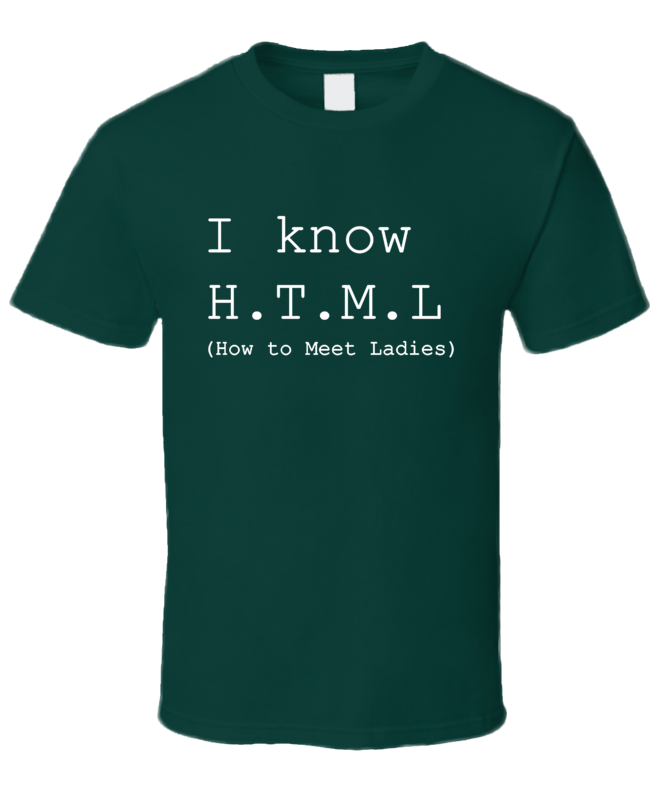
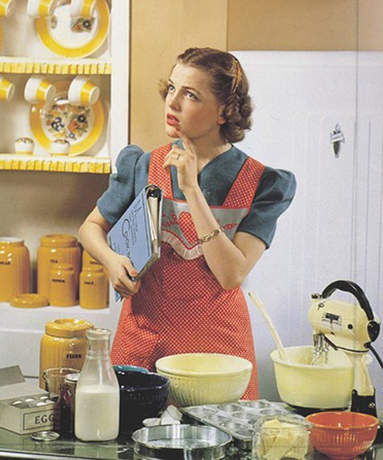

##The Backstory

Unless you have been under a rock for the last week or so, you have probably heard about the horrible allegations leveled against <a href="https://www.newyorker.com/news/news-desk/from-aggressive-overtures-to-sexual-assault-harvey-weinsteins-accusers-tell-their-stories" target="_blank" rel="noopener noreferrer">Harvey Weinstein</a> — a.k.a. the mega movie mogul who liked to leverage his position for evil. Really, it is a classic case of abuse of power...a real-life drama, that will likely become a movie itself in short time.

I applaud the women who came forward, both in the past — and were basically ignored or paid for their silence; and to the women in the present — who by sheer numbers alone, could no longer be ignored or silenced. It took courage to speak up. That is a courage I have not had. Until now.

##The Community
I am part of a smallish community of coding-types, who peel their fingers off of computer keyboards just long enough to gather en masse at conferences (where we promptly go back to said keyboards). We like to discuss the latest “tech hotness” and argue over the merits/limitations of the newest flavor of JavaScript. There is usually a lot of coffee during the day and a steady stream of beer flowing at night. It is a bit of a nerd paradise.

This story starts in March 2016. At this point in time, I have been a part of the community for a little over seven years — although I am only known by few people. I am virtually invisible. My employer has encouraged us to “be more involved in the community” and I somehow luck into getting selected to give a talk on website accessibility. My first real tech talk…in a real room…in front of real people. I was both elated and terrified.

As I am prepping for my talk in the common area, I notice a guy. Not just any guy, but “the guy” I have looked up to professionally for seven years. He is a little viking of a man — as charismatic as he is polarizing. People are naturally drawn to him, his ideas, his passion — even though he is a bit unorthodox and unfiltered at times. People seem to forgive that side of him, because of all the other things he has given to the community over the years. He is in essence the opposite of unknown me — he is a quintessential coding rockstar of the community.

So when my co-worker (who is sitting at his table), motions me over to sit with them, I gladly accept. I am not the type of person who passes over the chance to meet with someone who has inspired them, plus they had cookies. So we sat and chatted over the rims of our laptop screens, about all the things and nothing at all. For that brief moment in time, it was nice to be literally and figuratively “asked to the table” where I was treated as an equal. I was excited about what this new connection might mean for me and my future in the community. Maybe I could be a real voice and make some real change?

##The Incident
That hopeful bubble burst a day later when I met “the guy” at a post conference event. Our interaction that night started with him boasting about how good he was in bed and ended with him inappropriately groping my body. I remember him smirking at me with all the brazenness of a man who knew he could get away with anything.

In my imaginary world (before the incident actually happened), I thought of myself as quick-witted and feisty. I would do Kung-fu on any perpetrator’s nether regions and run straight to the authorities. I would be as loud and obnoxious as I needed to be, to make others notice and take action. But when it happened in real life, I froze. When I finally connected the dots, each movement took tremendous effort — as if my limbs were being pulled underwater. One second of time felt like an eternity, although the entire groping event probably only lasted five minutes.

I was lucky. I had a friend who saw the entire thing and “went all Milwaukee on him” (her words). She saved me from whatever badness would have happened next. I am beyond thankful for her actions. But the inevitable self-blame set in right away: Did I do something to provoke this? Was I not clear in my professional intent? Then the confusion came: Why did he do it? Because he had the power? Because who would believe my tiny voice in the community versus his?

After the dust settled a bit, my friend begged me to report him. My co-worker begged me to report him. My husband begged me to report him. Of course, I did not report him. I did not want to “rock the boat” or be labeled as “that girl.” I wanted to bury my feelings deep and pretend the incident did not happen. I assumed nothing would come of it any way. Sadder still, I sent a message to “the guy” and apologized for my friend’s actions. Not my proudest moment.

##The Repeat
Shortly after the incident with me, “the guy” took a break from the community. I seriously doubt I had any influence on that self-imposed tech time-out, but the timing (paired with other underground rumblings about similar incidents) is curious. When he finally came back to the community, he seemed a bit more mellow. From the outside, he was trying to listen more, be more inclusive and accommodating to other people’s opinions. In fact, he had even asked a small group (that included me) to help him review his latest project. Although I was skeptical, my helping nature won out and I pointed out a few places where he could improve his project. Besides, it was not like I would have to be in the same room with him, this was all virtual and presumably safe.

Fast forward a year and a half from the initial incident and you will find me at another tech conference, sitting in a large room full of excited people, hearing “the guy” give a tech talk about his latest project. Since I had helped out a tiny bit with the project, I was also excited to see it showcased to the world and hear what others thought of it…but my excitement quickly transformed into confusion and anger.

He started his talk with disparaging comments about women and their role in tech. He followed that up with a derogatory anecdote that his girlfriend’s job was to “do him.” He did not stop there, he went on to attack the group I work with, calling us whiny and making fun of our efforts to make websites more inclusive to people with disabilities. He mentioned (more than once) that he could care less about making his project more accessible to others.

Wait…did I hear all of that correctly? Or had we just time traveled back to the 1950s, where the role of women was to clean the house and please her man? Was I not to be seen as a tech equal just because I was a woman? Did he say disabled people and their needs do not matter…was this really happening in 2017? All those feelings I had buried a year and a half ago, bubbled to the surface and I instantly regretted everything: sitting at the table, talking to him, forgiving him, working with him, being nice to him, and more importantly, not reporting him the first time. He had not changed.

##The Transformation
The tech talk left me feeling personally attacked — both as a woman, but also as someone who advocates for an inclusive world (internet and otherwise), most likely heightened by all the past history with “the guy.” I reported him for violating the conference code of conduct, specifically calling out this part:

<blockquote>One of the greatest strengths of the community is our inclusiveness. Making all attendees feel welcome and included is everyone’s job. Sponsors, volunteers, speakers, attendees, and other participants should strive to treat all people with dignity and respect, regardless of their culture, religion, physical appearance, disability, race, ethnicity, gender, or sexual orientation.</blockquote>

We are a few weeks out from the conference and there still has been no disciplinary action for “the guy” that I know of — but honestly, that does not matter to me. I do not care if he is “punished” or not. I am proud I reported him, however inconsequential it may be. I did not report him to be vindictive. I reported him so I could have closure.

While I am no Hollywood actress, I did learn from all of these strong ladies (and all the #metoo voices on social media — both men and women), that I should always be treated in a professional manner. That my voice, however small, matters. That no matter how alone I feel, there are those in the community that will understand and help. The incident changed me, but it will not define me. It is now just a small part of my life history. My “Weinstein” has officially been put on notice.
