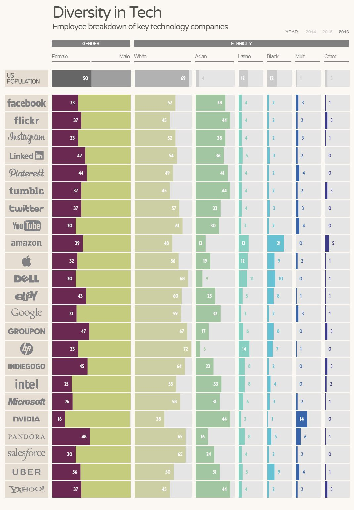

##Who Runs the Zoo?
I cried when I quit my last job, mainly out of frustration. It was not a pretty sight and I am a bit embarrassed to admit it out loud. Most of my clients, projects, and co-workers were amazing, but somewhere along the way my professional aspirations deviated from those of my company. It was the first time I had ever quit a job where I did not already have another job officially lined up, but I had gotten to a point where I had given so much and gotten so little in return. I felt I had no choice but to quit, if I wanted to keep some semblance of myself intact. Sadly, I think we have all been there.

The funny thing is, I had not realized how unhappy I was until one night — months before I quit — when I was reading bedtime books to my kids. We were on a <a class="c9" href="https://en.wikipedia.org/wiki/Dr._Seuss" target="_blank" rel="noopener noreferrer">Dr. Seuss</a>&nbsp;kick that month. We had read Green Eggs and Ham, Fox in Socks, The Lorax&nbsp;and many other Dr. Seuss classics, but it was the book If I Ran the Zoo&nbsp;that got me thinking about company culture. If I Ran the Zoo&nbsp;is a children’s book written in 1950 about a boy named Gerald McGrew who visits an ordinary zoo, but proclaims the animals are “not good enough.” If he ran the zoo, he would make the animals much more exotic and thus the zoo much more exciting. My kids and I giggled over the weird menagerie of animals with absurd names and agreed we would love to go to this new McGrew Zoo.

It was a bit unexpected, but the book made me reflect back on the past jobs I have had — ice cream maker to disability assistant to fruit-fly scientist to programmer and everything in-between. I wondered what made the good jobs good and the bad ones “not good enough?” Why had some jobs “<a class="c9" href="http://www.bucketfillers101.com/have-you-filled-a-bucket-today.php" target="_blank" rel="noopener noreferrer">filled my bucket</a>” while others just emotionally drained me? What would have happened to company culture if I, as an employee, could have helped shaped it? Essentially, what would I do if I ran the zoo?

##Change #1: Enforce Work/Life Balance

When a tech company says they “encourage their employees to strive for a great work/life balance,” they secretly mean they expect you to work a ridiculous amount of hours each week. You can see your significant other/kids/pets/friends on the weekend. Maybe. If you are lucky. If you do not work those unreasonable hours, you will quickly fall behind your co-workers and your performance reviews (which are tied to your salary and potential promotions) will suffer.

News flash! Most employees want to do a good job and be a productive member of the company. No one wants to feel like they are the bottleneck or the weakest link so they will put in all the time they can, but working that many hours continuously each week quickly leads to <a class="c9" href="https://hbr.org/2017/04/employee-burnout-is-a-problem-with-the-company-not-the-person" target="_blank" rel="noopener noreferrer">employee burnout</a>. An employee should not have to sacrifice their sanity or family or anything they love/value for a job. There have been numerous <a class="c9" href="https://pingboard.com/work-life-balance/" target="_blank" rel="noopener noreferrer">articles</a>&nbsp;written on the subject and <a class="c9" href="http://eprints.qut.edu.au/8128/" target="_blank" rel="noopener noreferrer">scientific studies</a>&nbsp;outlining the benefits — including increased profits — of having a robust work/life balance in a company. So why do employers still not get it?

There are many ways a tech company can support a healthy work/life balance to increase positive company culture. I think the easiest way to obtain balance is simply to enforce it. Unless it is a real business emergency, do not ping, email, text, or call an employee after hours or on their day off. Even if an employee is off the grid, they will feel compelled to respond. Most work issues can wait…no really, they can. If you think you are going to forget something, draft an email or record a voice memo to yourself and just sit on it until the employee is back in the office. Of course, everyone wants to feel important and needed at their job, but by allowing an employee to have that space to decompress from work makes them healthier, happier, and ultimately more productive.

##Change #2: Make Diversity a Priority

If you look around the tech arena, you will notice that a lot of management and code-based positions are (most likely) occupied by the straight, white male variety of our species. How can this even statistically be the case — with the wide array of diverse people in the world and especially with the recent push and supposed support in diversity and inclusivity? It is almost as though, scientifically speaking, they worked hard to not&nbsp;include a diverse workforce
Numerous studies show that including underrepresented communities helps your company’s <a class="c9" href="https://www.skyword.com/contentstandard/creativity/why-the-lack-of-diversity-in-business-has-reached-a-tipping-point/" target="_blank" rel="noopener noreferrer">innovation</a>, <a class="c9" href="https://www.fastcompany.com/3049056/5-ways-to-fix-the-tech-industrys-diversity-problem" target="_blank" rel="noopener noreferrer">longevity</a>, and <a class="c9" href="http://fortune.com/2017/01/18/leadership-diversity-bottom-line-career-advice/" target="_blank" rel="noopener noreferrer">bottom-line</a>. But large tech companies like <a class="c9" href="http://fortune.com/2017/06/29/google-2017-diversity-report/" target="_blank" rel="noopener noreferrer">Google</a>or <a class="c9" href="https://www.theguardian.com/technology/2016/aug/03/apple-diversity-report-race-gender-facebook-google" target="_blank" rel="noopener noreferrer">Apple</a>&nbsp;or [insert big tech giant name here] are still far behind including women, people of color, LGBTQ, and disabled communities into their folds. In fact women — who represent 59% of the US workforce and 51% of the global population — only represent 29% of all top tech jobs. This percentage gets even more depressing when you remove non-technical type positions (ex. HR, marketing, sales, etc.) out of the reports.

The technological workforce is seriously out-of-touch with the real world, if in 2017 a community that represents more than half the global population (i.e. women) is still considered a minority—a situation that only gets worse when you look at the statistics for other minority communities who are <a class="c9" href="https://www.usatoday.com/story/tech/news/2017/04/27/toxic-workplaces-technology-women-minorities-retention/100977038/" target="_blank" rel="noopener noreferrer">far more underrepresented</a>. It is time for tech companies to stop saying they support diversity and inclusivity, and time to actually do more about it. At the very least, a diverse workplace will help enhance company culture by bringing in a wealth of new perspectives and ideas.

##Change #3: Cultivate a Transparent Workplace

I still remember my first job out of college, <a class="c9" href="https://www.med.wisc.edu/news-events/sleep-tempers-growth-of-synapses/" target="_blank" rel="noopener noreferrer">keeping fruit flies awake</a>&nbsp;for science…yes, that was a real job that I was paid real money to do (and supported by the U.S. Department of Defense, no less). While there are many reasons why that particular job has stayed in my memory, the main reason I remember it so vividly is how I was treated. In the eyes of the scientific community, I was a lowly laboratory research assistant and should not be privy to all the complex interworking of a research lab. But in the <a class="c9" href="http://centerforsleepandconsciousness.med.wisc.edu/index.html" target="_blank" rel="noopener noreferrer">Tononi/Cirelli lab</a>&nbsp;I was a somebody. It did not matter if I only had an undergraduate degree, or what (little) I had accomplished so far in the realm of scientific research…I was a part of their work family and therefore I deserved workplace transparency.

Listen up: employees want and deserve transparency. We would much rather hear the awful truth than a perfect lie. We want transparency on salaries, business decisions, company growth, job performance, and so much more. Since we spend <a class="c9" href="https://revisesociology.com/2016/08/16/percentage-life-work/" target="_blank" rel="noopener noreferrer">35% of our waking lives at our job</a>, do we not deserve to know how the sausage is made — even if it might gross us out a bit?

According <a class="c9" href="https://www.liquidplanner.com/blog/9-ways-promote-transparency-non-transparent-work-culture/" target="_blank" rel="noopener noreferrer">many</a>&nbsp;<a class="c9" href="https://www.liquidplanner.com/blog/why-transparency-matters-and-how-to-make-it-happen/" target="_blank" rel="noopener noreferrer">workplace</a>&nbsp;<a class="c9" href="https://www.forbes.com/sites/glennllopis/2012/09/10/5-powerful-things-happen-when-a-leader-is-transparent" target="_blank" rel="noopener noreferrer">experts</a>, for the low price of transparency, you can get in return: an increase in employee performance and accountability, greater buy-in and ownership from the entire team, plus attract talent from outside the company while retaining talent within the company. All key ingredients for fostering a positive company culture. So employers, what is there to lose by being transparent and treating your employees more like a family member and less like a commodity?

##Change #4: Be Flexible with All the Things

One size does not fit all — especially those “ladies cut” conference T-shirts with pre-teen sizing that do not fit real women’s bodies (but I digress). Just like we all had different learning styles when we were kids in school, we all have different <a class="c9" href="https://www.inc.com/shelley-prevost/4-unique-working-styles-whats-yours.html" target="_blank" rel="noopener noreferrer">working styles</a>&nbsp;as adults at our jobs. Employers need to recognize that employees are individuals and as such, we will approach our job in different ways. Similarly, we are motivated in unique ways — some people want big piles of money à la Scrooge McDuck, while others would trade in a big bonus for more time off. Employers need to recognize these differences and be more flexible&nbsp;when it comes to tasks, teams, expectations, compensation…just about everything.

There are many different ways to access a person’s working style. One of the most popular is to use an assessment tool like the <a class="c9" href="https://discprofile.com/" target="_blank" rel="noopener noreferrer">DiSC Workplace Profile</a>. I think it is a brilliant way to get to know your employees — notably your new ones. Of course, it is not a perfect measure of an employee’s work style, but it does show your employee generally where they fall on the working style spectrum and how they compare to other team members. The assessment is used to increase an employee’s self-knowledge: how they respond to conflict, what motivates them, what causes them stress and how they solve problems. But it also helps employers understand: how to improve working relationships by recognizing the communication needs of team members, facilitate better teamwork, and teach productive conflict resolution.

No working style is inherently good or bad, but how employers deal with each employee’s working style can be. Having a deeper understanding of everyone’s working styles — priorities, motivations, fears, and limitations of each employee and team — allows you to cultivate a richer, deeper company culture. Of course, it will not solve that pesky world peace problem, but for your office peace it might just help.

##Change #5: Listen to People with Respect

Aretha Franklin&nbsp;said it best in 1967: “All I’m askin’ is for a little respect.” In the workplace, respect is fundamental. Yes, employees are there to do a job, but they are also people who deserve to be listened to and their ideas to be respected. It is so simple a concept, yet it is an often ignored aspect of creating positive company culture.

The implications for being a bad listener, dear employers, are real. I recently wrote about something personal that happened to me when I was at my last job. It was a secret I kept (mostly) to myself, for a longer amount of time than I should have. Why did I not talk about it sooner with my employer even though it happened at a work event? It is a complicated question I do not have an easy answer for, but I have to think that the lack of someone I felt safe talking to had a lot to do with my silence.

Employers have to work to become <a class="c9" href="https://hbr.org/2014/04/what-gets-in-the-way-of-listening" target="_blank" rel="noopener noreferrer">better listeners</a>. It does not happen without acknowledgement and active training, but when it does happen so <a class="c9" href="https://www.forbes.com/sites/lizryan/2015/06/13/six-ways-to-listen-to-your-employees/" target="_blank" rel="noopener noreferrer">many benefits</a>&nbsp;will come of it. Remember employers: listening is important and understanding goes a long way, but actions are a fundamental next step&nbsp;to listening. Do not be afraid to do the right thing for your employees, even if that means losing out on a new business contract. How you handle that type of situation will not go unnoticed — your employees will always remember who or what was your top priority.
